Atelier Python
==============
Rey Sebastien <rey.sebastien@yahoo.fr>
:Author Initials: SR
:toc2:
:toclevels: 4
:icons: font
:max-width: 70%
:source-highlighter: pygments
:sectanchors:
:experimental:
:pygments-style: monokai

* v0.1, Sept 15, 2012 : Initial version
* v0.2, Sept 17, 2012 : Add some major explanation about list, fonctions, indentation, etc.
* v0.3, Sept 18, 2012 : Add information for ubuntu and windows install, add some minor fixes on source code, add some new links
* v0.4, Sept 19, 2012 : Add section with information for POO, ROGLike exercices instruction and exemple
* v0.5, Sept 20, 2012 : Add new information for POO
* v0.6, Oct 2, 2012 : Add information for Labyrinthe exercice
* v0.7, Sept 20, 2013 : Add link to visualize program execution, correcting syntax, add pycharm IDE information, modify Ubuntu information
* v0.8, Sept 26, 2013 : Some new corrections, add a "Rendu" part, add "insert" function for list, add information into POO part, remove labyrinth old information
* v0.9, Sept 27, 2013 : Add mini games instruction
* v0.10, Sept 27, 2013 : Add information about cd command and folder to find Pycharm
* v0.11, Oct 13, 2013 : Add POO information and exercices
* v0.13, Oct 22, 2013 : Add POO information about inheritance and composition ; remove old version of Rogue

== Introduction au document

Cette longue introduction doit vous servir de point de départ pour vous lancer ensuite par la suite dans des développements python plus lourds.

Construit de façon dynamique, disponible en ligne, celui çi sera probablement mis à jour plusieurs fois durant cette semaine, et cela pour plusieurs raisons :

. si vous voyez des fautes, des coquilles, soyez gentils, ne m'insultez pas et faites moi signe, je corrigerai :)
. ce document sera nourri par vos remarques, vos questions durant les Tp

.Quels objectifs ?

* Etre capable de lire un code inconnu et de le comprendre
* Etre capable de chercher une information et de "poser une question" sur Internet et les sites spécialisés
* Etre capable de concevoir et de réaliser un programme simple
* Etre capable de travailler en groupe

Ce tutorial a pour but de vous faire travailler rapidement sur Python, et donc masque un certain nombre de questionnements théoriques.

De *très* nombreuses ressources existent pour vous éclairer sur Internet, et ce tutorial est un pot-pourri des informations que l'on peut trouver partout facilement, car Python est un langage *extremement populaire*,

J'essaierai d'en lister un certain nombre dans l'onglet ressource tout en bas de page.

== Le langage python

image::images/python.png[align="center"]

=== Présentation rapide

Python est un langage intéressant pour plusieurs raisons, à la fois technique :

* Il est interpreté (ligne par ligne), et portable facilement (windows, linux)
* Le typage est dynamique (pas besoin d'indiquer le type de votre variable...)
* Tout est *objet* en python (c'est à dire possède des attributs et des fonctions)
* Il existe de très nombreuses librairies logicielles qui étendent le langage dans plusieurs domaines
* Il permet à la fois de créer de petits programmes (scripts réalisant/automatisant de petites tâches), tout comme de très gros programmes ou logiciels
* Python permet de mixer différents paradigmes de programmation : *objet* et *fonctionel*

et pédagogique :

* python est connu comme un langage "fun"
* La documentation originale est de grande qualité
* La communauté utilisateur est très grande (poser des questions et se procurer de la documentation gratuite est facile)
* Le système d'indentation (le décalage à chaque ligne) est un bon guide à l'apprentissage, et favorise la lisibilité du code source
* La courbe d'apprentissage est très rapide avec ce langage, finalement assez proche du pseudo-code
* De nombreux logiciels ou systèmes proposent une API en Python pour ajouter des extensions/plugins, et réaliser des traitements automatisés
* Comme pour le langage R, une très forte communauté s'est formée en science autour de librairies/packages extension du langage : numpy, scipy, matplotlib etc.
* Des outils pour visualiser l'execution des programmes (vous pouvez en abuser pour comprendre et débugger vos programmes !) : http://pythontutor.com/visualize.html

Je ne rentrerai pas plus dans le détail sur les aspects techniques du langage pour ne pas vous noyer trop vite d'informations.

[NOTE]
====
.Toutefois, pour les plus curieux, quelques liens pour aller plus loin :
* la page wikipédia de python : http://fr.wikipedia.org/wiki/Python_%28langage%29
* une *API* : http://fr.wikipedia.org/wiki/Interface_de_programmation
* un *paradigme de programmation* :  http://fr.wikipedia.org/wiki/Paradigme_%28programmation%29
* la programmation orientée objet ou POO : http://fr.wikipedia.org/wiki/Programmation_orient%C3%A9e_objet
====

=== Utilisation/Usages

Python est un langage clairement à la mode, du fait qu'il est simple à utiliser et à étendre, ainsi on le retrouve un peu partout dans différents domaines :

* Mathématiques
* Intelligence artificielle
* Education
* Jeux
* Sécurité et Système d'exploitation
* etc. cf http://www.python.org/about/apps/

Quelques exemples d'utilisation de python spécifique en géomatique :

* QGIS (http://www.qgis.org/pyqgis-cookbook/)
* ArcGis 10
* GeoDjango
* Accès Postgis avec Psycopg2
* librairie *Numpy*
* librairie *GDAL* et *OGR*
* librairie *Geopy*
* librairie *Shapely*
* etc.

.Quelques pistes supplémentaires ici :
****

* http://geotribu.net/node/165 (ogr \+ python)
* http://www.paolocorti.net/2012/02/03/python_for_geospatial_developers/
* http://michalisavraam.org/2010/04/the-essential-python-modules-for-gis/
* http://spatiallyadjusted.com/2011/01/03/2011-the-year-python-takes-over-gis/
* http://2010.foss4g.org/workshop06.php

****

.Et pour ceux qui veulent prendre de l'avance sur l'année, un livre et quelques pointeurs supplémentaires :
****

* http://www.packtpub.com/python-geospatial-development/book
* http://www.gis.usu.edu/~chrisg/python/2009/
* http://gis.stackexchange.com/questions/tagged/python
****

=== Installation

==== Ubuntu

Ubuntu est un système d'exploitation libre, et open-source, alternatif à Windows, et qui peut être installé sur n'importe quel ordinateur.

image::images/ubuntu.png[align="center"]

Une des grandes forces c'est la mise à disposition des utilisateurs d'un système de gestion de paquets offrant l'installation en quelques clics d'un très grand nombre de logiciels, ou paquets, par rapport à son principal concurrent Windows.

L'autre force, qui pourra au demeurant vous faire penser à une faiblesse, est la mise à disposition d'un logiciel appelé *Terminal*, dans lequel l'utilisateur peut taper un très grand nombre de commandes, qui vont de l'installation d'un paquet à une infinité d'autres choses.

image::images/ubuntuTerminal.png[align="center"]

Ainsi par exemple, et pour vous donner un apercu du bonheur qu'il y a pour un développeur à travailler sous Ubuntu au jour le jour,
Python est natif. C'est à dire déjà installé et déjà accessible par une simple commande dans un Terminal. [red]*Joie !*

Si vous ne me croyez pas, jetez un oeil à la procédure d'installation sous <<_windows,Windows>>.

image::images/terminalPython.png[align="center"]

Les autres éléments, comme les librairies, peuvent être installées dans le terminal, via une commande simple :

[source,console]
$> sudo apt-get install python-pygame

NOTE: `$>` représente le *prompt* de votre terminal, qui contient des informations sur le répertoire dans lequel vous vous trouvez..

[NOTE]
====
Si vous possedez les droits administrateur sur votre machine, alors vous pouvez voir une liste des autres packages python disponibles sous ubuntu avec le paquet `aptitude` :

[source,console]
$> sudo apt-get install aptitude

[source,console]
$> sudo aptitude search python-* | grep 2.7

ou :

[source,console]
$> sudo aptitude search python-*

====

[NOTE]
====
Pour installer d'autres modules dans python, il existe plusieurs solutions :

* l'installateur easy_install livré avec python : http://wiki.python.org/moin/CheeseShopTutorial
* ou plus simple avec l'installateur de package d'ubuntu, qui contient aussi bon nombre de packages : `apt-get`
====

[NOTE]
====
Il existe de nombreux paquets python en rapport avec la géomatique dont vous pouvez partir à la chasse, voici quelques listes faites par des utilisateurs :

* http://gis.stackexchange.com/questions/23575/what-are-the-python-tools-modules-add-ins-crucial-in-gis
* http://gis.stackexchange.com/questions/3796/python-for-gis-on-a-thumb-drive?rq=1
* http://gis.stackexchange.com/questions/3796/python-for-gis-on-a-thumb-drive?rq=1
* La liste de module pour Pypi (mais aussi pour `apt-get`) : http://pypi.python.org/pypi?%3aaction=browse&show=all&c=391
====

Quelques commandes utiles pour le terminal :

.Afficher le répertoire courant
[source,console]
$> pwd

.Se déplacer dans les répertoires
[source,console]
$> cd nomDeMonRepertoire

.retour arrière dans la hiérarchie de répertoire
[source,console]
$> cd ..

.Afficher le contenu du répertoire
[source,console]
$> ls

NOTE: Vous pouvez appuyer sur la *flêche HAUT* de votre clavier numérique pour rapeller des commandes précédemment tapées et les modifier par la suite (idem dans l'interpreteur python)

NOTE: En appuyant sur la touche *TAB* deux fois lors de l'écriture de vos commandes, vous pouvez obtenir des informations de complétion.

D'autres commandes existent bien sur, et pourront vous servir lors de vos futurs développements, voici un http://doc.ubuntu-fr.org/tutoriel/console_ligne_de_commande[lien] contenant de nombreux exemples et une liste plus exhaustive.

En savoir plus sur Ubuntu:

* http://doc.ubuntu-fr.org/console
* https://help.ubuntu.com/community/UsingTheTerminal

Et pour aller plus loin avec QGIS et les plugin python pour GDAL / OGR ( http://pypi.python.org/pypi/GDAL/ )

[source,console]
----
$> sudo apt-get install python-software-properties
$> sudo add-apt-repository ppa:ubuntugis/ubuntugis-unstable
$> sudo apt-get update
$> sudo apt-get install qgis
$> sudo apt-get install gdal-bin
$> sudo apt-get install python-gdal
$> sudo apt-get install python2.7-qgis
----

==== Windows

Sous windows, l'installation est un poil plus délicate que sous Linux ou Ubuntu.

Je vous conseille de choisir plutôt une installation sous forme de packages pré-installés, du type de *pythonXY*,
car l'installation des modules supplémentaires un à un peut vite devenir *cauchemardesque* !

[NOTE]
.Quelques ressources :
====
* *pythonXY* qui contient des packages pour la géomatique et spyder +
http://code.google.com/p/pythonxy/

* *PortablePython* est un python qui tient sur clef USB : +
http://www.portablepython.com/

* La doc officielle propose quelques pointeurs également : +
http://docs.python.org/using/windows.html

* L'installeur officiel : +
http://www.python.org/getit/releases/2.7.3/
====

Une autre solution envisageable, pas forcément plus complexe qu'une installation qui se passe mal sous windows,
passe par l'installation d'une machine virtuelle avec Ubuntu sous windows.
L'avantage c'est qu'une fois Ubuntu installé ainsi, vous allez pouvoir profiter de tout un tas d'outils de développement beaucoup plus facilement que sous windows !!

[NOTE]
.Quelques ressources/ tutoriaux
====
* Ubuntu sous machine virtuelle : +
http://www.psychocats.net/ubuntu/virtualbox

* Ubuntu sur une clé usb : +
http://www.psychocats.net/ubuntu/usb
====

=== Mon premier programme en python

Il existe deux façon d'écrire et d'éxecuter un programme python :

* en mode *interactif* : l'utilisateur saisit les commandes les unes après les autres, et l'interpréteur execute/évalue chacunes d'elle au fur et à mesure de leur saisie.
* ou en mode *execution* : on execute une grosse portion de code stocké dans un ou plusieurs fichier, en une commande.

Pour le mode *execution* nous allons écrire nos programmes au préalable dans un document nommé avec l'extension *.py*

Pour éditer le document une fois créé nous allons utiliser un http://fr.wikipedia.org/wiki/Environnement_de_d%C3%A9veloppement[IDE] parmis ceux là :

* *Pycharm* en Community Edition (Windows et Linux) http://www.jetbrains.com/pycharm/download/index.html
* *Spyder* http://code.google.com/p/spyderlib/ ,

Vous pouvez plus simplement utiliser un éditeur de texte avec le plugin python, tel que *gedit* (par défaut installé avec Ubuntu),

CAUTION: Le copier - coller ne marche pas forcément des éditeurs vers le terminal, notamment lorsqu'on utilise la commande "raw_input()" qui attend une réponse utilisateur.
On préférera donc la commande *python nomdufichier.py* dans le terminal pour executer les fichiers.

==== Pycharm

image::images/pycharmLogo.png[align="center"]

Pycharm est un *excellent* IDE compatible avec Windows, Mac et Linux, +
téléchargeable gratuitement sur le site : http://www.jetbrains.com/pycharm/download/index.html

Sous Ubuntu, il n'y a pas d'installeur du logiciel comme sous windows.
Celui çi se présente sous la forme d'une archive (au format `.tar.gz`), et d'un executable qu'il faut lancer depuis le répertoire `/bin/` du dossier une fois extrait.

* Crééer un répertoire `pycharm` à la racine de votre `Dossier personnel`
* Télécharger `Pycharm` ici : http://www.jetbrains.com/pycharm/download/index.html
* Extraire l'archive `.tar.gz` dans un répertoire `pycharm` que nous avons créé dans votre espace personnel
* Ouvrir le Terminal (celui çi s'ouvre à la racine de votre `Dossier personnel`, la commande `ls` vous le confirmera)
* Se déplacer avec la commande `cd` dans le bon répertoire : `cd pycharm/`, puis `cd pycharm-community-3.0/`, puis `cd bin/`
* Puis tapez `sh pycharm.sh` dans le terminal pour lancer le logiciel !

[NOTE]
.Installation en salle 413
=====
J'ai installé et configuré pour vous le logiciel sur tout les postes de la salle 413.

Pour le lancer vous devez à l'aide du Terminal, et de la commande `cd` vous rendre dans le répertoire ou a été décompressé Pycharm.

.Représentation graphique de l'arborescence pour aller chercher pycharm
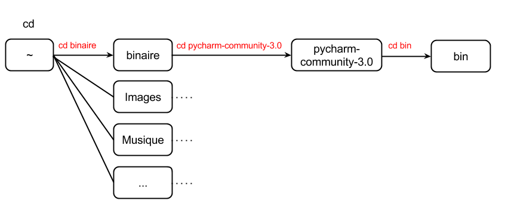

[source,console]
----
$> cd ~/binaire/pycharm-community-3.0/bin
$> sh pycharm.sh
----

ou commande équivalente

[source,console]
----
$> cd ~/binaire
$> cd pycharm-community-3.0
$> cd bin
$> sh pycharm.sh
----

=====

Pour configurer l'interpreteur si cela n'est pas déjà fait par défaut, vous pouvez aller dans les préférences du logiciels.

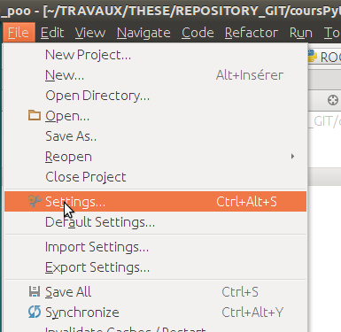

Et choisir l'interpréteur Python que vous souhaitez utiliser pour votre projet : 2.7 ou 3.0

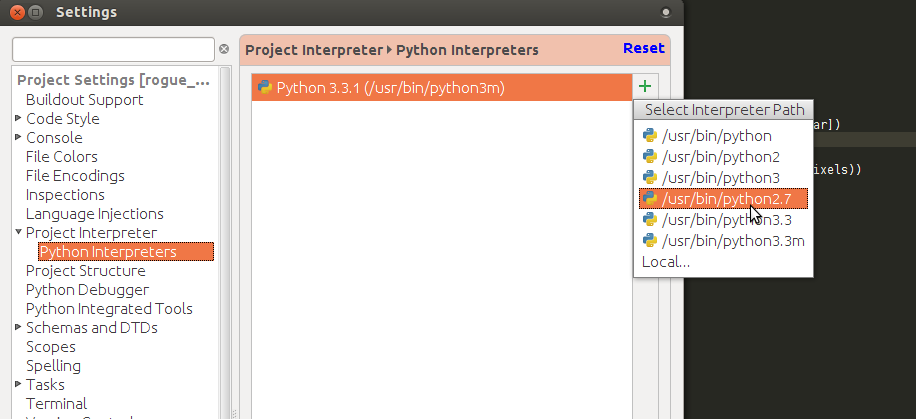

Pour lancer un programme python, il suffit de faire un clic droit sur le fichier python que vous voulez executer, et de cliquer sur `run`

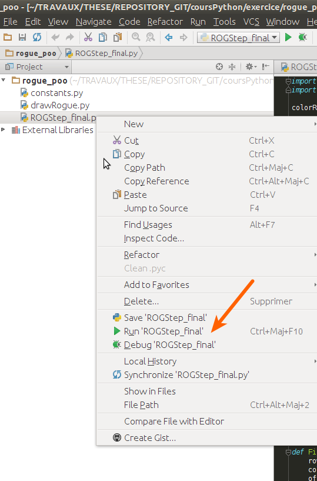

==== Spyder

[NOTE]
.Accélérer et configurer Spyder pour usage de la console interne
=====

Pour améliorer l'execution de spyder il faut aller dans les options et cocher la case : *Installer le input hook QT pour spyder*

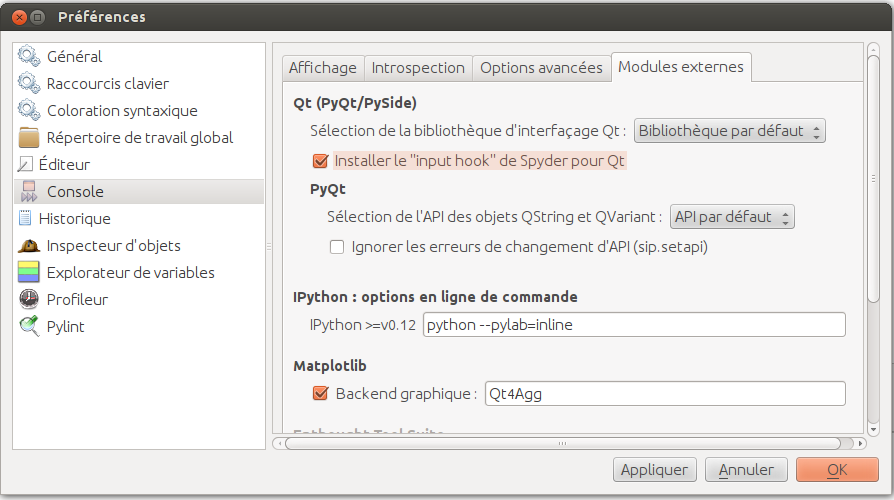

Pour avoir la main au moment de l'execution lors des saisies utilisateurs, il faut *configurer l'execution*

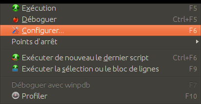

Et activer la case à cocher *Intéragir avec Python lors de l'exécution*

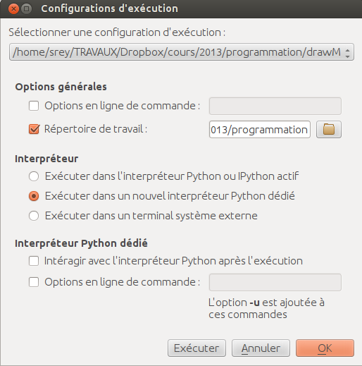

=====

==== avec l'interpréteur de commande python

Pour accéder à un terminal linux, cliquez sur l'onglet en haut à gauche avec une roue, et écrivez "Terminal"
Vous pouvez ensuite taper "python" dans le terminal linux, ce qui aura pour effet de lancer *l'intepreteur de commande en mode console interactif*.

[source,console]
----
> python
ActivePython 2.6.5.12 (ActiveState Software Inc.) based on
Python 2.6.5 (r265:79063, Mar 20 2010, 14:22:52) [MSC v.1500 32 bit (Intel)] on win32
Type "help", "copyright", "credits" or "license" for more information.
----

Chaque commande que vous allez taper dans l'interpreteur de code python sera évaluée :

[source,python]
----
>>> print "Hello World"
hello world
----

Python vous renvoie le résultat de votre commande à chaque  fois qu'il a réussi à l'évaluer, sinon il vous renvoie une erreur.

TIP: Pour quitter la console sous Ubuntu, appuyer sur la combinaison de touche : kbd:[Ctrl + D]

==== avec l'executable python

--
. Créer un fichier __hello.py__
. Taper le texte suivant :
+
.hello.py
[source,python]
----
# -*- coding: utf-8 -*-
print "Hello World"
----
+
. Enregistrer et fermer le programme
. Executer le programme ainsi dans la ligne de commande python
--

[source,console]
$> python hello.py

Réouvrez ensuite votre fichier __hello.py__ et ajoutez la ligne suivante :

.hello.py
[source,python]
----
print "Hello World"
print Bonjour Monde
----
On redemande à l'interpréteur de lire notre programme :

[source,console]
$> python hello.py

Celui-ci renvoie une erreur que nous allons apprendre à lire :

[source,console]
----
$> python hello.py
  File "hello.py", line 2
    print Bonjour Monde
                      ^
SyntaxError: invalid syntax
----

L'interpréteur vous donne la ligne et la faute : la syntaxe pour print est incorrecte, car il manque les guillemets

Point d'entrée d'un programme python :

.hello2.py
[source,python]
----
# -*- coding: utf-8 -*-
import sys # <1>

def main(): # <2>
    print 'Hello there', sys.argv[1] # <3>
    # Command line args are in sys.argv[1], sys.argv[2] ...
    # sys.argv[0] is the script name itself and can be ignored

if __name__ == '__main__': # <4>
    main()
----

.Execution de python2.py
[source,console]
----
$> python hello2.py "Sebastien Rey"
----

<1> Le mot-clef *import* permet d'étendre le programme en ajoutant des fonctionnalités qui existent dans des sous-modules de python,
ou des modules personnalisés définis dans le répertoire par le nom du fichier (nous en discuterons plus dans la partie module)
<2> La fonction qui sera lancée au démarrage du programme, on l'apelle souvent *main()* par convention.
<3> *sys.argv[]* est le nom du tableau définit par python qui contient l'ensemble des paramètres passé en ligne de commande. L'élément 0 est le nom du programme.
<4> *\__xxx__* est une dénomination spéciale de nom de fonction que seul python reconnait, ici cela a pour effet d'indiquer à l'interpréteur python que le bloc d'instruction suivant est le point de départ de notre programme lorsqu'il est executé en ligne de commande : cf. http://docs.python.org/reference/datamodel.html#specialnames pour en savoir plus

L'avantage de cette méthode par rapport à la première, c'est que dans la première, si vous fermez le terminal, ou que vous décidez de quitter le programme pour aller boire un café, tout ce que vous avez écrit est bel et bien perdu quand vous re-lancez la console Python.

Il est donc plus intéressant de stocker nos programmes dans des fichiers avec des noms *explicites*, comme dans la deuxième méthode.

NOTE: "Hello World" est le programme le plus connu des informaticiens, cf. http://en.wikipedia.org/wiki/Hello_world_program

CAUTION: Python est *sensible à la casse*, il faut donc faire attention aux majuscules / minuscules dans votre programme.

CAUTION: Pour ne pas avoir de problème avec les accents, pensez à ajouter la ligne suivante au tout début de votre programme :
__# -*- coding: utf-8 -*-__

== Indentation

Python utilise l'indentation pour définir le corps des blocs d'instruction.

Il n'y a pas donc pas d'instruction *FIN POUR* , *FIN TANT QUE*, *FIN FONCTION*, etc.

L'indentation se fait avec des espaces ([red]*4 espaces par niveau d'indentation*), ou avec des tabulations ([red]*1 tabulation*). Toutefois, pour ce cours, nous choisirons d'utiliser des tabulations car les erreurs sont plus faciles à voir.

[NOTE]
=====
Pycharm possède un super outil qui permet de corriger une *indentation défectueuse* de façon très simple.

* Selectionner le texte avec kbd:[Ctrl + A]

* Appliquer la correction d'indentation avec kbd:[Ctrl + Alt + I]
=====

.Exemple de bloc :
[source,python]
----
def calcul(a,b):
   if (a > b): # <1>
      return a - b # <2>
   else:
      return a + b
# <3>

sommeCalcul = 0

for i in xrange(5): #
   sommeCalcul = sommeCalcul + calcul(3,i) #<4>
   if (sommeCalcul > 15):
      sommeCalcul = sommeCalcul * 2 #<5>
#<6>
print sommeCalcul

----

<1> Premier niveau d'indentation pour définir le corps de la fonction
<2> Deuxième niveau d'indentation pour définir le corps du bloc *if*
<3> La fin de l'identation ici marque la fin du bloc de la fonction calcul()
<4> Premier niveau d'indentation pour marquer le corps d'instruction de la boucle *for*
<5> Idem, tout ce qui sera indenté au delà de ce niveau d'indentation sera executé par la boucle for, à condition ici de rentrer dans la condition if
<6> Fin d'indentation, fin de la boucle for et de son execution.

CAUTION: Il ne faut pas mixer les espaces et les tabulations

NOTE: Les informations sur le *style* à adopter pour les commentaires, l'indentation, etc sont définis dans une *guideline* : +
http://www.python.org/dev/peps/pep-0008/

NOTE: Plus d'informations ici aussi : +
http://diveintopython.adrahon.org/getting_to_know_python/indenting_code.html

== Variables, Objets et Références

=== Généralités

* Les variables commencent par un caractère et peuvent ensuite contenir des chiffres
* La casse est importante en python, `maVariable` est différent de `mavariable`
* Généralement, pour le nom des variables, des objets, des méthodes, on utilise le *camelCase* : on commence par une minuscule, et on marque les changements de mot par une majuscule.
* Les variables doivent porter des noms compréhensibles !! `temp` n'est pas un bon nom de variable
* Il y a 29 mots-clef en python, qui ne seront pas compris par l'interpréteur comme des variables mais bien comme des instructions spéciales :

|=================
|and | def | exec | if | not | return
|assert | del| finally | import| or| try
|break| elif| for | in| pass| while
|class| else| from| is| print| yield
|continue| except| global| lambda| raise
|=================

NOTE: Vous remarquerez que la commande *print* fait partie des mots-clef ou *statements* en anglais, ce n'est donc pas une fonction mais bien un élément du langage.

=== Affectation

Une variable est affectée avec le signe `=`
Une variable doit être initialisée puis affectée une première fois pour pouvoir ensuite être utilisée dans un programme

[source,python]
----
nbJambes = 2
couleurYeux = "marron"
----

NOTE: __Affecter__ est le terme correct pour indiquer l'initialisation d'une variable avec une valeur

NOTE: Pensez à utiliser le plus souvent possible cet outil pour visualiser l'execution des programmes, cela permet de mieux comprendre et débugger vos programmes !) : http://pythontutor.com/visualize.html

En réalité le modèle d'affectation de python est un peu différent des autres langages, au sens où python manipule des *références* et distingue nettement le *nom* d'une variable, et sa *valeur*.
La *référence* est donc le lien qui relie les deux objets python : *nom* et *valeur* !

Prenons un exemple simple :

[source,python]
a = 3

En réalité que se passe-t-il lors de cette affectation :

. Python crée un objet ayant une *valeur* 3
. puis la variable de *nom* "a" est créée si elle n'existe pas déjà
. enfin python relie l'objet ayant la *valeur* 3 avec la variable de *nom* "a"

.Etapes d'une affectation
image::images/obj1.png[align="center"]

Que se passe-t-il lors d'une ré-affectation ?

[source,python]
----
a = 3 # a est un nombre
a = "test" # puis il devient du texte
----

pass:macros[http://pythontutor.com/visualize.html#code=a+%3D+3+%0Aa+%3D+%22test%22%0A&mode=display&cumulative=true&heapPrimitives=true&drawParentPointers=true&textReferences=false&showOnlyOutputs=false&py=2&curInstr=0[Voir l'execution en ligne\]]

L'objet contenant la valeur 3 n'est plus lié à la *variable a* donc il disparait, et il ne peux plus être appelé par la suite !

Comment cela se passe-t-il lorsque j'observe un objet et des références partagés ?

[source,python]
----
a = 3 # a est un nombre
b = a # b est un nombre
----

pass:macros[http://pythontutor.com/visualize.html#code=a+%3D+3+%23+a+est+un+nombre%0Ab+%3D+a+%23+b+est+un+nombre&mode=display&cumulative=true&heapPrimitives=true&drawParentPointers=true&textReferences=false&showOnlyOutputs=false&py=2&curInstr=0[Voir l'execution en ligne\]]

.objets partagés
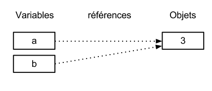

En réalité il existe toujours un seul objet contenant la valeur 3, et la référence est partagée, reliant la variable `a` et la variable `b` au même objet en mémoire.
Ouis mais dans ce cas, que se passe-t-il si je change la valeur de a ????

[source,python]

----
a = 3 # a est un nombre
b = a # b est un nombre
a = "test" # b vaut il "test" ou 3 à ce moment là ?
----

pass:macros[http://pythontutor.com/visualize.html#code=a+%3D+3+%0Ab+%3D+a+%0Aa+%3D+%22test%22+&mode=display&cumulative=true&heapPrimitives=true&drawParentPointers=true&textReferences=false&showOnlyOutputs=false&py=2&curInstr=0[Voir l'execution en ligne\]]

Et bien en fait, cela dépend des cas.

Tout objet dans Python est classifié en deux catégories, *mutable* ou *immutable*

Dans le cas des objets dit *immutables*, python crée un nouvel objet `test`, et il le relie par une référence à l'objet variable `a`

L'objet de valeur 3 reste quand à lui relié par une référence à la variable `b`.

Autrement dit, il n'est pas possible de modifier un objet lorsqu'il a été créé, il est dit *immutable*.

A l'inverse de ce fonctionnement, *un objet mutable* peut être en partie modifié (les éléments qui le composent), et nous verrons qu'en ce sens il faudra être *vigilant*, pour plusieurs raisons :

* car si vous changez la valeur, la ou les références restent intactes, et cela peut créer des problèmes de cohérence dans votre programme.
* car certains objets jouent le rôle de `container`, et peuvent embarqués des références avec eux (par exemple, une liste peut contenir une variable, qui pointe via une référence sur un objet externe à la liste). +
Peu importe alors qu'ils soient mutables (les objets listes et dictionnaires) ou immutables (les objets tuples), le contenu de ces `container` lui est de toute façon *mutable*. C'est le principe même des containers que de pouvoir stocker, lire et modifier leurs éléments. Là aussi nous en reparlerons plus en détails lorsque nous aborderons la section sur les listes.

La classification est donc assez simple :

* les types suivant `Numbers`, `String`, `Tuples` sont *immutables*
* les types suivant `Lists`, `dictionnaries` sont *mutables*

Par exemple :

[source,python]
----
# Pour des chaines de caractères
a = "test"
a[0] = "v" # impossible de changer le premier caractère de la chaîne

# Pour des variable de type Numbers, donc immutable
# la variable a n'est pas modifié par le changement de b, une nouvelle valeur en mémoire est créée !
a = 3
b = a
b = b + 4

# Pour des Lists, mutable, on voit que le comportement est totalement différent !
# La modification de a impacte aussi b, et inversement !
a = [3,2,5]
b = a
a.append(6)
b.append(8)
----

pass:macros[http://pythontutor.com/visualize.html#code=a+%3D+3%0Ab+%3D+a%0Ab+%3D+b+%2B+4%0A&mode=display&cumulative=true&heapPrimitives=true&drawParentPointers=false&textReferences=false&showOnlyOutputs=false&py=2&curInstr=0[Voir l'execution en ligne\]]

pass:macros[http://pythontutor.com/visualize.html#code=a+%3D+%5B3,2,5%5D%0Ab+%3D+a%0Aa.append(6)%0Ab.append(8)&mode=display&cumulative=true&heapPrimitives=true&drawParentPointers=false&textReferences=false&showOnlyOutputs=false&py=2&curInstr=0[Voir l'execution en ligne\]]

[red]*Complexe, n'est-ce-pas ?*

Pas tant que ça en fait, vous verrez qu'au jour le jour, et sur des programmes simples, ça ne vous posera aucun problème, ... il n'y a que dans quelques cas particuliers qu'il faut être vigilant, nous en reparlerons quand nous aborderons les listes.

****
.En savoir plus sur python et les variables :
 * http://openbookproject.net/thinkcs/python/english2e/

.En savoir plus sur le modèle objet de Python :
* http://docs.python.org/reference/datamodel.html

.En savoir plus sur le typage des données en général :
 * http://en.wikipedia.org/wiki/Type_system#Type_checking
****

=== Type des variables

Par chance pour vous, le typage des variables est dynamique (à l'inverse du *typage statique* vu en cours avec le pseudo-code). +
Autrement dit, python est capable de détecter à la lecture de votre ligne de commande quel type de valeur à partir de la valeur que vous affectez à une variable.

Il n'est donc plus utile de préciser quelle *type/nature de valeur* vous allez stocker dans votre variable.

*Mais ce système à son revers*, et il faut être vigilant car de nombreux bugs peuvent donc avoir lieu durant l'execution du programme...

Ainsi un programme peut se revéler correct pour l'interpréteur, mais plantera à l'execution car la nature des données attendues par votre programme divergera de ce qu'il aura vraiment reçu.

Un peu comme si vous passiez un __parapluie__ à un joueur de tennis attendant une __raquette__.

De ce fait, le programme ne saura plus quoi faire et s'arretera dans le meilleur des cas.

.principaux types du langage :
[options="header"]
|=================
|Types | Exemples
|Numbers | 1234, 3.1415
|Strings | \'spam',"guido\'s"
|Booleans | True , False
|Lists | [1, [2, \'three'], 4]
|Dictionnaries | {\'food': \'spam', \'taste': \'yum'}
|File | myfile = open(\'eggs', \'r')
|=================

CAUTION: Ce n'est pas parce que il n'y a plus besoin de typer les variables que celle-ci ne possèdent pas un type !
La méthode __type()__ nous retourne le type d'une variable après son initialisation.

[source,python]
----
nbJambes = 2
type(nbJambes)

# re-affectation de la variable nbJambes
nbJambes = "deux"
type(nbJambes)
----
== Commentaires

Afin de pouvoir transmettre le code à quelqu'un qui ne l'a jamais lu, il est courant et recommandé de rajouter des commentaires dans votre programme.
En python il y a plusieurs façons d'écrire des commentaires, avec `#` ou `"""`

.Afficher du texte
[source,python]
----
"""
Ceci est un commentaire
sur plusieurs lignes !
"""
reponse = 42
print "Je reviendrai." # Ceci est un commentaire en fin de ligne ...
# qui peut aussi être ici en début de ligne ...
print reponse
----

NOTE: Les informations sur le *style* à adopter pour les commentaires, l'indentation, etc sont définis dans une *guideline* : +
http://www.python.org/dev/peps/pep-0008/

== Input / Output

=== Sorties : print()

La méthode `print()` permet d'afficher du texte ainsi que le contenu des variables.

.Afficher du texte
[source,python]
----
reponse = 42
print "Je reviendrai."
print reponse
----

Tout ce qui est compris entre deux quotes `"` et `"` est considéré comme un type `String` par python.
Toutefois, nous allons voir ici qu'il possible d'imbriquer des variables dans une chaine de caractère, ce qui peut s'avérer très pratique quand on veux afficher divers résultats.
De nombreuses écritures sont possibles à affichage égal, nous allons seulement en voir quelques une ci-dessous :

.Concatener du texte avec une variable
[source,python]
----
reponse = 42
print "La grande question sur la vie, l'univers et le reste est", réponse

age = 900
print "Quand ", age , "ans comme moi tu auras, moins en forme tu seras !"

animal = "Tyranosaure"
print "Le ", animal, "  n'obéit à aucun schéma de groupe ni aucun horaire de parc d'attraction. C'est l'essence du chaos."

----

.Concatener du texte avec du texte
[source,python]
----
vetements = "vêtements, tes bottes"
vehicule = "moto"
print "Je veux tes " + vetements + " et ta " + vehicule
print "Hasta" + "la vista" + "baby"
----

.Concatener du texte avec des variables
[source,python]
----
tirade1 = "J'ose tout ce qui sied à un homme, qui n'ose plus n'en est pas un."
tirade2 = "Ignore ce que je suis et procure-moi quelque déguisement qui conviendrait au dessein que je forme."
tirade3a = " Les prolifiques vilenies de dame nature vont pullulant sur lui."
tirade3b = "Dédaignant la fortune et brandissant son épée qui fumait d'une sanglante exécution"

print "Shakespeare a dit : ", tirade1 ,"mais aussi ", tirade2

# ou sinon sous une autre forme en concatenant variable texte et texte :
print "Shakespeare a dit : " + tirade1 + "mais aussi " + tirade2

# ou avec les deux méthodes :
print  "shakespeare a dit : %s, mais aussi %s" % (tirade1, tirade3a + tirade3b)

# cela marche aussi avec les nombres :

print "La grande question sur la %s, %s, et le %s est %d " % ("vie", "l'univers", "le reste", 42)
----

CAUTION: Attention toutefois à ne pas tout mélanger ! les Types `String` et `Numbers` ne peuvent être concatenés avec l'opérateur `+`

NOTE: avec `,` la variable est automatiquement transformée en chaîne de caractère, contrairement à l'opérateur `+`

[source,python]
----
reponse = 42
print "La réponse à la question est :" + reponse

Traceback (most recent call last):
  File "<stdin>", line 1, in <module>
TypeError: cannot concatenate 'str' and 'int' objects
----

Si jamais vous voulez utiliser cette syntaxe malgré tout, il existe des fonctions qui permettent heureusement de transformer du texte en nombre et inversement :

* `str()` transforme un nombre en texte
* `int()` transforme un texte en nombre

NOTE: Ces fonctions sont livrées avec le langage, nul besoin de les créer. La liste complète est disponible ici : http://docs.python.org/library/functions.html

A ces différents types d'affichage il faut ajouter la possibilité de mettre en forme le texte pour son affichage.
Il existe donc des caractères spéciaux que l'on peux insérer dans une chaîne de caractère afin de modifier son affichage.

.Des caractères spéciaux pour la mise en forme
[source,python]
----
# tabulation
days = "Mon\tTue\tWed\tThu\tFri\tSat\tSun\t"
months = "Jan\nFeb\nMar\nApr\nMay\nJun\nJul\nAug"

# retour à la ligne
print days
print months
----

****
Une liste plus complète des caractères spéciaux, ainsi que de plus nombreuses informations sur le formatage de texte peuvent être trouvées ici :

* les chapitres 6,7,8,9, 10 du livre "learn python the hard way" http://learnpythonthehardway.org/book/
* La documentation officielle http://docs.python.org/reference/lexical_analysis.html#string-literals
****

=== Entrées : raw_input()

La fonction *raw_input(" message ")* est l'équivalent de la commande *LIRE(" message ")* vu en cours d'algorithmie.

[source,python]
----
value = raw_input ("Veuillez saisir un texte ou une valeur")
print value
----

== Fonctions

.Condition simple en Pseudo-Code
****
[red]*FONCTION* _NOMFONCTION_ [red]*(* _arguments1_, _arguments_, _..._, _argumentsN_ [red]*)*

_...traitement..._

[red]*RENVOIE* _[VALUE]_

[red]*FIN FONCTION*
****

Ce qui donne quasiment la même chose en python théorique, le mot clef `def` introduisant le corps de la fonction :

[source,python]
----
def nomFonction (arguments1, arguments2, ... argumentsN):
   #...traitements...
   return value
----

et en pratique :

[source,python]
----
# les fonctions doivent être déclarées avant de pouvoir être appelées !
def somme(a,b):
   return a + b

def multiply(a,b):
   return a * b

# On affiche les valeurs retournées
print somme(1,4) #<1>
print multiply(2,7)

a = 5
b = 2

# On peux passer des variables directement
print somme(2,a)

# ou en les modifiant/ faisant des calculs intermédiaires
print multiply(a + 2,3 * 2 + b)

# les appels de fonctions sont empilables sans aucune limite
print somme(multiply(2,3),somme(4,b + multiply(2,8))) # <2>

----

<1> L'appel de fonction se fait en appelant le *nom de la fonction* suivi des *arguments entre parenthèses*.
<2> Les arguments peuvent être calculés avant execution de la fonction, on peut donc facilement empiler les appels de fonctions comme dans cet exemple.

=== Portées des variables

Par *portée*, il faut entendre la durée de vie des variables dans votre programme ou un bloc d'instruction dans votre programme.

Une variable est soit :

* *globale* : visible de partout dans le programme
* *locale* : seulement visible dans le bloc d'instruction dans laquelle elle a été déclarée.

Les variables globales sont toutes celles qui ne sont pas dans une fonction, donc dans le corps du module, et qui ont été déclarées en entête de programme.
Elles sont visibles de partout dans votre programme, mais nous verrons par la suite qu'elles sont uniquement modifiables si le programmeur utilise le mot clef `global`

Essayons de comprendre la différence concrétement via ces exemples de programme :

.testGlobal.py
[source,python]
----
X = 99 # <1>

def foo1():
   Y = 55 # <2>
   print Y

foo1()
print Y # ne marchera pas # <3>

# On tente de redéfinir X dans cette fonction foo()
def foo2():
   X = 88 # <4>

foo2()
print X # X n'a pas bougé du fait de  <4> ...

# La aussi, ce code ne changera pas la valeur de la variable globale X = 99
def foo3(X):
   X = X + 1 # <5>

foo3(X)
print X

# Accès à la variable globale en lecture
def foo4(Y):
   # Portée locale
   Z = Y + X # <6>
   return Z

foo4(1)

# Accès à la variable globale en écriture
def foo5():
   global X
   X = X + 1 # <7>

foo5()
print X

----

<1> Déclarée *avant* et en *dehors* d'une fonction (dans le corps du module donc), la variable `X` est considérée comme une variable *globale*.
<2> Y est déclaré dans le corps de la fonction, c'est une variable *locale*, c'est à dire temporaire.
<3> Si on tente d'y accéder après appel de la fonction, on se rend bien compte qu'elle a disparue. Le seul moyen de récupérer une (ou plusieurs) valeur est donc de faire un renvoi avec `return`
<4> A partir du moment où il y a affectation dans le corps d'une fonction, Python déclare cette nouvelle variable comme une variable locale, peu importe qu'elle existe par ailleurs.
Autrement dit, elle [red]*masque* la variable `X` déclarée en globale.
De la même façon que précédemment, la variable `X` *disparait/meurt* à la fin de l'execution de la fonction, c'est une *variable temporaire* en quelque sorte.
<5> A partir du moment où vous assignez une valeur à une variable dans une fonction, Python considère qu'il s'agit d'une variable locale.
Ici vous aurez une erreur, car il va tenter d'incrémenter la variable locale X, hors celle-ci n'existe pas dans cette fonction.
<6> Z et Y sont des variables locales. Concernant X, si vous faites appel à une variable *globale*, et qu'elle n'a pas été redéfinie, python est capable de re-trouver par déduction la valeur de votre variable *globale*. Toutefois, celle ci ne sera accessible qu'en lecture et pas en écriture ( car comme vu précédemment toute nouvelle affectation entraine la création d'une nouvelle variable locale).
<7> Il existe un mot clef `global` permettant de passer outre cette limitation vu en 6, et permettant d'accéder en écriture à votre variable *globale*. Cette utilisation est clairement déconseillée car pouvant entrainer de nombreuses incohérences dans votre programme..

Voyons pourquoi dès à présent dans cet exemple :

[source,python]
----
X = 99

def func1():
   global X
   X = 88

def func2():
   global X
   X = 42

func1()
func2()
# ne donnera pas le même resultat que pour
func2()
func1()
----

pass:macros[http://pythontutor.com/visualize.html#code=X+%3D+99%0A%0Adef+func1()%3A%0A++++global+X%0A++++X+%3D+88%0A%0Adef+func2()%3A%0A++++global+X%0A++++X+%3D+42%0A++++%0Afunc1()%0Afunc2()%0A%0Afunc2()%0Afunc1()&mode=display&cumulative=true&heapPrimitives=true&drawParentPointers=false&textReferences=false&showOnlyOutputs=false&py=2&curInstr=0[Voir l'execution en ligne\]]

Compte tenu de ce programme, il est très clair ici qu'il risque de favoriser des conflits sur X, qui est devenu une ressource partagée !

L'ordre d'appels des fonctions aura donc une incidence sur la valeur finale de X, ce qui est *clairement un problème* (pour la recherche d'erreur par exemple) ...

=== Passage d'arguments et retour de données

Quelques règles sur les arguments, et le passage d'arguments à des fonctions en python.

* Les arguments sont passés par *assignation*, autrement dit il n'y a *pas de re-copie des valeurs* dans une nouvelle variable locale lors du transfert comme dans certains langages (cf C, C\+\+) .
* *Peu importe donc le nom de vos arguments*, ils peuvent recouper des noms de variable déjà existant ailleurs dans votre programme puisque *nous savons que leurs portées sont locales.*
* Changer un/plusieurs élément(s) dans un *objet mutable* a une *incidence sur le programme appelant* .

[source,python]
----
def modif(a,b):
   a = 2 # <1>
   b[0] = 5 # <2>

x = 1
list = [1, 2]

modif(x,list)

print x # valeur inchangé
print list # valeur changé
----

pass:macros[http://pythontutor.com/visualize.html#code=def+modif(a,b)%3A%0A++++a+%3D+2%0A++++b%5B0%5D+%3D+5%0A%0Ax+%3D+1%0Alist+%3D+%5B1,+2%5D%0A%0Amodif(x,list)%0A%0Aprint+x+%23+valeur+inchang%C3%A9%0Aprint+list+%23+valeur+chang%C3%A9&mode=display&cumulative=true&heapPrimitives=true&drawParentPointers=false&textReferences=false&showOnlyOutputs=false&py=2&curInstr=0[Voir l'execution en ligne\]]

.Avant execution du corps de la fonction, l'assignation est la suivante :
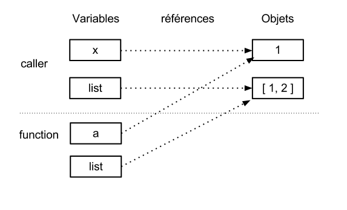

<1> `a` est une variable locale qui récupère la valeur de la variable `x` lors de l'appel de la fonction.
L'assignation n'a pas d'effet sur la variable `x`, seul la variable `a` locale sera modifiée ici.

<2> La liste passée ici en paramètre à une variable locale. Toutefois, une liste est un objet *mutable*, donc modifiable sur place !
Nous ne changeons pas `b`, mais un élément de la liste représentée par b, ce qui aura à la fin de l'execution une répercution sur la variable `list`

.Après execution du corps de la fonction, voici le résultat :
image::images/ref2.png[align="center"]

Un apercu des différentes techniques est donné via le lien ci dessous, mais la meilleur façon reste de renvoyer des données via le mot clef *return*

Référence ici : +
http://docs.python.org/release/2.7.3/faq/programming.html?highlight=nonlocal#how-do-i-write-a-function-with-output-parameters-call-by-reference

.exemple de code source bien écrit
[source,python]
----
sac = 3
def calcul(sac,nbOr): #<1>
   sac = sac + nbOr
   return sac

print calcul(sac,20)
----

pass:macros[http://pythontutor.com/visualize.html#code=sac+%3D+3%0A%0Adef+calcul(sac,nbOr)%3A+%0A++++sac+%3D+sac+%2B+nbOr%0A++++return+sac%0A%0Adef+calcul2(uxzefzzvc,nbOr)%3A+%0A++++uxzefzzvc+%3D+uxzefzzvc+%2B+nbOr%0A++++return+uxzefzzvc%0A%0Aprint+calcul(sac,20)%0Aprint+calcul2(sac,20)&mode=display&cumulative=true&heapPrimitives=true&drawParentPointers=false&textReferences=false&showOnlyOutputs=false&py=2&curInstr=0[Voir l'execution en ligne\]]

<1> Comme la fonction manipule des variables locales, peu importe que les noms d'arguments se recoupent +
  `sac` ou `x` ou `v` dans la définition de la méthode `calcul(..)` ne change rien.

.exemple de code source qu'il faut éviter
[source,python]
----
sac = 3
def calcul(nbOr): #<1>
   global sac #<2>
   sac = sac + nbOr #<3>

calcul(20)
print sac
----

<1> Seul nbOr est une variable locale
<2> On accède à sac en variable globale
<3> Et on le modifie ainsi, c'est mal ! :)

Le mot clef `return` implique quand il est rencontré par le programme, l'arrêt du traitement de la fonction, et le retour du résultat.
Ce qui n'exclue pas la possibilité d'avoir plusieurs fonctions `return` dans un même programme, qui renvoie un résultat en fonction de condition différentes.

.multiples retours de fonctions
[source,python]
----
sac = int(raw_input("nombre de pièces dans votre sac ?"))

def douane(sac):
    taxe = 15
    if sac > taxe:
        print("par ici la monnaie")
        return sac - taxe
    else:
        print("pas de taxe pour les pauvres")
        return sac

print douane(sac)
----

== Listes

=== Définition

Les listes sont l'équivalent des tableaux que nous avons vu en cours. La seule différence,
c'est que les listes sont *forcément dynamiques*, et elles peuvent stocker *n'importe quel type de données*.

A ce titre elles sont considérées comme des `containers` car elles peuvent stocker des *objets quelconques* ou bien des *références d'objets* (par exemple des fonctions).

.initialiser une liste
[source,python]
----
#Une liste 1D vide
listX = []

# 1 dimension
listA = [ 1,2,3,4 ]
print len(listA) # 4 elements

# 2 dimension matrice
listB = [ [1,2],[2,3],[4,5]]
print listB

# 2 dimension non symmétrique
listC = [[1,2,3], [2,1], [4]]
print listC
----

Initialiser une liste avec d'autres listes :

.initialiser une liste avec d'autres listes
[source,python]
----
listA = [ 1,2,3,4 ]
listB = [ 1,2 ]
listC = [listA, listB]

print listC
----

Construire une liste avec la fonction `append()` :

.initialiser une liste avec une fonction python
[source,python]
----
listA = []
for i in range(3):
  listA.append(1)

print listA
----

pass:macros[http://pythontutor.com/visualize.html#code=listA+%3D+%5B%5D%0Afor+i+in+range(3)%3A%0A++listA.append(1)%0A%0Aprint+listA&mode=display&cumulative=true&heapPrimitives=true&drawParentPointers=false&textReferences=false&showOnlyOutputs=false&py=2&curInstr=0[Voir l'execution en ligne\]]

Avec des fonctions, même principe pour l'initialisation, seul l'appel du tableau est un peu différent.

.initialiser une liste avec des fonctions
[source,python]
----
# 1 dimension avec des fonctions
def somme(a,b):
  return a + b

def multiply(a,b):
  return a * b

listd = [somme,multiply]
print listd[0](1,2)
print listd[1](2,9)
----

pass:macros[http://pythontutor.com/visualize.html#code=%23+1+dimension+avec+des+fonctions%0Adef+somme(a,b)%3A%0A++return+a+%2B+b%0Adef+multiply(a,b)%3A%0A++return+a+*+b%0A%0Alistd+%3D+%5Bsomme,multiply%5D%0Aprint+listd%5B0%5D(1,2)%0Aprint+listd%5B1%5D(2,9)&mode=display&cumulative=true&heapPrimitives=true&drawParentPointers=false&textReferences=false&showOnlyOutputs=false&py=2&curInstr=0[Voir l'execution en ligne\]]

.afficher un élément dans une liste
[source,python]
----
# 1 dimension
listA = [1,2,3,4]
print listA[0]

# 2 dimension matrice
listB = [[1,2],[2,3],[4,5]]
print listB[1][0]

# 2 dimension non symmétrique
listC = [[1,2,3], [2,1], [4]]
print listC[0][2]
print listC[2][0]
----

En rapport avec la section qui discutait des références et du passage d'argument lorsque l'objet est *mutable* (comme l'objet liste) que se passe-t-il pour une liste qui contient des références vers des objets ?

.changement sur place d'une liste
[source,python]
----
L1 = [2,3,4]
L2 = L1
----

Jusqu'à présent, rien de particulier, le comportement est le même qu'avec des objets immutables.

.affectation normale
image::images/lref1.png[align="center"]

[source,python]
----
L1 = [2,3,4]
L2 = L1
L1 = 24
----

.re-assignation normale
image::images/lref2.png[align="center"]

Dans ce cas-là, là encore le mécanisme marche, Python détecte le changement et il crée un nouvel objet de valeur 24, qu'il rattache à la variable `L1`

[source,python]
----
L1 = [2,3,4]
L2 = L1
L1[0] = 10
----

pass:macros[http://pythontutor.com/visualize.html#code=L1+%3D+%5B2,3,4%5D%0AL2+%3D+L1%0AL1%5B0%5D+%3D+10&mode=display&cumulative=true&heapPrimitives=true&drawParentPointers=false&textReferences=false&showOnlyOutputs=false&py=2&curInstr=0[Voir l'execution en ligne\]]

Dans ce cas là, tout est différent car nous accédons à l'intérieur de l'objet `L1` sans qu'il y ait ré-affectation, il n'y a donc pas de modification de la référence comme précédemment.

[red]*L1 et L2 désigne donc toujours le même objet, donc la modification est valable pour les deux !!*

[source,python]
----
print L1
print L2
----

.modification d'un élément de l'objet liste mutable
image::images/lref3.png[align="center"]

Voyons un cas encore plus vicieux, lorsque notre liste comporte une référence vers un autre objet.

[source,python]
----
L1 = [2,3]
L2 = [1, L1, 8] # L2 contient une référence vers L1
print L1
print L2
----

pass:macros[http://pythontutor.com/visualize.html#code=listA+%3D+%5B%5D%0Afor+i+in+range(3)%3A%0A++listA.append(1)%0A%0Aprint+listA&mode=display&cumulative=true&heapPrimitives=true&drawParentPointers=false&textReferences=false&showOnlyOutputs=false&py=2&curInstr=0[Voir l'execution en ligne\]]

Que se passe-t-il si je modifie les éléments appartenant à L1 dans L2 ?

[source,python]
----
L2[1].append(5)
print L1
print L2
# marche aussi en modifiant L1
L1.append(8)
print L1
print L2
----

pass:macros[http://pythontutor.com/visualize.html#code=L1+%3D+%5B2,3%5D%0AL2+%3D+%5B1,+L1,+8%5D+%23+L2+contient+une+r%C3%A9f%C3%A9rence+vers+L1%0Aprint+L1%0Aprint+L2%0A%0AL2%5B1%5D.append(5)%0Aprint+L1%0Aprint+L2%0A%0A%23+marche+aussi+en+modifiant+L1%0AL1.append(8)%0Aprint+L1%0Aprint+L2&mode=display&cumulative=true&heapPrimitives=true&drawParentPointers=false&textReferences=false&showOnlyOutputs=false&py=2&curInstr=0[Voir l'execution en ligne\]]

[red]*Surprise !* Les éléments de L1 ont été modifiés ! Donc Python accède bien à `L1` dans `L2` via une référence vers `L1` et non pas une copie des éléments du tableau !

.visualisation de la référence entre L2 et L1
image::images/lref4.png[align="center"]

Si on veut éviter ce comportement, par peur de faire des erreurs, ou parce que c'est inutile, on peut indiquer à Python que l'on veut faire une copie, avec l'opérateur `[:]` :

[source,python]
----
L1 = [2,3]
L2 = [1, L1[:], 8] # L2 contient une re-copie de la liste L1
print L1
print L2
----

Pour connaitre la taille d'une liste, on utilise la méthode len() fournie par le langage.

.récupérer la taille d'une liste
[source,python]
----
# 1 dimension
listA = [1,2,3,4]
print len(listA)

# 2 dimension matrice
listB = [[1,2],[2,3],[4,5]]
print len(listB) , "/" , len(listB[0]), "/", len(listB[1]), "/", len(listB[2])

# 2 dimension non symmétrique
listC = [[1,2,3], [2,1], [4]]
print len(listC)
print len(listC[0])
print len(listC[1])
print len(listC[2])

----

=== Opérations

.Modifier un élément
[source,python]
----
listA = [1,5,3]
listB = ["gerard", "paul", "albert"]
listA[0] = 2
listB[1] = "Edouard"
print listA
print listB
----

Les listes, comme beaucoup d'autres choses en python, sont des objets qui possèdent des méthodes, et des attributs.
C'est l'opérateur `.` qui permet d'accéder et d'appliquer des méthodes sur les objets.

Autrement dit, voici comment se présente un attribut et une méthode/fonction *s'appliquant sur un objet* :

* *objet.attribut*
* *objet.methode()*

Si l'objet est la liste, alors nous allons voir toutes les méthodes qui s'appliquent sur celle-ci.

CAUTION: La plupart de ces méthodes/fonctions ne retournent rien, et modifient la liste en place.

.Ajouter des éléments
[source,python]
----
listA = [1,5,3]
listA.append(4)
print listA

listB = ["oeuf","jambon"]
listB.append("Frites")
print listB

listC = ["gerard", "paul", "albert"]
listC.append(["Eleonore",5])
print listC

listD = []
listD.append(1)
listD.append([2,3])
listD.append("test")
print listD
----

.Insérer des éléments
[source,python]
----
listA = [1,5,3]
# Insérer un 8 à la position 2 se fait avec la commande suivante :
listA.insert(2,8)
print listA
----

.Supprimer des éléments en utilisant l'indice et la fonction pop()
[source,python]
----
listA = [1,5,3]
# pop renvoie la valeur supprimé
print "element supprimé = " , listA.pop(1)
print "liste après suppression", listA

listB = [[2,3],[1,4]]
print "element supprimé = " , listB[0].pop(1)
print "liste après suppression", listB
----

.Supprimer des occurence de valeurs directement avec remove()
[source,python]
----
listA = [1,5,3]
listB = [2,4,3,4]

#Enleve le chiffre 5 de la liste A
listA.remove(5)
print listA

# Enleve la première occurence 4 de la liste B
listB.remove(4)
print listB
----

.Accèder à l'index d'une occurence avec index()
[source,python]
----
listA = [1,5,3]
listB = [2,4,3,4]
listC = [[2,3],[1,4]]

print "index liste A = ", listA.index(3)
print "index liste B = ", listB.index(4) # Ne renvoie l'index que de la première valeur trouvée
print "index liste C = ", listC[1].index(4) # Marche aussi sur les tableau deux dimensions, a condition d'indiquer la dimension de recherche !!
----

.Concaténation
[source,python]
----
listA = [1,5,3]
listB = [2,[4,3]]
listC = ["gerard", "paul", "albert"]

print listA + listB
print listA + listC + listB
----

.Multiplication
[source,python]
----
listA = [1,5,3]
print listA * 2
----

.tri
[source,python]
----
listA = [1,5,3]
listB = [2,4,3,4]
listC = [[3,2],[4,1]]

# Modifie la liste en place
listA.sort()
listB.sort()
listC[0].sort()
listC[1].sort()

print listA
print listB
print listC

----

[red]*Attention*, et c'est très important, les listes sont dites *mutables* en comparaison des autres types qui sont pour la plupart du temps *immutables* +
Par mutable, il faut comprendre qu'elles sont donc modifiables en l'état, sans qu'une copie ait besoin d'être faite :

.Copie
[source,python]
----
listA = [1,5,3]
listB = listA[:]
listB.append(8)

print listA
print listB
----

[NOTE]
.Quelques ressources supplémentaires :
====
* La liste complète des méthodes est disponible ici, avec des exemples : +
http://docs.python.org/tutorial/datastructures.html#more-on-lists

* voir aussi les exemples et les exercices de Google : +
http://code.google.com/edu/languages/google-python-class/lists.html

* et de "learn python the hard way" : +
http://learnpythonthehardway.org/book/ex38.html
====

== Structure de controle

=== Condition(s)

.Condition simple en Pseudo-Code
****
[red]*SI* _[ EXPRESSION ] == TRUE_ [red]*ALORS*

_...traitement..._

[red]*FIN SI*
****

En python les mots-clef équivalents sont *if* , *elif*, *else* et *:* et c'est la forme de l'indentation qui définit la taille du bloc d'instruction.

La condition la plus simple donne en python :

[source,python]
----
if (expression == True):
   # traitement
----

.Condition simple en Pseudo-Code
****
[red]*SI* _[ EXPRESSION ] == TRUE_ [red]*ALORS*

_...traitement..._

[red]*SINON*

_...traitement..._

[red]*FIN SI*
****

Ce qui donne en python :

[source,python]
----
if (expression == True):
   # traitement 1
else:
   # traitement 2
----

.Condition plus complexe en Pseudo-Code
****
[red]*SI* _[ EXPRESSION ] == TRUE_ [red]*ALORS*

_...traitement..._

[red]*SINON* _[ EXPRESSION ] == TRUE_

_...traitement..._

[red]*SINON*

_...traitement..._

[red]*FIN SI*
****

Ce qui donne en python :

[source,python]
----
if (expression == True):
   # traitement 1
elif (expression == True):
   # traitement 2
else:
   # traitement 3
----

Le mot-clef `in` peut être utilisé en accord avec les structures conditionnelles
pour vérifier la présence (ou la non présence) d'un élément dans une liste, que cela soit un chiffre ou un caractère.

Ainsi, grâce à cette notation, il est possible de faire des choses très intéressantes :

[source,python]
----
myList = ["alex","paul","gerard","martine","helene","laurent"]
element = raw_input("Quel nom  ? > ")

if element not in myList:
   print "L'element n'est pas présent! "
else:
   print "L'element est présent = ", element
----

ou bien autre exemple :

[source,python]
----
censor = [ 'bugger', 'nickle' ]
word = 'bugger'
if word in censor:
   print 'CENSORED'
----

=== Boucle(s)

==== Definition ====

En programmation impérative, une structure de contrôle est une commande qui contrôle l'ordre dans lequel les différentes instructions d'un algorithme ou d'un programme informatique sont exécutées.

.Boucle "TANT QUE" en Pseudo-Code
****
[red]*TANT QUE* _[ EXPRESSION ] == TRUE_

_...traitement..._

[red]*FIN TANT QUE*
****

En python on utilisera le mot-clé `while`

[source,python]
----
while expression == True:
   # traitement
----

Ce qui donne par exemple :

[source,python]
----
count = 0
while (count < 9):
   print 'The count is:', count
   count = count + 1
----

.Boucle "POUR" en Pseudo-Code
****
[red]*POUR* _[ VARIABLE ]_ [red]*DE* _[ DEBUT ]_ [red]*A* _[ FIN ]_

_...traitement..._

[red]*FIN POUR*
****

En fait en python cette instruction n'existe pas sous cette forme,
par contre il existe des opérateurs très pratiques pour parcourir des listes avec des boucles.
Il est possible d'obtenir le même comportement en utilisant la fonction *xrange()* générant une liste allant de __[DEBUT]__ A __[FIN]__

==== Parcours de liste

===== for in

Python est aussi capable de manipuler directement les éléments du tableau, sans avoir à passer par les indices, même si la liste contient des éléments complexes

[source,python]
----
# Avec une liste simple
myList = ["alex","paul","gerard","martine","helene","laurent"]
for element in myList:
   print "L'element est = ", element

# ou avec une liste plus complexe
myList = ['paul', "laurent", 4, [3,2]]
for element in myList:
   print "L'element est de type ", type(element) , " = ", element
----

Malheureusement dans ce cas-là, nous n'avons pas accès aux indices, et donc nous ne savons pas de façon explicite de quelle position dans le tableau nous avons extrait l'élément.
Dans certains cas de figure cela peut poser problème (les tris par exemple où nous avons besoin de manipuler des indices), pour résoudre cela, il existe plusieurs autres syntaxes python :

===== for in + xrange()

Première solution, en générant une liste allant de *__[DEBUT]__* A *__[FIN]__* avec la fonction `xrange()` , il est possible de faire évoluer une variable qui va prendre de manière sucessive les différentes valeurs de notre liste, quelle soit générée ou donnée par l'utilisateur :

.Avec une liste générée par la fonction xrange()
[source,python]
----
# xrange() génère une liste allant de debut a fin - 1 , fin étant exclu
debut = 1
fin = 4

print xrange(debut, fin) # renvoie une liste [2, 3]

for i in xrange(debut,fin): # ou xrange(2,4) cela marche aussi
   print 'The count is:', i

#Par défaut xrange va de 0 a la valeur - 1 passé en paramètre
for i in xrange(5):
   print "The count is:", i
----

.Pour lire et afficher les éléments d'une liste
[source,python]
----
myList = ["alex","paul","gerard","martine","helene","laurent"]
for i in xrange(len(myList)):
   print "At index", i, " value equal ", myList[i]
----

De façon plus générale, python nous permet de parcourir n'importe quel type de collection, résultat d'une fonction (comme c'est le cas pour `xrange()`) ou bien définie par l'utilisateur ...

.Parcour d'une liste avec une liste d'indices personnalisés
[source,python]
----
# Equivalence avec l'exemple précédent
myList = ["alex","paul","gerard","martine","helene","laurent"]
myIndex = [0, 2 , 3]
for i in myIndex:
   print "At index ", i ," value equal ", myList[i]
----

Deuxième solution, plus élégante mais plus complexe, il est possible de conserver un appel direct aux élémentx de la liste, tout en récupérant l'index.
Pour cela on fait appel a la fonction enumerate() qui nous renvoie une collection avec les élémentx numérotés utilisables avec la notation ci-dessous :

[source,python]
----
myList = ["alex","paul","gerard","martine","helene","laurent"]
for i,element in enumerate(myList):
   print "At index ", i ," value equal ", element
----

===== For in + zip()

Il est également possible de parcourir deux listes de façon simultanée en joignant les éléments de chaque liste à fusionner 1 par 1
Voyons voir ce que nous retourne la fonction `zip(listA,listB)`

[source, python]
----
questions = ["name", "quest", "favorite color"]
answers = ["lancelot", "the holy grail", "blue"]
result = zip(questions,answers)
print result
#renvoie [('name', 'lancelot'), ('quest', 'the holy grail'), ('favorite color', 'blue')]
----

pass:macros[http://pythontutor.com/visualize.html#code=questions+%3D+%5B%22name%22,+%22quest%22,+%22favorite+color%22%5D%0Aanswers+%3D+%5B%22lancelot%22,+%22the+holy+grail%22,+%22blue%22%5D%0Aresult+%3D+zip(questions,answers)%0Aprint+result&mode=display&cumulative=true&heapPrimitives=false&drawParentPointers=true&textReferences=false&showOnlyOutputs=false&py=2&curInstr=0[Voir l'execution en ligne\]]

Une liste de Tuple (question,réponse) nous est renvoyés, dans notre boucle il est donc possible pour chacun des éléments tuple () de notre liste d'assigner *q* à question et *a* à reponse

[source,python]
----
questions = ["name", "quest", "favorite color"]
answers = ["lancelot", "the holy grail", "blue"]
resultOfZipping = zip(questions,answers)
for q, a in resultOfZipping :
   print 'What is your %s ?  It is %s' % (q, a)

# ou plus simplement :

questions = ["name", "quest", "favorite color"]
answers = ["lancelot", "the holy grail", "blue"]
for q, a in zip(questions, answers):
   print 'What is your %s ?  It is %s' % (q, a)
----

==== Construire à une liste

.Opérer sur une liste 1 dimension
[source,python]
----
L = [1,2,3,4,5] # Liste de valeurs quelconques
res = [] # Initialisation d'une liste vide résultat

for x in L:
   res.append(x + 10)

print res

# ou bien avec l'autre technique :

L = [1,2,3,4,5] # Liste de valeurs quelconques
res = [] # Initialisation d'une liste vide résultat

for x in xrange(0,len(L)):
   res.append(L[x] + 10)

print res
----

.Opérer sur une liste 2D, ici une initialisation
[source,python]
----
a = [] # initialisation tableau contenant les lignes
for i in xrange(3):
   b = [] # initialisation
   for j in xrange(3):
      b.append(i*j) # ajout colonne
   a.append(b) # ajout n colonne comme une nouvelle ligne
print a
----

pass:macros[http://pythontutor.com/visualize.html#code=a+%3D+%5B%5D+%23+initialisation+tableau+contenant+les+lignes%0Afor+i+in+xrange(3)%3A%0A+b+%3D+%5B%5D+%23+initialisation%0A+for+j+in+xrange(3)%3A%0A++b.append(i*j)+%23+ajout+colonne%0A+a.append(b)+%23+ajout+n+colonne+comme+une+nouvelle+ligne%0Aprint+a&mode=display&cumulative=true&heapPrimitives=false&drawParentPointers=true&textReferences=false&showOnlyOutputs=false&py=2&curInstr=0[Voir l'execution en ligne\]]

=== Mot-Clef spécifique

Le mot clef *break* interrompt immédiatement une boucle *for* ou *while* en cours

Par exemple dans ce code, il est inutile d'aller jusqu'au bout de la boucle si l'utilisateur a trouvé le bon nombre.

Src du code : http://inventwithpython.com/chapter4.html

.guess.py
[source,python]
----
# -*- coding: utf-8 -*-
import random

if __name__ == "__main__":

   guesses_made = 0
   name = raw_input('Hello! What is your name?\n')
   number = random.randint(1, 20)

   print 'Well, {0}, I am thinking of a number between 1 and 20.'.format(name)

   while guesses_made < 6:
      guess = int(raw_input('Take a guess: '))
      guesses_made += 1
      if guess < number:
         print 'Your guess is too low.'
      if guess > number:
         print 'Your guess is too high.'
      if guess == number:
         break

   if guess == number:
       print 'Good job, {0}! You guessed my number in {1} guesses!'.format(name, guesses_made)
   else:
       print 'Nope. The number I was thinking of was {0}'.format(number)
----

.Execution du programme dans le terminal
[source,console]
$> python guess.py

Le mot clef *continue* passe directement à l'itération suivante et saute les instructions qui suivent, valable pour une boucle *for* et *while*

[source,python]
----
for k in xrange(2,10):
   if k > 3 and k < 8:
     print "skipping this iteration!"
     continue
   print k
----

== Dictionnaires

Les dictionnaires sont un autre type de structures de données permettant de stocker de l'information.

A la différence des listes qui ne peuvent être accédé que par leurs indices, les dictionnaires permettent d'accéder aux données en suivant un schéma dit *clef-valeur*

=== Initialiser un dictionnaire

[source,python]
----
# Initialisation d'un dictionnaire vide
monDictionnaire1 = {}
print monDictionnaire1

# Initialisation d'un dictionnaire déjà rempli
monDictionnaire2 = {"pomme":2, "orange":3}
print monDictionnaire2

# Avec une clef numérique
monDictionnaire3 = {1:"Gauche", 2:"Droite"}
print monDictionnaire3

----

=== Accéder à un dictionnaire

Les dictionnaires ne sont pas des séquences comme les listes, et la clef qui détermine l'entrée dans le dictionnaire peut être numérique, caractère ou composite.

[source,python]
.Lister des éléments
----
monDictionnaire4 = {"pomme":2, "orange":3, "patate":2}
print monDictionnaire4["patate"]

monDictionnaire5 = {1:"Gauche", 2:"Droite"}
print monDictionnaire5[1]

----

[source,python]
.Ajouter des éléments
----
# Initialisation d'un dictionnaire vide
monDictionnaire6 = {}
# et remplissage
monDictionnaire6["patate"] = 3
monDictionnaire6["orange"] = 8
monDictionnaire6["citron"] = 5
print monDictionnaire6

# Ajout dans un dictionnaire existant
# L'ordre n'a aucune d'importance dans un dictionnaire
monDictionnaire7 = {1:"Gauche", 3:"Droite"}
monDictionnaire7[2] = "Milieu"
print monDictionnaire7
----

[source,python]
.Supprimer des éléments
----
monDictionnaire8 = {"pomme":2, "orange":3, "patate":2}
del monDictionnaire8["pomme"]
print monDictionnaire8
----

=== Méthodes spécifiques aux dictionnaires

[source,python]
.Lister les clef dans le dictionnaire
----
monDictionnaire9 = {"pomme":2, "orange":3, "patate":2}
print monDictionnaire9.keys()
----

[source,python]
.Lister les valeurs dans le dictionnaire
----
monDictionnaire10 = {"pomme":2, "orange":3, "patate":2}
print monDictionnaire10.values()
----

[source,python]
.Tester l'existence d'une valeur dans le dictionnaire
----
monDictionnaire11 = {"pomme":2, "orange":3, "patate":2}
print monDictionnaire11.has_key("Pomme")
print monDictionnaire11.has_key("pomme")
print monDictionnaire11.has_key("citron")
----

=== Parcourir les dictionnaires

[source,python]
.Parcourir les clef
----
monDictionnaire12 = {"pomme":2, "orange":3, "patate":2}
for clef in monDictionnaire12:
	print clef
----

[source,python]
.Parcourir les valeurs
----
monDictionnaire13 = {"pomme":2, "orange":3, "patate":2}
for clef in monDictionnaire13:
	print monDictionnaire13[clef]
----

[source,python]
.Parcourir les clef + valeurs
----
monDictionnaire14 = {"pomme":2, "orange":3, "patate":2}
for clef, valeur in monDictionnaire14.items():
	print clef ," = ",  valeur
----

== POO

=== Définition

Comme on a pu le voir au début de ce document, en python tout est *objet*

image::images/ontology.gif[align="center"]

Pour rappel, la Programmation Orientée Objet (ou *http://fr.wikipedia.org/wiki/Programmation_orient%C3%A9e_objet[POO]*) est un paradigme de programmation qui passe par une organisation des données particulière. Depuis son invention, ce paradigme domine dans l'industrie informatique.

Nous n'avons que *très peu de temps pour aborder les concepts théorique* en regard avec la POO. Sachez toutefois que vous allez manipuler les concepts théoriques lors des cours de modélisation à l'ENSG et que l'apprentissage de ceux ci vous aideront autant pour la *représentation de vos problèmes* (avec un langage de description de données comme *UML* par exemple) en base de données, que pour leur *traduction en programme informatique* Je n'insisterai donc pas sur les détails théorique dans ce cours, et vous pouvez vous référez aux ressources dessous pour en savoir plus.

L'intérêt de ce paradigme, vous allez voir, et qu'il s'accorde beaucoup mieux à une représentation complexe de la réalité par rapport à que ce que nous avons vu jusqu'à présent.

Vous verrez lors du cours de modélisation que le vocabulaire et les concepts généraux vont se recouper avec ce que nous allons voir ici. Seul le niveau d'abstraction utilisé pour décrire votre problème rendra plus ou moins difficile une future traduction informatique / base de données.

[red]*Attention* toutefois à ne pas vouloir trop vite coller au langage informatique, car il est très difficile de couvrir correctement la description d'un problème en restant à un niveau d'abstraction trop bas (c'est à dire proche de la machine). Repensez à notre résolution de labyrinthe, et voyez comment l'apprentissage de python à modifié votre perception globale du problème. Il y'aura donc un avant et un après votre formation, et il vous faudra régulièrement savoir jongler entre ces différents niveaux d'abstraction pour être efficace dans la discussion, qu'elle soit avec un client ou avec un développeur informatique !

Un `Objet` est donc une *structure de donnée* qui va nous permettre d'organiser nos données selon un certain schéma:

* autour de la descriptions de ces données (critère descriptif)
* et des moyens de traiter ces données (dynamique).

Prenons par exemple un exemple concret : vous même.

A priori vous êtes un *humain*, et normalement vous partagez un certain nombre de descripteurs ou *attributs* avec vos autres congénères humains :

* Deux yeux
* Deux bras
* Deux jambes
* Une couleur de cheveux
* Une couleur pour les yeux
* Une couleur de peau
* etc.

Là où je veux en venir, c'est que si nous devions gérer des humains dans un programme classique tel que nous les avons fait jusqu'à présent, il nous faudrait autant de variables décrites ci dessous que de personnes. Sachant qu'une variable doit être unique, imaginez le bazar :

[source,python]
----

#Gérard
couleurYeuxGerard = "brun"
couleurCheveuxGerard = "brun"
couleurDePeauGerard = "blanche"
nombreJambeDeGerard = 2
nombreOeilDeGerard = 2
nombreBrasDeGerard = 2

#Paul
couleurYeuxGerard = "vert"
couleurCheveuxGerard = "brun"
couleurDePeauGerard = "blanche"
nombreJambeDeGerard = 2
nombreOeilDeGerard = 2
nombreBrasDeGerard = 2
----

Bon, et maintenant si je doit gérer la classe entière de carthagéo avec ce modèle de représentation de données, il va me falloir un peu de patience...
En plus, vous avez du le remarquer, il y a de nombreuses données redondantes, pourtant nécessaires, car Gérard pourrait bien n'avoir qu'un oeil, une jambe et travailler sur un bateau après tout.

Premier constat, il existe une *matrice* commune, l'espèce humaine.

Deuxième constat, il est possible de trouver une *matrice* originelle à pas mal de choses dans ce monde. Pensez à la fabrication en série, et à l'invention de la reproduction mécanisé : Voiture, Maison, Avion, Animaux, Porte, Chaise, Chanson, SérieTV, Acteur, Réalisateur, Pompier, etc. Et c'est à partir de cette *matrice originelle* que nous allons pouvoir généraliser, ou spécialiser un certain nombre de choses à l'aide de deux choses : des *attributs* et des *fonctions*.

Oui, différencier la couleur des yeux ou des cheveux en *instanciant notre matrice originelle* (c'est à dire en produisant un objet reprenant et complétant *le plan definis* par la matrice originelle) est un bon début, mais si par exemple, je veux aller plus loin et différencier vraiment les humains entre eux, et la manière dont ils interagissent entre eux,il faut que je m'intéresse non seulement aux aspects *statique* mais également *dynamique*.

Par exemple, dans le contexte d'une université (la description de vos données dépend donc beaucoup du *contexte du problème* !), nous voyons qu'une sous-spécialisation de l'être humain générique est tout à fait possible, car dans son interaction avec l'université un étudiant n'a pas tout à fait les même fonctions ni les même droits qu'un professeur, et cela bien que les deux soient des humains !!

.Représentation graphique d'une classe
image::images/classe.png[align="center"]

Cette *matrice originelle* est ce que l'on appelle une *http://fr.wikipedia.org/wiki/Classe_%28informatique%29[classe]*, elle définit à la fois des critères descriptifs ou *attributs*, ainsi que des *fonctions* ou interfaces permettant de communiquer avec les autres objets de ce monde. *Instancier une classe* revient à définir un ou plusieurs *objets* qui dérivent de cette classe.

Pour reprendre notre exemple, Gérard et Paul sont *deux instances* de la matrice originelle *Humain*.

Mais si Gérard est professeur, et Paul étudiant, et que nous voulons les différencier dans notre programme, alors il nous faudra créer quelque chose qui spécialise encore un peu plus notre *Humain*, par exemple en définissant :

* une classe *Etudiant* (qui possède un numéro étudiant par exemple),

* et une classe *Professeur* (qui possède lui d'autres attributs administratif spécifique).

Par chance avec la *POO* nous pourrons également *http://en.wikipedia.org/wiki/Object_composition[composer]* les classe entres elles, car un étudiant est un humain, et un professeur est un humain également !

Il est donc tout à fait possible d'établir une *hierarchie* structurant un peu plus notre programme pour la gestion d'une université, en adoptant soit un *héritage* , soit une *composition* entre les classes : Etudiant et Professeurs contiennent les attributs d'un être humain, mais aussi des attributs (statique) et des fonctions (dynamique) qui leurs sont spécifiques.

En python une classe est définit par le mot clef `class` et un bloc d'instruction clos avec un *début* et une *fin*, comme pour une fonction, une boucle, une condition, etc.

La seule différence avec une fonction, c'est qu'une classe embarque avec elle des fonctions, et des variables (qui représentent les attributs) qui sont caractéristique de la classe que l'on veut représenter.

.Une classe dans son plus simple appareil
[source,python]
----
class Humain(object): # <1>
   nbYeux = 2 #<2>
   nbBras = 2
   nbJambes = 2

   def marche(self): # <3>
      print "Je marche !"
      #... traitement ...

#fin du bloc classe
----

<1> Par convention les classes démarrent avec une majuscule, et le mot clé `object` entre parenthèse est obligatoire
<2> Les variables définies ici correspondent aux *attributs* de notre classe
<3> Les *fonctions* en rapport avec la classe sont définies dans le corps de la classe. Nous verrons par la suite qu'elles peuvent accéder direcement aux attributs de la classe. Seule spécificité comparé à une fonction normale, le mot clef `self` est obligatoire en début de toute vos fonctions.

.Pour instancier une classe, donc créer des objets à partir de cette matrice originelle
[source,python]
----
gerard = Humain() # <1>
paul = Humain () # <2>

print gerard # <3>

print gerard.nbBras # <4>
print paul.marche() # <5>
----

pass:macros[http://pythontutor.com/visualize.html#code=class+Humain(object)%3A%0A++++nbYeux+%3D+2+%0A++++nbBras+%3D+2%0A++++nbJambes+%3D+2%0A%0Adef+marche(self)%3A+%0A++++print+%22Je+marche+!%22%0A+++%23...+traitement+...%0A%0Agerard+%3D+Humain()+%0Apaul+%3D+Humain+()+%0A%0Aprint+gerard.nbBras+%0Aprint+paul.marche()&mode=display&cumulative=false&heapPrimitives=false&drawParentPointers=false&textReferences=false&showOnlyOutputs=false&py=2&curInstr=0[Voir l'execution en ligne\]]

<1> A partir de la matrice originelle, on crééé un objet unique dont la référence est relié à la variable gerard
<2> A partir de la matrice originelle, on créé un nouvel objet unique dont la référence est relié à la variable paul
<3> Cela nous renvoie à la référence de l'objet, que l'on peut donc stocker, puis rapeller par la suite ! (voir l'exemple des listes qui contiennent des variables pointant sur des listes)
<4> On peut récupérer la valeur des attributs de notre objet à l'aide l'opérateur `.`
<5> De la même façon que nous avons appelé un attribut, nous pouvons également appelé une fonction si elle existe, en utilisant l'opérateur `.` suivi du *nom de la fonction* et de *parenthèses* `()` (qui peuvent contenir des arguments comme n'importe quelle fonction ...).

A présent j'aimerais pouvoir modifier les attributs, pour que le nombre de bras, ou de jambes puissent être différents selon les personnes !

Pour cela il faut que j'utilise un *constructeur*, en fait il s'agit d'une fonction *automatiquement appelé à la création de l'objet*

Il s'agit de la fonction `__init()__` qui prend automatiquement l'argument `self` qui est une auto-référence désignant l'objet.

`self` doit être indiqué comme argument dans chacune des fonctions de la classe, c'est obligatoire, c'est ce qui permet à Python de savoir a qui vous faite référence, donc ici à l'objet même ! +
[red]*=>* self = objet courant

Ainsi, pour appeler des attributs depuis des fonctions de votre classe, il faut toujours indiquer `self.nomDeVotreAttribut`

Idem pour appeler une fonction en interne dans une classe, il faut toujours l'apeller avec le mot clef self devant `self.nomDeVotreFonction()`

=== Exemple

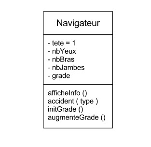

Voyons avec un autre exemple d'humain, le `Navigateur` , et plus spécifiquement, le navigateur pirate !

.pirate.py (voir dans /exercice)
[source,python]
----
class Navigateur(object):
   def __init__(self,yeux,bras,jambes): # <1>
      self.tete = 1 # <2>
      self.nbYeux = yeux # <3>
      self.nbBras = bras
      self.nbJambes = jambes
      self.afficheInfo() # <4>

   def afficheInfo(self): # <5>
      print "Bonjour ! J'ai ", self.nbYeux, "yeux, ", self.tete, " tête, ", self.nbBras, " bras, et ", self.nbJambes, " jambes ..."

   def accident(self,type): # <6>
      if type == "bras":
         self.nbBras = self.nbBras - 1 # <7>
      elif type == "jambe":
         self.nbJambes = self.nbJambes - 1
      elif type == "yeux":
         self.nbYeux = self.nbYeux - 1

   def initGrade(self):
      self.grade = "minable" # <8>
      print "je suis un pirate ", self.grade

   def augmenteGrade(self):
      if self.grade == "minable":
         self.grade = "minus"
      elif self.grade == "minus":
         self.grade = "chef"
      elif self.grade == "chef":
         self.grade = "capitaine"

#fin du bloc classe
----

<1> Notre constructeur initialise et donc personnalise la matrice originelle que représente la classe `Navigateur`
<2> Mais j'ai le droit de définir également des attributs par défaut +
[red]*! Attention !* Les attributs n'existe que dans la portée de la classe (même fonctionnement que pour les fonctions donc)
<3> Je transfere l'argument passé à mon constructeur dans mon attribut de classe
<4> J'appelle une fonction de mon programme à la fin de l'initialisation de l'objet, celle ci affiche des informations sur mon nouvel objet navigateur personnalisé
<5> Une fonction, même si elle ne prend pas d'argument, doit prendre l'argument par défaut nommé 'self'
<6> Ici on passe un argument supplémentaire qui est utilisé dans la fonction.
<7> Je modifie un attribut de mon objet, j'ai le droit du moment que j'utilise self pour indiquer qu'il existe ! +
[red]*=>* sinon cela créé une nouvelle variable locale à la fonction !!
<8> Cette fonction ajoute un attribut grade à mon objet, celui-ci est ensuite accessible normalement comme tout les autres attributs existant et définis dans `__init__`

.Amusons nous maintenant avec une instance de classe : Gérard le pirate !
[source,python]
----
# gerard est un petit navigateur de plaisance, et pour le moment il a tout ses membres :)
gerard = Navigateur(2,2,2)

# il décide de rentrer dans la piraterie
gerard.initGrade()

# Sauf qu'un jour gerard croise un requin au bout d'une planche, le risque du métier, heureusement il s'en tire pas trop mal
gerard.accident("jambe")
gerard.afficheInfo()

# Avec l'experience Gerard fait de grand progrès !
gerard.augmenteGrade()
gerard.augmenteGrade()
gerard.augmenteGrade()
gerard.augmenteGrade()

print "Gerard est maintenant ", gerard.grade ," ! "

# Malheureusement, la vie de capitaine n'est pas facile ...
gerard.accident("yeux")

# Pauvre Gerard ...
gerard.afficheInfo()

----

Exercice ::
Essayez maintenant de faire un autre parcours de vie avec un autre pirate !

=== Stocker des objets

Comme les fonctions les objets possède une adresse en mémoire, vous avez probablement déjà afficher celle ci par erreur avec les fonctions ..

Il est possible de stocker la référence des objets dans une variable, tout comme il est possible de mettre un objet de type liste dans un autre objet de type liste.
Il est donc également possible de stocker la référence d'une fonction, ou d'un objet dans un attributs/variables quelconques, que cela soit dans un objet, dans une liste, dans une variable.

Regardons ça plus en détail dans les exemples ci dessous :

[source,python]
----
def somme(a,b):
   return a+b

def multiply(a,b):
   return a*b

print somme # renvoie une adresse de l'objet en mémoire
print somme() # execute la fonction !

class Personne(object):

   def __init__(self,nom,prenom,age):
      self.nom = nom
      self.prenom = prenom
      self.age = age

   def anniversaire(self):
      print "Bon anniversaire ", self.nom, " !!"
      self.age = self.age + 1

   def information(self):
      print "Mon nom est ", self.nom, " et mon prénom est ", self.prenom
      print "Aujourd'hui j'ai ", self.age, " ans."

tomy = Personne("Ungerer","Tomy",75)
gerard = Personne("Mulot","Gerard",55)
# etc...

# Et donc vous pouvez stocker les références/adresses dans des structures de données, c'est à dire dans des classes (dans les attributs), dans des listes, dans des dictionnaires, etc.
listePersonne = [tomy,gerard]

listeFonctionCalculette = [somme,multiply]

for i in listePersonne:
   i.information()

for i in listePersonne:
   i.anniversaire()

for i in listePersonne:
   i.information()

for i in listeFonctionCalculette:
   print "Resultat = ", i(1,3)

----

Exercice::
. En reprenant l'exemple des navigateurs et du pirate, essayez de stocker plusieurs pirates dans un tableau, et avec un générateur aléatoire d'accident ( => une tempête par exemple) , appliquez des accidents à tel ou tel navigateur de votre tableau !
. Affichez ensuite le résultat de cette tempête !

=== Bref rappel des termes

[source,python]
----
class Navigateur(object)
----

Une classe Navigateur qui hérite d'un `object`, obligatoire pour Python.

[source,python]
----
class Navigateur(object): def __init__(self,yeux,bras,jambes)
----

La classe `Navigateur` est initialisé grâce à la fonction constructeur `__init__` qui prend `self` et 3 paramètres"

[source,python]
----
class Navigateur(object): def accident(self,type):
----

La classe `Navigateur` possède une fonction nommé `accident` qui prend `self` et 1 paramètre"

[source,python]
----
gerard = Navigateur(2,2,2)
----

gerard est une variable qui contient une instance de la classe `Navigateur` (cad un objet)

[source,python]
----
gerard.accident("jambe")
----

Depuis l'instance de la classe `Navigateur` contenu dans la variable `gerard` (cad un objet), je récupère et apelle la fonction `accident` avec `self` et la valeur pour un paramètre.

[source,python]
----
gerard.nbJambes = 1
----

Depuis l'instance de la classe `Navigateur` contenu dans la variable `gerard` (cad un objet), je récupère et écrase l'attribut `nbJambes` avec la valeur passé par `l'affectation`

A l'aide de ces principes, nous essaierons de réfléchir par la suite à la manière de structurer plus efficacement nos futurs programme, comme par exemple le rogueLike.

.Ressources python POO pour aller plus loin :
* http://fr.openclassrooms.com/informatique/cours/langage-python[Partie 3 du cours Python du site openClassRooms]

.Ressource modélisation :
* http://laurent-piechocki.developpez.com/uml/tutoriel/lp/cours/
* http://fr.wikipedia.org/wiki/Diagramme_de_classes

=== Des objets dans des objets ?

image::images/worldofpirates.png[align="left", 500]

C'est ici que se trouve la vrai puissance de la programmation orientée objet, car elle permet de créer un code complexe de façon modulaire et générique.
Reprenons notre exemple du pirate, et essayons de lui créer un monde adapté à sa mesure.

image::images/classNavigateur2.png[align="center", 400]

[source,python]
----
# -*- coding: utf-8 -*-

import random

# Definition des classes du monde des pirates !
class Navigateur(object): # <1>
    def __init__(self, nom, yeux=2, bras=2, jambes=2, argent=0, force=1, grade="minable"):
        self.nom = nom
        self.tete = 1
        self.nbYeux = yeux
        self.nbBras = bras
        self.nbJambes = jambes
        self.argent = argent # <2>
        self.force = force
        self.grade = grade
        self.afficheInfo()

    def afficheInfo(self):
        print "Bonjour ! Je suis ", self.nom, " un navigateur", self.grade, "et de force", self.force, "\n"
        print "J'ai ", self.nbYeux, "yeux, ", self.tete, " tête, ", self.nbBras, " bras, et ", self.nbJambes, " jambes ...\n"
        print "J'ai ", self.argent, " dans ma bourse \n"

    def augmenteGrade(self):
        if self.grade == "minable":
            self.grade = "minus"
        elif self.grade == "minus":
            self.grade = "chef"
        elif self.grade == "chef":
            self.grade = "capitaine"

        self.force = self.force + 1 # <3>
----
<1> La classe Navigateur change un peu, on passe des arguments par défaut pour définir la morphologie et le grade de nos navigateurs. Ainsi on part du principe que le grade par défaut est "minus", et la morphologie normale.
<2> De nouveaux attributs apparaissent dans notre programme : argent, force et grade.
<3> A chaque augmentation de grade on augmente la force du navigateur de 1, par exemple cette fonction peut être appellé à chaque fois que son navire gagne un combat, on peut considérer qu'il augmente de grade.

Les marins sont en général recrutés dans des `Tavernes`, logique non ?

[source,python]
----
class Taverne(object):
    def __init__(self, listeDeNoms, listeDePrenoms):
        self.listDeNoms = listeDeNoms
        self.listDePrenoms = listeDePrenoms

    def debaucher(self): # <1>
        salaire = random.randint(1, 10)
        force = salaire * 1.5
        nomPrenom = " ".join([self.listDeNoms[random.randint(0, len(self.listDeNoms) - 1)],
                              self.listDePrenoms[random.randint(0, len(self.listDePrenoms) - 1)]])
        return Navigateur(nomPrenom, force=int(force)) # <2>
----
<1> En utilisant la liste de noms et prénoms stockés par l'objet `Taverne`, on génère un nouveau objet Navigateur, en piochant au hasard un salaire entre 1 et 10 pièce d'or.
<2> Le Navigateur ainsi créé est renvoyé par la fonction débaucher()

[source,python]
----
class Equipage(object): # <1>
    def __init__(self, marins):
        self.marins = marins

    def jourDePaye(self, sommeParMarin):
        print ("ajoute de l'argent à la bourse de chacun des marins")

class Navire(object): # <2>
    def __init__(self, nom, marins):
        self.nom = nom
        self.equipage = Equipage(marins)

    def combat(self, ennemi): # <3>
        print "combat le bateau ennemi ! "
----

<1> L'équipage se compose de marins, la classe a donc besoin d'une liste de `Navigateur` pour être instancié correctement
<2> La classe navire est responsable d'un équipage et un seul, c'est elle qui créée l'instance de la classe `Equipage` accueillant la liste de `Navigateurs`.
Ainsi la liste de marins passés en paramètres sert ici à instancier la classe `Equipage` stocké par chaque objet `Navire`
<3> La classe qui définit les combats, pour déterminer l'issue du combat et calculer l'abordage, il faut prendre en paramètre un navire ennemi.

[source,python]
----
# Programme principal

# Fonction pour construire equipage
def buildEquipage(nbMarins): # <1>
    equipage = []
    for x in range(nbMarins):
        equipage.append(taverneAPirate.debaucher())
    return equipage

if __name__ == "__main__":
    nomDePirate = ["Bonny", "Jack", "Teach", "Drake", "Morgan", "Nau", "Read"]
    prenomDePirate = ["Anne", "Calico", "Edward", "Francis", "Henry", "Jean", "Mary"]

    taverneAPirate = Taverne(nomDePirate, prenomDePirate) # <2>

	# Deux navires sont instanciés avec des équipages différents
    Navire("Queen Anne's Revenge", buildEquipage(10)) # <3>
    Navire("Adventure Galley", buildEquipage(10))

----

<1> Fonction qui construit un équipage à partir d'une taverne, on s'en sert ensuite plusieurs fois dans <3> et l'instanciation des `Navire`
<2> On instance une `Taverne` à l'aide d'une liste de noms et prénoms de pirates connus.
<3> Les `Navires` sont créés à partir d'équipage construits dynamiquement.

*Exercices* :

[options=interactive]
- [ ] Réaliser les fonctions permettant de calculer un combat entre deux Navires en se basant sur la force des pirates qui les composent.
- [ ] Penser à payer vos pirates à la fin de chaque combat victorieux!
- [ ] Penser à ajouter une ou plusieurs classes de votre choix permettant d'enrichir ce monde de Pirate par de nouvelles aventures.

=== Héritage ou Composition ?

De la même façon qu'il existe les fonctions pour éviter d'avoir à réécrire du code, il existe deux notions en Poo qui permettent de limiter la redondance de code entre des classes qui partageraient les mêmes comportements(attributs et fonctions).

Il faut savoir qu'il n'y a pas de meilleur techniques l'une par rapport à l'autre, tout est avant tout une *question d'usage*. Ainsi n'y a pas de duel entre héritage et/ou composition, il faut seulement savoir que les deux techniques possèdent leurs avantages ou leurs inconvénients, et qu'elle sont bien souvent interchangeables.

==== Héritage

L'héritage est la notion la plus facile à comprendre, et la plus facile à mettre en oeuvre, et donc c'est aussi la plus dangereuse. Il existe un débat très vif sur son utilisation dans le cercle des développeurs. Je vous donne dans la suite du document quelques clefs (non exhaustives) pour mieux comprendre quand il faut, et quand il ne faut pas l'utiliser.

Voici par exemple ce que dit le très bon site de http://learnpythonthehardway.org/book/ex44.html[learn python the hard way] à ce sujet :

[quote, 'suite sur http://learnpythonthehardway.org/book/ex44.html[learn python the hard way]' ]
____
On object-oriented programming, *Inheritance is the evil forest*. Experienced programmers know to avoid this evil because they know that deep inside the Dark Forest Inheritance is the Evil Queen Multiple Inheritance. She likes to eat software and programmers with her massive complexity teeth, chewing on the flesh of the fallen. But the forest is so powerful and so tempting that nearly every programmer has to go into it, and try to make it out alive with the Evil Queen's head before they can call themselves real programmers. You just can't resist the Inheritance Forest's pull, so you go in. After the adventure you learn to just stay out of that stupid forest and bring an army if you are ever forced to go in again.
____

L'héritage permet plusieurs choses, mais on la retient surtout pour sa capacité à factoriser du code tout en spécialisant une classe de base existante, ce qui permet de garder le comportement initial (attributs et méthodes), tout en lui en ajoutant de nouveaux (attributs et méthodes).

Voyons ce que cela donne avec nos pirates ...

image::images/classPiratesMZV.png[align="center", 500]

Pour déterminer si une relation d'héritage est possible ou pas entre deux classes, on peut s'aider de cette règle : *is-a*

* Un PirateZombie *is-a* Pirate
* Un PirateVolant *is-a* Pirate
* Un PirateMagicien *is-a* Pirate

[source,python]
----

# -*- coding: utf-8 -*-

import random

class Pirate(object): # <1>
    def __init__(self,nation):
        self.nation = nation
    def speak(self):
        print "je suis ", self.nation
        print "et je suis un pirate normal ..."

# PirateMagicien is - a Pirate
class PirateMagicien(Pirate): # <2>
    def __init__(self, nation, listFormule = ["Abracadabra"]):
        super(PirateMagicien, self).__init__(nation) # <3>
        self.formules = listFormule # <4>

    def speak(self): <5>
        print "je suis un magicien de nationalité ", self.nation

    def cast(self): # <6>
        self.speak()
        print self.formules[random.randint(0,len(self.formules)-1)]
----

<1> La classe de Base, qui va servir à la dérivation, celle ci n'a rien de particulier.
<2> C'est ici que l'on déclare la dérivation, en indiquant bien de quelle classe on hérite, ici `Pirate`
<3> `super()` est une fonction spéciale qui permet d'apeller la méthode `__init__()` de `Pirate`. C'est ainsi que l'on ajoute les comportements de la classe `Pirate` à notre classe dérivée `PirateMagicien`. Pour que cette méthode s'initialise bien, des paramètres doivent lui être passé en entrées, ce qui explique le passage de nation à la méthode `__init__()` de `Pirate` : `__init__(nation)`
<4> Il est temps de spécialiser notre pirate en lui ajoutant de nouveaux attributs, ici une liste de formules pour lancer un sort.
<5> Si je ne suis pas content du comportement de la classe de base, comme par exemple ici la fonction `speak()` de `Pirate`, je peux toujours l'écraser (plus connu sous l'appelation 'override') par un `speak()` plus adapté comme c'est le cas ici.
<6> Idem, on continue la spécialisation en ajoutant une nouvelle méthode disponible uniquement pour les instances de la classe `PiratesMagiciens`*

Le reste du programme avec d'autres types de pirates spécialisés. +
L'appel des functions propre à chacun est en bas du programme.

[source,python]
----
# PirateZombie is - a Pirate
class PirateZombie(Pirate):
    def __init__(self, nation, vitesse):
        super(PirateZombie, self).__init__(nation)
        self.vitesse = vitesse

    def eat(self):
        self.speak()
        print("miam miam")

    def speak(self):
        print " *Bweahhhh* ", self.nation
        print " *Bweahhhh* Brain ... "

# PirateVolant is - a Pirate
class PirateVolant(Pirate):
    def __init__(self, nation,nomDuBalais):
        super(PirateVolant, self).__init__(nation)
        self.nomDuBalais = nomDuBalais

    def fly(self):
        self.speak()
        print("Je vole sur mon " + self.nomDuBalais)

    def speak(self):
        print "Je suis ", self.nation
        print "et je suis l'as des as pirates ... "

unPremierSpecialiste = PirateMagicien("Italien",["Abracadabra","Bazinga"])
unPremierSpecialiste.cast()

unDeuxiemeSpecialiste = PirateZombie("Haitien",10)
unDeuxiemeSpecialiste.eat()

unTroisiemeSpecialiste = PirateVolant("Hollandais","Alactasar")
unTroisiemeSpecialiste.fly()

----

Ok, comme vous voyez, ça marche plutôt bien, et ça peut nous faire économiser pas mal de code dans certains cas en factorisant les comportements similaires dans une même classe de base.

Toutefois, dans le cadre du développement d'un logiciel plus complexe, on pourrait être tenté de réaliser une hierarchie bien plus grande que celle ci. Voici donc un exemple simple qui montre bien les limites de ce type de hierarchie finalement très *statique*, ou *rigide*.

Que se passe t il dans mon programme si je décide tout à coup que les Pirates peuvent cumulés plusieurs traits, autrement dit, si je veux pouvoir créer des Pirate qui sont par exemple à la fois Volant et Magicien ? ou Zombie et Volant ? etc. Vais je continuer à étendre ma hierarchie ? Non car je vais perdre tout le bénéfice de la factorisation réalisé au préalable.

Voici une proposition de test vue sur stackOverflow, que j'ai traduite ci dessous, et qui permet de detecter avec un peu plus de discernation si vous avez besoin d'un héritage ou plutôt d'une composition dans votre programme :

[TIP]
.Un petit test pour y voir plus clair
====

* Does `TypeB` want to expose the complete interface (all public methods no less) of `TypeA` such that `TypeB` can be used where `TypeA` is expected? Indicates Inheritance.

	e.g. A Cessna biplane will expose the complete interface of an airplane, if not more. So that makes it fit to derive from Airplane.

* Does `TypeB` only want only some/part of the behavior exposed by `TypeA`? Indicates need for Composition.

	e.g. A Bird may need only the fly behavior of an Airplane. In this case, it makes sense to extract it out as an interface / class / both and make it a member of both classes.

**Source** : 'http://stackoverflow.com/questions/49002/prefer-composition-over-inheritance?rq=1[stackoverflow]'
====

[CAUTION]
.Version informaticien du test décrit ci dessus :
====
* http://fr.wikipedia.org/wiki/Principe_de_substitution_de_Liskov[Barbara Liskov's Liskov Substitution Principle] as a test for 'Should I be inheriting from this type?'
* Les principes de POO http://fr.wikipedia.org/wiki/SOLID_%28informatique%29[SOLID]
====

Quelques phrases que j'ai trouvé un peu partout sur Internet qui permettent de cloturer ce sujet épineux :

[quote, 'suite sur http://learnpythonthehardway.org/book/ex44.html[learn python the hard way]'  ]
____
Most of the uses of inheritance can be simplified or replaced with composition, and multiple inheritance should be avoided at all costs.
____

[quote, 'http://berniesumption.com/software/inheritance-is-evil-and-must-be-destroyed[berniesumption]']
____

All of the pain caused by inheritance can be traced back to the fact that inheritance forces *is-a* rather than *has-a* relationships. If class R2Unit extends Droid, then a R2Unit is-a Droid. If class Jedi contains an instance variable of type Lightsabre, then a Jedi has-a Lightsabre.

The difference between *is-a* and *has-a* relationships is well known and a fundamental part of OOAD, but what is less well known is that almost every *is-a* relationship would be better off re-articulated as a *has-a* relationship.
____

[quote, 'suite sur http://www.ronaldwidha.net/2009/03/22/a-good-example-of-favouring-composition-over-inheritance/[ronaldwidha.net]' ]
____
Inheritance doesn’t work in real life
During my Computer Science studies, I learned about a cliche example of Student and Teacher classes should inherit from a Person base class. All the common properties and methods should be put in the base class, therefore when new common properties and methods are added, they will not be duplicated in different child classes.In reality, this almost never happens.
____

CAUTION: Il faut privilégier la composition dès que votre hierarchie de classe vous parait trop complexe ou inadapté.

[NOTE]
====
Pour aller plus loin dans le débat héritage vs composition :

* http://learnpythonthehardway.org/book/ex44.html
* http://www.copypasteisforword.com/notes/use-inheritance-properly
* http://stackoverflow.com/questions/49002/prefer-composition-over-inheritance?rq=1
* http://www.artima.com/lejava/articles/designprinciples4.html
* http://stackoverflow.com/questions/1020453/whats-the-point-of-inheritance-in-python?rq=1
* http://berniesumption.com/software/inheritance-is-evil-and-must-be-destroyed/
* http://en.wikipedia.org/wiki/Composition_over_inheritance
====

==== Composition

Cette notion est moins facile à comprendre et demande l'écriture de plus de code, mais par contre elle amène aussi beaucoup plus de souplesse pour penser l'architecture de vos programmes.

Si on change notre façon de raisonner en essayant d'externaliser les comportements de notre `Pirate` initial.  En utilisant la relation *has-a* propre à l'aggrégation ou à la composition, il est possible de construire des objets complexes à partir de sous blocs plus simple, pensé pour être réutilisable.

Est ce que notre exemple de pirate aux multiples fonctionnalités (volant, zombie, magicien) devient possible ?

[source,python]
----
# -*- coding: utf-8 -*-

import random

class MagicPower(object):
    def __init__(self,power):
        self.power = power

    def cast(self):
        print ("pfscht ")

class ZombiePower(object):
    def __init__(self,vitesse):
        self.vitesse = vitesse

    def eat(self):
        print("miam")

class VolantPower(object):
    def __init__(self,nomDuBalais):
        self.nomDuBalais = nomDuBalais

    def fly(self):
        print "Je vole sur mon ", self.nomDuBalais
----

Il y a plusieurs façon de voir une composition, tout dépend du problème.

Dans cette première version les classes sont créés directement dans la classe `PirateZombieMagicien`, elles sont donc liées à celle ci.
Si le `PirateZombieMagicien` se faisait tuer, alors les définitions des classes qu'il contient sont également perdus.

image::images/classPiratesCompose.png[align="center", 500]

[source,python]
----
#Pirate Zombie Magicien has-a MagicPower, has-a ZombiePower
class PirateZombieMagicien(Pirate):
    def __init__(self, nation):
        super(PirateZombieMagicien, self).__init__(nation)
        self.magic = MagicPower(5)
        self.zombie = ZombiePower(2.5)

    def eat(self):
        self.zombie.eat()

    def cast(self):
        self.magic.cast()

#Pirate Zombie Magicien has-a VolantPower, has-a ZombiePower
class PirateZombieVolant(Pirate):
    def __init__(self, nation):
        super(PirateZombieVolant, self).__init__(nation)
        self.volant = VolantPower("Asclatra")
        self.zombie = ZombiePower(2.5)

    def eat(self):
        self.zombie.eat()

    def fly(self):
        self.volant.fly()

monpiratecustom1 = PirateZombieMagicien("Hongrie")
monpiratecustom1.cast()
monpiratecustom1.eat()

monpiratecustom2 = PirateZombieVolant("Pérou")
monpiratecustom2.fly()
monpiratecustom2.eat()
----

image::images/classPiratesAggregation.png[align="center", 500]

Une autre possibilité est envisageable, où cette fois ci la nature des pouvoirs du Pirate est passée en paramètre au moment de sa création.
Il s'agit d'une aggregation, mais le bénéfice est le même que pour la composition, et la flexibilité pour développer des fonctionnalités dans notre programme est d'autant plus grande.

[source,python]
----
class Pirate(object):
    def __init__(self, nation, magicien = None, zombie = None, volant = None):
        self.nation = nation
        self.magic = magicien
        self.zombie = zombie
        self.volant = volant

magicien = MagicPower(5)
volant = VolantPower("Patatra")
monpirate = Pirate("BarbeCourte",magicien = magicien, volant = volant)
if monpirate.volant :
    monpirate.volant.fly()
if monpirate.magic :
    monpirate.magic.cast()
if monpirate.zombie:
    monpirate.zombie.eat()
----

Bon et admettons maintenant que le Pirate magicien possède une barbe de feu, qu'il soit diabolique, et possède un sort capable de lui rendre de la vie ?

image::images/lechuck.png[align="center", 200]

Une des solution est de rendre bi-directionelle la relation d'aggregation *has-a* entre la classe `Pirate` et la classe `MagicPower`, comme cela la classe `MagicPower` qui contient le sort de vie peut avoir accès aux attributs et aux méthodes du `Pirate` et les modifier.

Exactement ce que l'on veut faire, et donc pour cela il suffit d'enlever la flèche de direction dans le schéma UML.

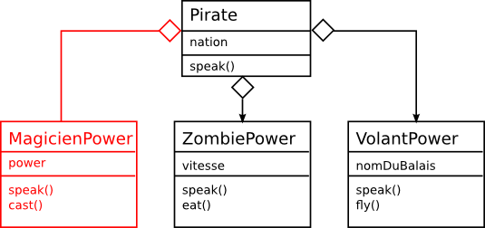

Voici pour le code source correspondant au diagramme UML :

[source,python]
----
class MagicPower(object):
    def __init__(self,power):
        self.power = power

    def cast(self):
        if self.owner: # <1>
            self.owner.vie += 5.0 * self.power # <2>
            print "pfscht +",  5.0 * self.power , " vie"

class Pirate(object):
    def __init__(self, nation, vie,magicien = None, zombie = None, volant = None):
        self.vie = vie
        self.nation = nation
        self.magic = magicien
        self.zombie = zombie
        self.volant = volant

        if self.magic: # <3>
            self.magic.owner = self # <4>

magicien = MagicPower(2.0)
monpirate = Pirate("LeChuck", 100.0, magicien = magicien)
monpirate.magic.cast()
print monpirate.vie # <4>
----

<1> A l'execution de la fonction, et avant d'appliquer le pouvoir on s'assure bien que l'attribut `self.owner` existe. En l'occurence à cet instant là qui correspond à la définition de la fonction, il n'existe pas encore, et il faudra attendre l'étape 4 pour que cet attribut soit fixé par la classe `Pirate`. Il est donc tout à fait possible de définir des attributs à posteriori pour une classe. Toutefois on voit que nous avons rajouté un lien de dépendance entre ces deux classes, car cette fonction a maintenant besoin d'une classe parente pour pouvoir marcher correctement (cad ajouter de la vie à son propriétaire ici)
<2> On accède à l'objet parent, et on modifie son attribut de vie !
<3> On teste que le `Pirate` en question est bien un magicien
<4> On ajoute un attribut owner à l'objet `MagicPower`, qui connait donc maintenant son propriétaire.

=== Duck Typing

La notion de DuckTyping est très très utilisé en Python, et préfigure plus d'une philosophie que d'une réelle contrainte technique.
Pour mieux comprendre en quoi consiste cette posture mentale il faut déjà tenter de comprendre pourquoi les informaticiens font référence à un canard...

[quote , Alex Martelli (2000) on comp.lang.python newsgroup]
In other words, don't check whether it IS-a duck: check whether it QUACKS-like-a duck, WALKS-like-a duck, etc, etc, depending on exactly what subset of duck-like behaviour you need to play your language-games with.

Autrement dit si je vois un animal qui vole comme un canard, cancane comme un canard, et nage comme un canard, alors j'appelle cet oiseau un canard !

[source,python]
.Pris sur wikipedia > http://en.wikipedia.org/wiki/Duck_typing#History[DuckTyping]
----
class Duck(object):
    def quack(self):
        print("Quaaaaaack!")

    def feathers(self):
        print("The duck has white and gray feathers.")

class Person(object):
    def quack(self):
        print("The person imitates a duck.")

    def feathers(self):
        print("The person takes a feather from the ground and shows it.")

    def name(self):
        print("John Smith")

def in_the_forest(animal): # <1>
    animal.quack()
    animal.feathers()

def game():
    donald = Duck()
    john = Person()
    in_the_forest(donald)
    in_the_forest(john)

game() # <2>
----
<1> Ici une fonction qui prend en paramètre n'importe quel animal, et essaye voir si il a les capacité de comportements `quack()` ou `feathers()`
<2> On voit bien quand on execute `game()` que Python se contrefiche de savoir quel est la nature de la classe à l'origine de la méthode, pour lui john est un canard car il possède bien les comportement attendus.

En quoi cette technique est intéressante ? Elle permet de filtrer ou d'apeller des classes sans forcément savoir tout de leur comportement, c'est ce que l'on apelle aussi le `polymorphisme`. Il y'en a absolument partout dans le langage Python, ainsi par exemple la fonction `len()` est tout à fait capable de calculer la taille de n'importe quel `type` d'objets : tuple, list, texte sans se soucier de sa nature !

[source,python]
----
>>> len("How long am I?")
14
>>> len((1, 2, 3, 4, 5))
5
>>> len(["a", "b", "c"])
3
----

Si nous revenons à l'exemple du pirate dans le cadre de l'héritage vu tout à l'heure, le `polymorphisme` est possible du fait que nous pouvons utiliser n'importe quel fonction `speak()` ou `nation` sans forcément savoir si ce qu'il y a dans la liste c'est un `PirateZombie` ou un `PirateVolant`. Cette notion est extrement importante car elle permet d'avoir des comportements génériques.

*exemple*

Le duckTyping va plus loin encore, et permet d'avoir du `polymorphisme` sans qu'il y ai un `héritage` derrière. En ce sens son utilisation est encore plus simple et intuitive.

[source,python]
----
class Mousse(object):
    def __init__(self, nom, vie):
        self.nom = nom
        self.vie = vie

        def blessure(self,vie):
            self.vie -= vie

class Pirate(object):
    def __init__(self, nom, vie, power):
        self.vie = vie
        self.nom = nom
        self.power = power

    def attaque(self, ennemi):
        print "Attaque de puissance ",self.power ," sur ",ennemi.nom
        ennemi.blessure(self.power)

    def blessure(self,vie):
        self.vie -= vie
        print "Aie ! moi ", self.nom, "je suis blessé de -", vie

class Equipage(object):
    def __init__(self, marins):
        self.marins = marins

    def jourDePaye(self, sommeParMarin):
        print ("ajoute de l'argent à la bourse de chacun des marins")

    def random(self):
        numMarin = random.randint(0,len(self.marins)-1)
        return self.marins[numMarin]

class Navire(object):
    def __init__(self, nom, marins):
        self.nom = nom
        self.equipage = Equipage(marins)

    def random(self):
        return self.equipage.random()

    def combat(self, ennemi):

        print "Attaque de puissance ",self.power ," sur ",ennemi.nom
        ennemi.blessure(self.power)

        nombreDeCombat = random.randint(0, len(self.equipage.marins)-1)
        print "nombreDeCombat = ", nombreDeCombat
        for i in xrange(nombreDeCombat):
            #Duels
            # Marin 1
            pirate1 = navire1.equipage.random()
            # Marin 2
            pirate2 = navire1.equipage.random()

            # Seul les pirates ou tout autre objet ayant une fonction attaque() peut attaquer le pirate 2 !
            # Donc lorsque pirate 1 est un mousse il ne se passe rien...
            if hasattr(pirate1,"attaque"):
                pirate1.attaque(pirate2)

class Taverne(object):
    def __init__(self, listeDeNoms, listeDePrenoms):
        self.listDeNoms = listeDeNoms
        self.listDePrenoms = listeDePrenoms

    def debaucher(self):
        salaire = random.randint(1, 10)
        force = salaire * 1.5
        nomPrenom = " ".join([self.listDeNoms[random.randint(0, len(self.listDeNoms) - 1)],
                              self.listDePrenoms[random.randint(0, len(self.listDePrenoms) - 1)]])
        #La taverne renvoie different type de pirates
        des = random.randint(0, 1)
        if des == 0:
            return Pirate(nomPrenom,120.0, random.randint(0.0,5.0,))
        else:
            return Mousse(nomPrenom,100.0)

# Fonction pour construire equipage
def buildEquipage(nbMarins):
    equipage = []
    for x in range(nbMarins):
        equipage.append(taverneAPirate.debaucher())
    return equipage

# Programme principal
if __name__ == "__main__":
    nomDePirate = ["Bonny", "Jack", "Teach", "Drake", "Morgan", "Nau", "Read"]
    prenomDePirate = ["Anne", "Calico", "Edward", "Francis", "Henry", "Jean", "Mary"]

    taverneAPirate = Taverne(nomDePirate, prenomDePirate)

    navire1 = Navire("Queen Anne's Revenge", buildEquipage(10))
    navire2 = Navire("Adventure Galley", buildEquipage(10))

    navire1.combat(navire2)
----

CAUTION: Le duckTyping pourrait être utile dans le cadre du RogueLike

== Mini-Jeux

=== Pendu

Définir une fonction `pendu()` qui pour une liste de mots passés en paramètre, permet de jouer au pendu, et renvoie à la fin du jeu `True` (gagné) or `False` (perdu)

Quelques astuces techniques :

* Vous pouvez stocker vos mots dans une liste et tiré aléatoirement le mot
* Vous pouvez maintenir une liste de lettre trouvés par l'utilisateur
* Une chaîne de caractère peut être manipulé comme une liste avec des indice
* Vous pouvez avoir une fonction affichage qui prend les éléments trouvés par l'utilisateur 1 par 1 et les compare lettre à lettre au mot
** si lettre existe j'affiche la lettre
** si lettre existe pas j'affiche `_`

[source,python]
.Exemple d'appel de la fonction
----
mot = ["Vélociraptor", "Amazonie", "Fondation", "Titanic"]
print pendu(mot)
----

=== Shifumi

image::images/RPS2.png[align="center", 300]

Définir une fonction `shifumi()` qui permet de jouer au shifumi avec l'ordinateur, et renvoie à la fin du jeu `True` (gagné) or `False` (perdu)

Pour vous aider dans votre tâche, voici un bout de code utilisant un dictionnaire et un générateur de chiffre aléatoire.
Ce code permet de renvoyer à chaque appel un choix de l'ordinateur pour le prochain tour !

[source,python]
----
from random import randint

gameDict = {1:"Pierre",2:"Papier",3:"Ciseaux"}
computer_value = gameDict[randint(1,3)]
print computer_value
----

== RogueLike

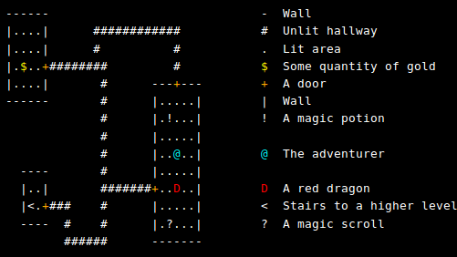

.Qu'est ce qu'un RogueLike et comment y jouer ?
* Un exemple en ligne jouable dans un navigateur: http://ondras.zarovi.cz/games/trw/[The Royal Wedding]
* http://en.wikipedia.org/wiki/Roguelike
* http://en.wikipedia.org/wiki/Chronology_of_roguelike_video_games
* Un autre style de jeu en mode texte : http://en.wikipedia.org/wiki/Dwarf_Fortress

== Labyrinthe

video::images/maze.ogv[width=600, align="center"]

L'objectif est de retrouver la logique qui existe derrière l'algorithme de http://en.wikipedia.org/wiki/Maze_solving_algorithm#Tr.C3.A9maux.27s_algorithm[Trémaux], et de l'implémenter en utilisant le programme à trou existant. Celui ci gère déjà l'affichage et la construction du labyrinthe, reste à programmer le comportement du robot en utilisant les documents.

.Dans le repertoire */exercice/labyrinthe_v1/* vous trouverez les fichiers suivants :
* *constants.py* contient les variables de correspondance couleur ainsi que les valeurs attribués aux différents blocs, a priori il n'est là que pour consultation.
* *drawMaze.py* et le fichier *Maze.py* contiennent les fonctions permettant la création de la matrice de chiffre labyrinthe, ainsi que les fonctions nécessaires à son affichage.
* *mazeBuilder_exercice.py* est le seul fichier que vous devez compléter.
* *labyrinthe_enonce_eleve.odt* qui contient des informations sur l'algorithme et chacune des fonctions.

Dans ce dernier, l'objectif est de *remplir chacune des fonctions* jusqu'à obtenir une version fonctionelle du programme comme présenté sur la vidéo ci dessus.

Vous pouvez d'ores et déjà tester que le programme est fonctionnel en vous placant dans le repertoire */exercice/labyrinthe_v1/* et en lancant la commande suivante

[source,console]
----
$> python mazeBuilder_exercice.py
----

.Fonction existantes :
****
Sur l'objet labyrinthe, les fonctions suivantes existent et peuvent être apellées :

* [red]*maze.getValueAtXY(x,y)* +
Renvoie une valeur numérique (de -1 a 4 correspondant aux variables vu dessus) correspondant à la position x y passé en paramètre

* [red]*maze.setValueAtXY(x,y,value)* +
Met la valeur 'value' dans la matrice a la position x y
****

.Fonction à réaliser:
****

Les fonctions à remplir et le type de retour de celles ci sont largement commentés dans le code source et dans le document distribué en cours.

Voici un bref rappel des fonctions que vous devez réaliser et agencer pour que le robot puisse fonctionner :

* [red]*def avance(direction,xRobot,yRobot)* +

* [red]*def randomDirection(tableau,valueToFind)* +

* [red]*def getDirection(tableau, valueToFind)*

* [red]*def returnWallCase(t_world)*

* [red]*def xyVoisinnage(t_world, xRobot, yRobot)*

* [red]*def calculeChemin(t_world,xRobot,yRobot)*

* [red]*def run()* +

****

[NOTE]
.La fonction random
====

Il est nécessaire d'importer le module random en haut de votre programme pour pouvoir ensuite utiliser des fonctionnalités de ce module :

image::images/random.gif[align="center"]

[source,python]
import random

Dans votre programme vous pouvez ensuite utiliser la fonction `randInt()` qui vous renvoie un chiffre aléatoire entre *début* et *fin*

[source,python]
nbAleatoire = random.randint(0,5)  # renvoi un chiffre entre 0 et 5 inclus

D'autres fonctions utiles existent dans ce module, vous pouvez les voir ici : +
http://docs.python.org/library/random.html

====

== Rendu TP

=== Pour le 14 octobre

* Traduction en Python des exercices vus en cours d'algorithmie (tout sauf sac à dos)
* Réaliser les <<_mini_jeux,Mini-Jeux>>
* Lire la partie <<_poo,POO>> et essayer de faire les exercices

=== Pour le 24/25 octobre

* Finir les exercices sur les pirates.

=== Projets
* Labyrinthe en groupe de 3
* Rogue Like en groupe de 3

[CAUTION]
.Tous les codes des exercices seront commentés et regroupés dans une arborescence de cette forme :
====

* NomsDesElevesDuGroupe/
** exercices/
** miniJeux/
** rogueLike/
** labyrinthe/

Chaque répertoire contiendra un ou des fichiers executables depuis *Pycharm* en cliquant sur le bouton `Run`.

Le répertoire sera ensuite compressé, et mis dans le dossier *renduTP* sur l'espace de partage.

====

== Ressources

.Officielle :
* http://docs.python.org/tutorial/index.html
* http://docs.python.org/index.html

.Autres :
* http://hyperpolyglot.org/
* http://rgruet.free.fr/PQR27/PQR2.7.html
* http://programming-motherfucker.com/become.html
* http://mindview.net/Books/Python/ThinkingInPython.html

////
blabla
////
