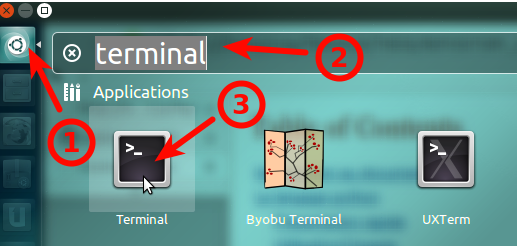
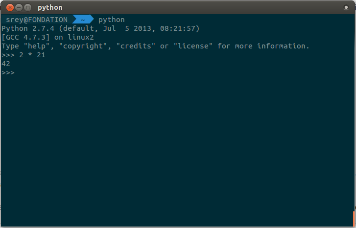

= Atelier Python
Rey Sebastien <rey.sebastien-coyrehourcq@univ-rouen.fr> , Van Hamme Adrien <adrien.van.hamme@gmail.com>
:Author Initials: SR
:toc2:
:toclevels: 4
:icons: font
:max-width: 70%
:source-highlighter: pygments
:sectanchors:
:experimental:
:pygments-style: tango

=== Installation de Python

==== Sous Ubuntu

Ubuntu est un système d'exploitation libre, et open-source, alternatif à Windows, et qui peut être installé sur n'importe quel ordinateur.

image::images/ubuntu.png[align="center"]

Une des grandes forces c'est la mise à disposition des utilisateurs d'un système de gestion de paquets offrant l'installation en quelques clics d'un très grand nombre de logiciels, ou paquets, par rapport à son principal concurrent Windows.

L'autre force, qui pourra au demeurant vous faire penser à une faiblesse, est la mise à disposition d'un logiciel appelé *Terminal*, dans lequel l'utilisateur peut taper un très grand nombre de commandes, qui vont de l'installation d'un paquet à une infinité d'autres choses.

Ainsi par exemple, et pour vous donner un apercu du bonheur qu'il y a pour un développeur à travailler sous Ubuntu au jour le jour,
Python est natif. C'est à dire déjà installé et déjà accessible par une simple commande dans un Terminal. [red]*Joie !*

Si vous ne me croyez pas, jetez un oeil à la procédure d'installation sous <<_windows,Windows>>.

Les autres éléments, comme les librairies, peuvent être installées dans le terminal, via une commande simple :

[source,python]
$> sudo apt-get install python-pygame

NOTE: `$>` représente le *prompt* de votre terminal, qui contient des informations sur le répertoire dans lequel vous vous trouvez..

[NOTE]
====
Si vous possedez les droits administrateur sur votre machine, alors vous pouvez voir une liste des autres packages python disponibles sous ubuntu avec le paquet `aptitude` :

[source,python]
$> sudo apt-get install aptitude

[source,python]
$> sudo aptitude search python-* | grep 2.7

ou :

[source,python]
$> sudo aptitude search python-*

====

[NOTE]
====
Pour installer d'autres modules dans python, il existe plusieurs solutions :

* l'installateur easy_install livré avec python : http://wiki.python.org/moin/CheeseShopTutorial
* ou plus simple avec l'installateur de package d'ubuntu, qui contient aussi bon nombre de packages : `apt-get`
====

[NOTE]
====
Il existe de nombreux paquets python en rapport avec la géomatique dont vous pouvez partir à la chasse, voici quelques listes faites par des utilisateurs :

* http://gis.stackexchange.com/questions/23575/what-are-the-python-tools-modules-add-ins-crucial-in-gis
* http://gis.stackexchange.com/questions/3796/python-for-gis-on-a-thumb-drive?rq=1
* http://gis.stackexchange.com/questions/3796/python-for-gis-on-a-thumb-drive?rq=1
* La liste de module pour Pypi (mais aussi pour `apt-get`) : http://pypi.python.org/pypi?%3aaction=browse&show=all&c=391
====

Quelques commandes utiles pour le terminal :

.Afficher le répertoire courant
[source,python]
$> pwd

.Se déplacer dans les répertoires
[source,python]
$> cd nomDeMonRepertoire

.retour arrière dans la hiérarchie de répertoire
[source,python]
$> cd ..

.Afficher le contenu du répertoire
[source,python]
$> ls

NOTE: Vous pouvez appuyer sur la *flêche HAUT* de votre clavier numérique pour rapeller des commandes précédemment tapées et les modifier par la suite (idem dans l'interpreteur python)

NOTE: En appuyant sur la touche *TAB* deux fois lors de l'écriture de vos commandes, vous pouvez obtenir des informations de complétion.

D'autres commandes existent bien sur, et pourront vous servir lors de vos futurs développements, voici un http://doc.ubuntu-fr.org/tutoriel/console_ligne_de_commande[lien] contenant de nombreux exemples et une liste plus exhaustive.

En savoir plus sur Ubuntu:

* http://doc.ubuntu-fr.org/console
* https://help.ubuntu.com/community/UsingTheTerminal

Et pour aller plus loin avec QGIS et les plugin python pour GDAL / OGR ( http://pypi.python.org/pypi/GDAL/ )

[source,python]
----
$> sudo apt-get install python-software-properties
$> sudo add-apt-repository ppa:ubuntugis/ubuntugis-unstable
$> sudo apt-get update
$> sudo apt-get install qgis
$> sudo apt-get install gdal-bin
$> sudo apt-get install python-gdal
$> sudo apt-get install python2.7-qgis
----

==== Sous Windows

Sous windows, l'installation est un poil plus délicate que sous Linux ou Ubuntu.

Je vous conseille de choisir plutôt une installation sous forme de packages pré-installés, du type de *pythonXY*, *anaconda*, *osgeo4w*
car l'installation des modules supplémentaires un à un peut vite devenir *cauchemardesque* !

[NOTE]
.Quelques ressources :
====
* *pythonXY* qui contient des packages pour la géomatique et spyder +
http://code.google.com/p/pythonxy/

* *PortablePython* est un python qui tient sur clef USB : +
http://www.portablepython.com/

* La doc officielle propose quelques pointeurs également : +
http://docs.python.org/using/windows.html

* L'installeur officiel de python : +
http://www.python.org/getit/releases/

* Le set de package python *Osgeo4w* : +
http://trac.osgeo.org/osgeo4w/

* Le gestionnaire de package python *Anaconda* : +
https://www.continuum.io/downloads

====

Une autre solution envisageable, pas forcément plus complexe qu'une installation qui se passe mal sous windows,
passe par l'installation d'une machine virtuelle avec Ubuntu sous windows.
L'avantage c'est qu'une fois Ubuntu installé ainsi, vous allez pouvoir profiter de tout un tas d'outils de développement beaucoup plus facilement que sous windows !!

[NOTE]
.Quelques ressources/ tutoriaux
====
* Ubuntu sous machine virtuelle : +
http://www.psychocats.net/ubuntu/virtualbox

* Ubuntu sur une clé usb : +
http://www.psychocats.net/ubuntu/usb
====

=== Mon premier programme en python

Il existe deux façon d'écrire et d'éxecuter un programme python :

* en mode *interactif* : l'utilisateur saisit les commandes les unes après les autres, et l'interpréteur execute/évalue chacunes d'elle au fur et à mesure de leur saisie.
* ou en mode *execution* : on execute une grosse portion de code stocké dans un ou plusieurs fichier, en une seule commande.

Les deux prochaines sections *interpréteur de commande* (mode interactif) et *Executer un bloc de code entier* (mode exécution) s'appuient sur l'utilisation du programme `Python`. Il est en effet le seul qui peut comprendre les programmes que vous écrirez dans ce langage.

Ces deux modes d'utilisation du programme python suffisent pour écrire des programmes, mais offre un confort très relatif. On préférera utiliser un IDE (qui se base sur le mode exécution), comme décrit dans la troisième section *En utilisant l'IDE Pycharm*.

==== En utilisant l'interpréteur de commande Python

===== Sous windows

Pour accéder à un terminal windows, cliquez sur le bouton Démarrer, puis cherchez l'outil *invite de commande* aussi nommé *cmd* (voir https://fr.wikipedia.org/wiki/Cmd[wikipedia] et http://windows.developpez.com/cours/ligne-commande/?page=page_4[liste des commandes] )

L'executable de Python 2.7 se trouve généralement dans le répertoire `c:\Python27` , pour cela vous devez vous déplacer dans l'invite de commande avec les commandes suivantes :

.Afficher le répertoire courant
[source,python]
dir

.Se déplacer dans les répertoires
[source,python]
cd nomDeMonRepertoire

.retour arrière dans la hiérarchie de répertoire
[source,python]
cd ..

.exemple d'accès au repertoire contenan l'interpréteur python 2.7
[source,python]
cd c:\Python27

Une fois dans le répertoire `c:\Python27`, vous pouvez ensuite taper `python`, ce qui aura pour effet de lancer *l'intepreteur de commande en mode console interactif*.

[source,python]
----
> python
ActivePython 2.6.5.12 (ActiveState Software Inc.) based on
Python 2.6.5 (r265:79063, Mar 20 2010, 14:22:52) [MSC v.1500 32 bit (Intel)] on win32
Type "help", "copyright", "credits" or "license" for more information.
----

Toutes les commandes que vous tapez dans ce mode interactif doivent être en python pour être comprise par l'interpréteur Python. Une ligne n'est évalué que lorsque vous tapez kbd:[Entrée].

[source,python]
----
>>> print( "Hello World")
hello world
----

Pour quitter ce *mode interactif* et revenir dans l'*invite de commande*, vous pouvez taper `exit()` ou kbd:[Ctrl + D]

===== Sous linux

Pour accéder à un terminal linux, cliquez sur l'onglet en haut à gauche avec une roue, et écrivez "Terminal"
Vous pouvez ensuite taper "python" dans le terminal linux, ce qui aura pour effet de lancer *l'intepreteur de commande en mode console interactif*.

[source,python]
----
> python
ActivePython 2.6.5.12 (ActiveState Software Inc.) based on
Python 2.6.5 (r265:79063, Mar 20 2010, 14:22:52) [MSC v.1500 32 bit (Intel)] on win32
Type "help", "copyright", "credits" or "license" for more information.
----

Chaque commande que vous allez taper dans l'interpreteur de code python sera évaluée :

[source,python]
----
>>> print( "Hello World")
hello world
----

Python vous renvoie le résultat de votre commande à chaque  fois qu'il a réussi à l'évaluer, sinon il vous renvoie une erreur.

TIP: Pour quitter la console python sous Ubuntu, appuyer sur la combinaison de touche : kbd:[Ctrl + D]

==== Executer un bloc de code entier

Pour le mode *execution* nous allons écrire nos programmes au préalable dans un document nommé avec l'extension *.py* dans le repertoire de votre choix. Vous devez ouvrir une *invite de commande* (windows), ou un *terminal* (linux) et vous positionner ensuite dans ce répertoire avec les commandes adéquates propre au système que vous utilisez(cd, dir, etc.)

Si vous êtes sous linux, alors vous pouvez directement taper `python nomduprogramme.py` dans le terminal.

Si vous êtes sous windows, alors il faut remplace `python nomduprogramme.py` par la commande suivante `C:\Python27\python nomduprogramme.py` dans les programmes ci-dessous.

--
. Créer un fichier __hello.py__
. Ecrire dans ce fichier le texte suivant :
+
.hello.py
[source,python]
----
# -*- coding: utf-8 -*-
print( "Hello World")
----
+
. Enregistrer et fermer le programme
. Executer le programme ainsi dans la ligne de commande python
--

[source,python]
python hello.py

Réouvrez ensuite votre fichier __hello.py__ et ajoutez la ligne suivante :

.hello.py
[source,python]
----
print( "Hello World")
print( Bonjour Monde)
----
On redemande à l'interpréteur de lire notre programme :

[source,python]
python hello.py

Celui-ci renvoie une erreur que nous allons apprendre à lire :

[source,python]
----
python hello.py
  File "hello.py", line 2
    print( Bonjour Monde)
                      ^
SyntaxError: invalid syntax
----

L'interpréteur vous donne la ligne et la faute : la syntaxe pour print() est incorrecte, car il manque les guillemets

NOTE: "Hello World" est le programme le plus connu des informaticiens, cf. http://en.wikipedia.org/wiki/Hello_world_program

==== En utilisant l'IDE Pycharm

Pour éditer le document une fois créé nous allons utiliser un http://fr.wikipedia.org/wiki/Environnement_de_d%C3%A9veloppement[IDE] nommé *Pycharm* (Windows, Linux, MacOSX) disponible http://www.jetbrains.com/pycharm/download/index.html[ici]

Vous pouvez plus simplement utiliser un éditeur de texte, mais un IDE fournit des fonctions avancées facilitant votre vie de développeur.

image::images/pycharmLogo.png[align="center"]

Pycharm est un *excellent* IDE compatible avec *Windows, Mac et Linux*, +
téléchargeable gratuitement sur le http://www.jetbrains.com/pycharm/download/index.html[site]

===== Installation sous Windows

L'installation de Pycharm est relativement simple sous windows.

Python doit d'abord être installé sur l'ordinateur (voir section installation de python)

Il suffit ensuite de télécharger la version *community* ou *education* sur le site, puis de lancer l'installation.

Une fois installé, vous pouvez lancer Pycharm, qui vous demandera de configurer l'interpréteur python que vous voulez utiliser par défaut. Sous windows, celui-ci se trouve généralement dans `c:\Python27\python.exe`.

===== Installation sous Ubuntu

Sous Ubuntu, il n'y a pas d'installeur du logiciel comme sous windows.
Celui çi se présente sous la forme d'une archive (au format `.tar.gz`), et d'un executable qu'il faut lancer depuis le répertoire `/bin/` du dossier une fois extrait.

* Crééer un répertoire `pycharm` à la racine de votre `Dossier personnel`
* Télécharger `Pycharm Education` ici : http://www.jetbrains.com/
* Extraire l'archive `.tar.gz` dans un répertoire `pycharm` que nous avons créé dans votre espace personnel
* Ouvrir le Terminal (celui çi s'ouvre à la racine de votre `Dossier personnel`, la commande `ls` vous le confirmera)
* Se déplacer avec la commande `cd` dans le bon répertoire : `cd pycharm/`, puis `cd pycharm-edu-2.0/`, puis `cd bin/`
* Puis tapez `sh pycharm.sh` dans le terminal pour lancer le logiciel !

===== Configurer l'interpréteur python (windows/ubuntu)

Pycharm a besoin de savoir ou se trouve le programme `Python` pour executer les programmes. Pour configurer l'interpreteur si cela n'est pas déjà fait par défaut, vous pouvez aller dans les préférences du logiciels.

image::images/pycharm1.png[align="center"]

Et choisir l'interpréteur Python que vous souhaitez utiliser pour votre projet : 2.7 ou 3.0

image::images/pycharm2.png[align="center"]

Pour lancer un programme python, il suffit de faire un clic droit sur le fichier python que vous voulez executer, et de cliquer sur `run`

image::images/pycharm3.png[align="center"]
