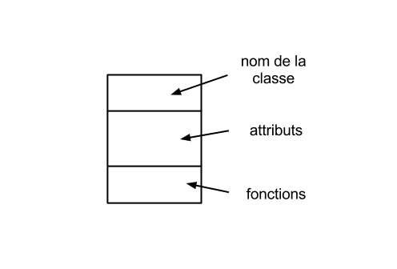
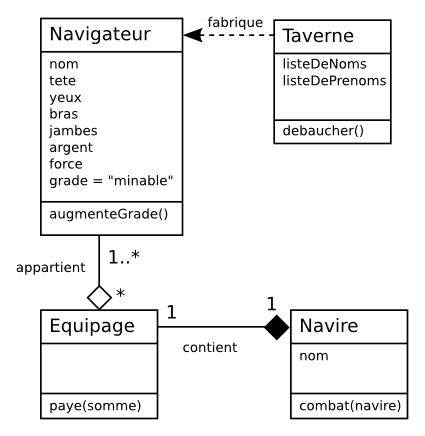

= Atelier Python
Rey Sebastien <rey.sebastien-coyrehourcq@univ-rouen.fr> , Van Hamme Adrien <adrien.van.hamme@gmail.com>
:Author Initials: SR
:toc2:
:toclevels: 4
:icons: font
:max-width: 70%
:source-highlighter: pygments
:sectanchors:
:experimental:
:pygments-style: tango

== POO

=== Définition

Comme on a pu le voir au début de ce document, en python tout est *objet*

image::images/ontology.gif[align="center"]

Pour rappel, la Programmation Orientée Objet (ou *http://fr.wikipedia.org/wiki/Programmation_orient%C3%A9e_objet[POO]*) est un paradigme de programmation qui passe par une organisation des données particulière. Depuis son invention, ce paradigme domine dans l'industrie informatique.

Nous n'avons que *très peu de temps pour aborder les concepts théorique* en regard avec la POO. Sachez toutefois que vous allez manipuler les concepts théoriques lors des cours de modélisation à l'ENSG et que l'apprentissage de ceux ci vous aideront autant pour la *représentation de vos problèmes* (avec un langage de description de données comme *UML* par exemple) en base de données, que pour leur *traduction en programme informatique* Je n'insisterai donc pas sur les détails théorique dans ce cours, et vous pouvez vous référez aux ressources dessous pour en savoir plus.

L'intérêt de ce paradigme, vous allez voir, et qu'il s'accorde beaucoup mieux à une représentation complexe de la réalité par rapport à que ce que nous avons vu jusqu'à présent.

Vous verrez lors du cours de modélisation que le vocabulaire et les concepts généraux vont se recouper avec ce que nous allons voir ici. Seul le niveau d'abstraction utilisé pour décrire votre problème rendra plus ou moins difficile une future traduction informatique / base de données.

[red]*Attention* toutefois à ne pas vouloir trop vite coller au langage informatique, car il est très difficile de couvrir correctement la description d'un problème en restant à un niveau d'abstraction trop bas (c'est à dire proche de la machine). Repensez à notre résolution de labyrinthe, et voyez comment l'apprentissage de python à modifié votre perception globale du problème. Il y'aura donc un avant et un après votre formation, et il vous faudra régulièrement savoir jongler entre ces différents niveaux d'abstraction pour être efficace dans la discussion, qu'elle soit avec un client ou avec un développeur informatique !

Un `Objet` est donc une *structure de donnée* qui va nous permettre d'organiser nos données selon un certain schéma:

* autour de la descriptions de ces données (critère descriptif)
* et des moyens de traiter ces données (dynamique).

Prenons par exemple un exemple concret : vous même.

A priori vous êtes un *humain*, et normalement vous partagez un certain nombre de descripteurs ou *attributs* avec vos autres congénères humains :

* Deux yeux
* Deux bras
* Deux jambes
* Une couleur de cheveux
* Une couleur pour les yeux
* Une couleur de peau
* etc.

Là où je veux en venir, c'est que si nous devions gérer des humains dans un programme classique tel que nous les avons fait jusqu'à présent, il nous faudrait autant de variables décrites ci dessous que de personnes. Sachant qu'une variable doit être unique, imaginez le bazar :

[source,python]
----

#Gérard
couleurYeuxGerard = "brun"
couleurCheveuxGerard = "brun"
couleurDePeauGerard = "blanche"
nombreJambeDeGerard = 2
nombreOeilDeGerard = 2
nombreBrasDeGerard = 2

#Paul
couleurYeuxPaul = "vert"
couleurCheveuxPaul = "brun"
couleurDePeauPaul = "blanche"
nombreJambeDePaul = 2
nombreOeilDePaul = 2
nombreBrasDePaul = 2
----

Bon, et maintenant si je doit gérer la classe entière de carthagéo avec ce modèle de représentation de données, il va me falloir un peu de patience...
En plus, vous avez du le remarquer, il y a de nombreuses données redondantes, pourtant nécessaires, car Gérard pourrait bien n'avoir qu'un oeil, une jambe et travailler sur un bateau après tout.

Premier constat, il existe une *matrice* commune, l'espèce humaine.

Deuxième constat, il est possible de trouver une *matrice* originelle à pas mal de choses dans ce monde. Pensez à la fabrication en série, et à l'invention de la reproduction mécanisé : Voiture, Maison, Avion, Animaux, Porte, Chaise, Chanson, SérieTV, Acteur, Réalisateur, Pompier, etc. Et c'est à partir de cette *matrice originelle* que nous allons pouvoir généraliser, ou spécialiser un certain nombre de choses à l'aide de deux choses : des *attributs* et des *fonctions*.

Oui, différencier la couleur des yeux ou des cheveux en *instanciant notre matrice originelle* (c'est à dire en produisant un objet reprenant et complétant *le plan definis* par la matrice originelle) est un bon début, mais si par exemple, je veux aller plus loin et différencier vraiment les humains entre eux, et la manière dont ils interagissent entre eux,il faut que je m'intéresse non seulement aux aspects *statique* mais également *dynamique*.

Par exemple, dans le contexte d'une université (la description de vos données dépend donc beaucoup du *contexte du problème* !), nous voyons qu'une sous-spécialisation de l'être humain générique est tout à fait possible, car dans son interaction avec l'université un étudiant n'a pas tout à fait les même fonctions ni les même droits qu'un professeur, et cela bien que les deux soient des humains !!

.Représentation graphique d'une classe

Cette *matrice originelle* est ce que l'on appelle une *http://fr.wikipedia.org/wiki/Classe_%28informatique%29[classe]*, elle définit à la fois des critères descriptifs ou *attributs*, ainsi que des *fonctions* ou interfaces permettant de communiquer avec les autres objets de ce monde. *Instancier une classe* revient à définir un ou plusieurs *objets* qui dérivent de cette classe.

Pour reprendre notre exemple, Gérard et Paul sont *deux instances* de la matrice originelle *Humain*.

Mais si Gérard est professeur, et Paul étudiant, et que nous voulons les différencier dans notre programme, alors il nous faudra créer quelque chose qui spécialise encore un peu plus notre *Humain*, par exemple en définissant :

* une classe *Etudiant* (qui possède un numéro étudiant par exemple),

* et une classe *Professeur* (qui possède lui d'autres attributs administratif spécifique).

Par chance avec la *POO* nous pourrons également *http://en.wikipedia.org/wiki/Object_composition[composer]* les classe entres elles, car un étudiant est un humain, et un professeur est un humain également !

Il est donc tout à fait possible d'établir une *hierarchie* structurant un peu plus notre programme pour la gestion d'une université, en adoptant soit un *héritage* , soit une *composition* entre les classes : Etudiant et Professeurs contiennent les attributs d'un être humain, mais aussi des attributs (statique) et des fonctions (dynamique) qui leurs sont spécifiques.

En python une classe est définit par le mot clef `class` et un bloc d'instruction clos avec un *début* et une *fin*, comme pour une fonction, une boucle, une condition, etc.

La seule différence avec une fonction, c'est qu'une classe embarque avec elle des fonctions, et des variables (qui représentent les attributs) qui sont caractéristique de la classe que l'on veut représenter.

.Une classe dans son plus simple appareil
[source,python]
----
class Humain(object): # <1>
   nbYeux = 2 #<2>
   nbBras = 2
   nbJambes = 2

   def marche(self): # <3>
      print( "Je marche !")
      #... traitement ...

#fin du bloc classe
----

<1> Par convention les classes démarrent avec une majuscule, et le mot clé `object` entre parenthèse est obligatoire
<2> Les variables définies ici correspondent aux *attributs* de notre classe
<3> Les *fonctions* en rapport avec la classe sont définies dans le corps de la classe. Nous verrons par la suite qu'elles peuvent accéder direcement aux attributs de la classe. Seule spécificité comparé à une fonction normale, le mot clef `self` est obligatoire en début de toute vos fonctions.

.Pour instancier une classe, donc créer des objets à partir de cette matrice originelle
[source,python]
----
gerard = Humain() # <1>
paul = Humain () # <2>

print (gerard) # <3>

print (gerard.nbBras) # <4>
print (paul.marche()) # <5>
----

pass:macros[http://pythontutor.com/visualize.html#code=class+Humain(object)%3A%0A++++nbYeux+%3D+2+%0A++++nbBras+%3D+2%0A++++nbJambes+%3D+2%0A%0Adef+marche(self)%3A+%0A++++print+%22Je+marche+!%22%0A+++%23...+traitement+...%0A%0Agerard+%3D+Humain()+%0Apaul+%3D+Humain+()+%0A%0Aprint+gerard.nbBras+%0Aprint+paul.marche()&mode=display&cumulative=false&heapPrimitives=false&drawParentPointers=false&textReferences=false&showOnlyOutputs=false&py=2&curInstr=0[Voir l'execution en ligne\]]

<1> A partir de la matrice originelle, on crééé un objet unique dont la référence est relié à la variable gerard
<2> A partir de la matrice originelle, on créé un nouvel objet unique dont la référence est relié à la variable paul
<3> Cela nous renvoie à la référence de l'objet, que l'on peut donc stocker, puis rapeller par la suite ! (voir l'exemple des listes qui contiennent des variables pointant sur des listes)
<4> On peut récupérer la valeur des attributs de notre objet à l'aide l'opérateur `.`
<5> De la même façon que nous avons appelé un attribut, nous pouvons également appelé une fonction si elle existe, en utilisant l'opérateur `.` suivi du *nom de la fonction* et de *parenthèses* `()` (qui peuvent contenir des arguments comme n'importe quelle fonction ...).

A présent j'aimerais pouvoir modifier les attributs, pour que le nombre de bras, ou de jambes puissent être différents selon les personnes !

Pour cela il faut que j'utilise un *constructeur*, en fait il s'agit d'une fonction *automatiquement appelé à la création de l'objet*

Il s'agit de la fonction `__init()__` qui prend automatiquement l'argument `self` qui est une auto-référence désignant l'objet.

`self` doit être indiqué comme argument dans chacune des fonctions de la classe, c'est obligatoire, c'est ce qui permet à Python de savoir a qui vous faite référence, donc ici à l'objet même ! +
[red]*=>* self = objet courant

Ainsi, pour appeler des attributs depuis des fonctions de votre classe, il faut toujours indiquer `self.nomDeVotreAttribut`

Idem pour appeler une fonction en interne dans une classe, il faut toujours l'apeller avec le mot clef self devant `self.nomDeVotreFonction()`

=== Exemple

image::images/classNavigateur.png[align="center"]

Voyons avec un autre exemple d'humain, le `Navigateur` , et plus spécifiquement, le navigateur pirate !

.pirate.py (voir dans /exercice)
[source,python]
----
class Navigateur(object):
   def __init__(self,yeux,bras,jambes): # <1>
      self.tete = 1 # <2>
      self.nbYeux = yeux # <3>
      self.nbBras = bras
      self.nbJambes = jambes
      self.afficheInfo() # <4>

   def afficheInfo(self): # <5>
      print( "Bonjour ! J'ai ", self.nbYeux, "yeux, ", self.tete, " tête, ", self.nbBras, " bras, et ", self.nbJambes, " jambes ...")

   def accident(self,typeAcc): # <6>
      if typeAcc == "bras":
         self.nbBras = self.nbBras - 1 # <7>
      elif typeAcc == "jambe":
         self.nbJambes = self.nbJambes - 1
      elif typeAcc == "yeux":
         self.nbYeux = self.nbYeux - 1

   def initGrade(self):
      self.grade = "minable" # <8>
      print( "je suis un pirate ", self.grade)

   def augmenteGrade(self):
      if self.grade == "minable":
         self.grade = "minus"
      elif self.grade == "minus":
         self.grade = "chef"
      elif self.grade == "chef":
         self.grade = "capitaine"

#fin du bloc classe
----

<1> Notre constructeur initialise et donc personnalise la matrice originelle que représente la classe `Navigateur`
<2> Mais j'ai le droit de définir également des attributs par défaut +
[red]*! Attention !* Les attributs n'existe que dans la portée de la classe (même fonctionnement que pour les fonctions donc)
<3> Je transfere l'argument passé à mon constructeur dans mon attribut de classe
<4> J'appelle une fonction de mon programme à la fin de l'initialisation de l'objet, celle ci affiche des informations sur mon nouvel objet navigateur personnalisé
<5> Une fonction, même si elle ne prend pas d'argument, doit prendre l'argument par défaut nommé 'self'
<6> Ici on passe un argument supplémentaire qui est utilisé dans la fonction.
<7> Je modifie un attribut de mon objet, j'ai le droit du moment que j'utilise self pour indiquer qu'il existe ! +
[red]*=>* sinon cela créé une nouvelle variable locale à la fonction !!
<8> Cette fonction ajoute un attribut grade à mon objet, celui-ci est ensuite accessible normalement comme tout les autres attributs existant et définis dans `__init__`

.Amusons nous maintenant avec une instance de classe : Gérard le pirate !
[source,python]
----
# gerard est un petit navigateur de plaisance, et pour le moment il a tout ses membres :)
gerard = Navigateur(2,2,2)

# il décide de rentrer dans la piraterie
gerard.initGrade()

# Sauf qu'un jour gerard croise un requin au bout d'une planche, le risque du métier, heureusement il s'en tire pas trop mal
gerard.accident("jambe")
gerard.afficheInfo()

# Avec l'experience Gerard fait de grand progrès !
gerard.augmenteGrade()
gerard.augmenteGrade()
gerard.augmenteGrade()
gerard.augmenteGrade()

print( "Gerard est maintenant ", gerard.grade ," ! ")

# Malheureusement, la vie de capitaine n'est pas facile ...
gerard.accident("yeux")

# Pauvre Gerard ...
gerard.afficheInfo()

----

*Exercices* :

[options=interactive]
- [ ] Essayez maintenant de faire un autre parcours de vie avec un autre pirate !
- [ ] Ajoutez une nouvelle fonction `descendreGrade()`

=== Stocker des objets

Comme les fonctions les objets possède une adresse en mémoire, vous avez probablement déjà afficher celle ci par erreur avec les fonctions ..

Il est possible de stocker la référence des objets dans une variable, tout comme il est possible de mettre un objet de type liste dans un autre objet de type liste.
Il est donc également possible de stocker la référence d'une fonction, ou d'un objet dans un attributs/variables quelconques, que cela soit dans un objet, dans une liste, dans une variable.

Regardons ça plus en détail dans les exemples ci dessous :

[source,python]
----
def somme(a,b):
   return a+b

def multiply(a,b):
   return a*b

print (somme) # renvoie une adresse de l'objet en mémoire
print (somme()) # execute la fonction !

# Et donc vous pouvez stocker les références/adresses dans des structures de données, c'est à dire dans des classes (dans les attributs), dans des listes, dans des dictionnaires, etc.

listeFonctionCalculette = [somme,multiply]

for i in listeFonctionCalculette:
   print( "Resultat = ", i(1,3))

----

Cela marche exactement de la même façon avec des objets, qui peuvent également être stockés dans des listes, des dictionnaires, etc.

[source,python]
----

class Personne(object):

   def __init__(self,nom,prenom,age):
      self.nom = nom
      self.prenom = prenom
      self.age = age

   def anniversaire(self):
      print( "Bon anniversaire ", self.nom, " !!")
      self.age = self.age + 1

   def information(self):
      print( "Mon nom est ", self.nom, " et mon prénom est ", self.prenom)
      print( "Aujourd'hui j'ai ", self.age, " ans.")

# Creation de deux objets a partir de la classe Personne
tomy = Personne("Ungerer","Tomy",75)
gerard = Personne("Mulot","Gerard",55)
# etc...

# On stocke ces objets dans une liste
listePersonne = [tomy,gerard]

# On appelle des fonctions sur les objets contenus dans cette liste
for i in listePersonne:
   i.information()

for i in listePersonne:
   i.anniversaire()

for i in listePersonne:
   i.information()

----

*Exercices* :

[options=interactive]
- [ ] En reprenant l'exemple des navigateurs et du pirate, essayez de stocker plusieurs pirates dans une liste, appelez un accident sur chacun d'eux à l'aide d'une boucle.
- [ ] Construisez une fonction tempete qui prend un objet navigateur en paramètre, et lui applique un accident au hasard. Appelez ensuite cette fonction sur un des pirates de votre liste.
- [ ] Essayez maintenant d'appliquer cette fonction sur un navigateur tiré au hasard dans votre liste de pirate !

=== Bref rappel des termes

[source,python]
----
class Navigateur(object)
----

Une classe Navigateur qui hérite d'un `object`, obligatoire pour Python.

[source,python]
----
class Navigateur(object): def __init__(self,yeux,bras,jambes)
----

La classe `Navigateur` est initialisé grâce à la fonction constructeur `__init__` qui prend `self` et 3 paramètres"

[source,python]
----
class Navigateur(object): def accident(self,typeAcc):
----

La classe `Navigateur` possède une fonction nommé `accident` qui prend `self` et 1 paramètre"

[source,python]
----
gerard = Navigateur(2,2,2)
----

gerard est une variable qui contient une instance de la classe `Navigateur` (cad un objet)

[source,python]
----
gerard.accident("jambe")
----

Depuis l'instance de la classe `Navigateur` contenu dans la variable `gerard` (cad un objet), je récupère et apelle la fonction `accident` avec `self` et la valeur pour un paramètre.

[source,python]
----
gerard.nbJambes = 1
----

Depuis l'instance de la classe `Navigateur` contenu dans la variable `gerard` (cad un objet), je récupère et écrase l'attribut `nbJambes` avec la valeur passé par `l'affectation`

A l'aide de ces principes, nous essaierons de réfléchir par la suite à la manière de structurer plus efficacement nos futurs programme.

.Ressources python POO pour aller plus loin :
* http://fr.openclassrooms.com/informatique/cours/langage-python[Partie 3 du cours Python du site openClassRooms]

.Ressource modélisation :
* http://laurent-piechocki.developpez.com/uml/tutoriel/lp/cours/
* http://fr.wikipedia.org/wiki/Diagramme_de_classes

=== Des objets dans des objets ?

image::images/worldofpirates.png[align="left", 500]

C'est ici que se trouve la vrai puissance de la programmation orientée objet, car elle permet de créer un code complexe de façon modulaire et générique, par exemple en imbriquant des objets dans d'autres objets.

Essayons à présente de créer un monde à la mesure de nos pirates. La première étape consiste à revoir notre classe `Navigateur`

[source,python]
----
# -*- coding: utf-8 -*-

import random

# Definition des classes du monde des pirates !
class Navigateur(object): # <1>
    def __init__(self, nom, salaire=10, yeux=2, bras=2, jambes=2, argent=0, force=1, grade="minable"):
        self.nom = nom
        self.salaire = salaire
        self.tete = 1
        self.nbYeux = yeux
        self.nbBras = bras
        self.nbJambes = jambes
        self.argent = argent # <2>
        self.force = force
        self.grade = grade
        self.afficheInfo()

    def augmenteGrade(self):
        if self.grade == "minable":
            self.grade = "minus"
        elif self.grade == "minus":
            self.grade = "chef"
        elif self.grade == "chef":
            self.grade = "capitaine"

        self.force = self.force + 1 # <3>
----
<1> La classe Navigateur change un peu, on passe des arguments par défaut pour définir la morphologie et le grade de nos navigateurs. Ainsi on part du principe que le grade par défaut est "minus", et la morphologie normale.
<2> De nouveaux attributs apparaissent dans notre programme : argent, force et grade.
<3> A chaque augmentation de grade on augmente la force du navigateur de 1, par exemple cette fonction peut être appellé à chaque fois que son navire gagne un combat, on peut considérer qu'il augmente de grade.

Mais nous le savons bien, un pirate tout seul n'a aucune chance de survie dans ce monde hostile, il lui faut donc un équipage.

Dans le code suivant nous créons un premier équipage en utilisant une liste dans lequel nous stockons plusieurs instances de cette classe `Navigateur`.

[source,python]
----
jack =  Navigateur("Jack Calico", argent=10, force=10, grade="capitaine")
edward =  Navigateur("Edward Drake", argent=2, force=3, grade="minable")
anne = Navigateur("Anne Bonny",argent= 3, force=2, grade="minable")
equipe1 = [jack,edward,anne]
print( equipe1)
----

Normalement un code bizarre de ce type s'affiche `[<__main__.Navigateur instance at 0x7f632f278908>, <__main__.Navigateur instance at 0x7f632f2789e0>, <__main__.Navigateur instance at 0x7f632f278a28>]`

Il s'agit de la référence des objets en mémoire. Pour accéder au contenu de chacun de ces objets navigateurs, il n'y a pas d'autres choix que de faire appel aux méthodes ou aux attributs propre à ces objets.

Pour mieux comprendre la structure qui résulte d'un tel code, on peut se représenter la liste sous cette forme en mémoire. Les valeurs initialisées pour chaque attributs étant commentée ici en rouge.

image::images/equipage.png[align="center", 500]

Si je veux affiche par exemple, le nom de chacun des pirates, je pourrais faire la boucle suivante :

[source,python]
----
for p in equipe1:
	print( p.nom)
----

Je peux aussi changer la valeur des attributs directement :

[source,python]
----
for p in equipe1:
	p.argent = p.argent * 2
	print( p.argent)
----

Si je veux uniquement augmenter le grade des *minables* dans mon équipage, il suffit de filtrer notre liste en fonction d'un attribut :

[source,python]
----
for p in equipe1:
	if p.grade == "minable":
		p.augmenteGrade()
----

Si je veux calculer l'argent total que possède cet équipage, encore une fois rien de plus facile. Il suffit d'accéder à l'attribut correspondant lors d'un parcours de liste.

[source,python]
----
richesse = 0
for p in equipe1:
	richesse = richesse + p.argent
print( richesse)
----

Réaliser cet équipage n'est qu'une première étape, que pouvons nous ajouter à présent ? Il serait intéressant par exemple d'encapsuler notre liste de pirates fraichement construite dans un objet `Equipage` auquel on pourra rajouter la fonction de calcul des richesses que nous avons déjà réalisé.

[source,python]
----
class Equipage(object): # <1>
    def __init__(self, marins):
        self.marins = marins

    def calculDesRichesses(self): #<2>
        richesse = 0
        for p in self.marins:
            richesse = richesse + p.argent
        print( richesse)

    def rechercheDuPlusRiche(self): #<3>
        pass

    def rechercheDuPlusFort(self):
        pass

    def calculForceEquipage(self): #<4>
        pass
----

<1> La classe a besoin d'une liste de `Navigateur` pour que notre méthode marche correctement.
<2> On interroge l'attribut de notre objet qui contient à présent la liste de navigateurs, à savoir `self.marins`
<3> Il est intéressant de pouvoir savoir à tout moment quel est le navigateur le plus fort mais aussi le plus riche de la bande. A vous d'écrire le code :)
<4> Une fonction qui renvoie la force totale de notre équipage, pratique pour comparer deux équipages par la suite (dans la future fonction `combat()` par exemple)

Une première idée serait de définir un équipage ainsi :

[source,python]
----
equipage1 = Equipage([jack,edward,anne])
----

Seulement voilà, maintenant que nous avons définit un équipage comme un objet à part entière, plus complexe qu'une simple liste, il serait également intéressant de donner une vrai raison d'être à cet équipage, à savoir un bateau qui l'abrite.

Plutôt que de créer un objet `Equipage` à part, pour ensuite le passer en paramètre lors de l'instanciation d'un `Navire`, nous préferons ici faire le choix d'une vrai composition. Ainsi l'équipage (et non les navigateurs, qui eux restent libre d'être associés à d'autres bateaux/équipages) devient exclusivement rattaché à un objet Navire. Si le `Navire` sombre, alors l'objet `Equipage` sombre avec lui.

[source,python]
----
class Navire(object): # <1>
    def __init__(self, nom, marins):
        self.nom = nom
        self.equipage = Equipage(marins)

    def combat(self, ennemi): # <2>
        print( "combat le bateau ennemi ! ")
----

<1> La classe navire est responsable d'un équipage et un seul, c'est elle qui créée l'instance de la classe `Equipage` accueillant la liste de `Navigateurs`.
Ainsi la liste de marins passés en paramètres sert ici à instancier la classe `Equipage` stocké par chaque objet `Navire`
<2> La classe qui définit les combats, pour déterminer l'issue du combat et calculer l'abordage, il faut prendre en paramètre un navire ennemi. On se base sur une comparaison de force entre les deux équipages pour le moment. Le navire le plus fort l'emporte.

Désormais, c'est l'objet `Navire` qui récupère la liste de navigateurs pour en faire un objet `Equipage`.

[source,python]
----
navire1 = Navire("Queen Anne's Revenge",[jack,edward,anne])
----

En terme d'imbrication entre objets (`Navire` contient `Equipage` contient une liste de `Navigateurs`), cela représente le diagramme de classe, puis d'objets suivant :

image::images/imbricationClasses.png[align="center", 500]

image::images/imbricationClasses2.png[align="center", 600]

La liste de navigateurs est passée à `navire1`, qui lors de sa initialisation construit directement un objet de type `Equipage` qui prend en paramètre cette même liste (`self.equipage = Equipage(marins)`). Celle-ci étant stocké dans l'attribut `marins` de cet équipage, on pourra l'apeller ainsi : `navire1.equipage.marin`. Comme il s'agit d'une liste, les navigateurs qu'elle contient peuvent être appelé avec la notation tableau classique. Ainsi `navire1.equipage.marins[0]` renvoie le premier marin de l'équipage, dont on peut également afficher le nom `navire1.equipage.marins[0].nom`

Autrement dit, chaque imbrication implique un niveau supplémentaire dans la notation pointé.

Enfin, pour cette dernière étape, essayons d'être encore plus imaginatif. Les pirates ne se recrutent pas n'importe comment, il faut aller les chercher dans des `Tavernes`, logique non ?

[source,python]
----
class Taverne(object):
    def __init__(self, listeDeNoms, listeDePrenoms):
        self.listDeNoms = listeDeNoms
        self.listDePrenoms = listeDePrenoms

    def debaucher(self): # <1>
        salaire = random.randint(1, 10)
		argent = random.randint(1, 20)
        force = salaire * 1.5
        nomPrenom = " ".join([self.listDeNoms[random.randint(0, len(self.listDeNoms) - 1)],
                              self.listDePrenoms[random.randint(0, len(self.listDePrenoms) - 1)]])
        return Navigateur(nomPrenom, salaire, argent=argent, force=int(force)) # <2>
----
<1> En utilisant la liste de noms et prénoms stockés par l'objet `Taverne`, on génère un nouvel objet `Navigateur`, en piochant au hasard un salaire entre 1 et 10 pièce d'or.
<2> Le Navigateur ainsi créé est renvoyé par la fonction `debaucher()`

Ne reste plus ici qu'à construire une fonction qui apelle de multiple fois la fonction `debaucher()` pour constituer équipage. Nous allons voire cela dans les exercices.

Voici un schéma UML qui tente de résumer de façon globale cette architecture.

Ce schéma UML (diagramme de classe) peut se lire ainsi. Un objet construit avec la classe `Taverne` doit pouvoir construire des navigateurs en partant de la classe `Navigateur`. Un objet de type `Equipage` contient en ensemble d'objets de type `Navigateur` (dans une liste par exemple). L'objet de type `Equipage` est ici dépendant et construit par l'objet de type `Navire`, il n'existe pas en dehors (symbole losange noir). Enfin un objet de type `Navire` contient un seul objet équipage.

Ainsi on peut en déduire qu'un objet navire contient un objet équipage qui contient lui même un attribut contenant une liste d'objets navigateurs.

*Exercices* :

[options=interactive]

- [ ] Construire/Instancier un objet de type `Taverne` stocké dans une variable `taverneAPirate` en lui passant les listes ci-dessous :

[source,python]
----
nomDePirate = ["Bonny", "Jack", "Teach", "Drake", "Morgan", "Nau", "Read"]
prenomDePirate = ["Anne", "Calico", "Edward", "Francis", "Henry", "Jean", "Mary"]
----

- [ ] Ecrire une fonction `buildEquipage` qui prend en paramètre un nombre de marin (nbMarins) et un objet taverneAPirate de type `Taverne`, et renvoie une liste d'objets `Navigateur`.

[source,python]
----

# Fonction pour construire equipage
def buildEquipage(taverne, nbMarins):
    equipage = []
    equipage.append(...)
    ...
    return equipage
----

Comme déjà vu un peu plus haut, on apelle les attributs et les fonctions à l'aide d'une notation pointée. Une fois l'objet `taverneAPirate` instancié, il est possible d'apeller sa fonction `debaucher()` ainsi `taverneAPirate.debaucher()`

- [ ] Construire et stocker dans des variables deux objets navires (`navire1` et `navire2` par exemple) à partir de la classe `Navire` en leur passant des équipages renvoyés par `buildEquipage(...)`

Comme déjà vu un peu plus haut, on apelle les attributs et les fonctions des objets à l'aide d'une notation pointée, et cela de façon hiérarchique.

- [ ] Réaliser les fonctions permettant de calculer un combat entre deux Navires en se basant sur la force des pirates qui les composent. Remplir la fonction `calculForceEquipage()` et `combat()` qui prend forcément un objet navire en paramètre (pour comparer les deux forces, celle de lui-même, et celle du navire passé en paramètre).

- [ ] Penser à payer vos pirates à la fin de chaque combat victorieux! Remplir la fonction `jourDePaye()` qui se base sur le salaire de vos pirates.

- [ ] Penser à ajouter une ou plusieurs classes de votre choix permettant d'enrichir ce monde de Pirate par de nouvelles aventures.

image::images/bandePirates.jpg[align="center", 400]

=== Héritage ou Composition ?

De la même façon qu'il existe les fonctions pour éviter d'avoir à réécrire du code, il existe deux notions en Poo qui permettent de limiter la redondance de code entre des classes qui partageraient les mêmes comportements(attributs et fonctions).

Il faut savoir qu'il n'y a pas de meilleur techniques l'une par rapport à l'autre, tout est avant tout une *question d'usage*. Ainsi n'y a pas de duel entre héritage et/ou composition, il faut seulement savoir que les deux techniques possèdent leurs avantages ou leurs inconvénients, et qu'elle sont bien souvent interchangeables.

==== Héritage

L'héritage est la notion la plus facile à comprendre, et la plus facile à mettre en oeuvre, et donc c'est aussi la plus dangereuse. Il existe un débat très vif sur son utilisation dans le cercle des développeurs. Je vous donne dans la suite du document quelques clefs (non exhaustives) pour mieux comprendre quand il faut, et quand il ne faut pas l'utiliser.

Voici par exemple ce que dit le très bon site de http://learnpythonthehardway.org/book/ex44.html[learn python the hard way] à ce sujet :

[quote, 'suite sur http://learnpythonthehardway.org/book/ex44.html[learn python the hard way]' ]
____
On object-oriented programming, *Inheritance is the evil forest*. Experienced programmers know to avoid this evil because they know that deep inside the Dark Forest Inheritance is the Evil Queen Multiple Inheritance. She likes to eat software and programmers with her massive complexity teeth, chewing on the flesh of the fallen. But the forest is so powerful and so tempting that nearly every programmer has to go into it, and try to make it out alive with the Evil Queen's head before they can call themselves real programmers. You just can't resist the Inheritance Forest's pull, so you go in. After the adventure you learn to just stay out of that stupid forest and bring an army if you are ever forced to go in again.
____

L'héritage permet plusieurs choses, mais on la retient surtout pour sa capacité à factoriser du code tout en spécialisant une classe de base existante, ce qui permet de garder le comportement initial (attributs et méthodes), tout en lui en ajoutant de nouveaux (attributs et méthodes).

Voyons ce que cela donne avec nos pirates ...

image::images/classPiratesMZV.png[align="center", 500]

Pour déterminer si une relation d'héritage est possible ou pas entre deux classes, on peut s'aider de cette règle : *is-a*

* Un PirateZombie *is-a* Pirate
* Un PirateVolant *is-a* Pirate
* Un PirateMagicien *is-a* Pirate

[source,python]
----

# -*- coding: utf-8 -*-

import random

class Pirate(object): # <1>
    def __init__(self,nation):
        self.nation = nation
    def speak(self):
        print( "je suis ", self.nation)
        print( "et je suis un pirate normal ...")

# PirateMagicien is - a Pirate
class PirateMagicien(Pirate): # <2>
    def __init__(self, nation, listFormule = ["Abracadabra"]):
        super(PirateMagicien, self).__init__(nation) # <3>
        self.formules = listFormule # <4>

    def speak(self): <5>
        print( "je suis un magicien de nationalité ", self.nation)

    def cast(self): # <6>
        self.speak()
        print( self.formules[random.randint(0,len(self.formules)-1)])
----

<1> La classe de Base, qui va servir à la dérivation, celle ci n'a rien de particulier.
<2> C'est ici que l'on déclare la dérivation, en indiquant bien de quelle classe on hérite, ici `Pirate`
<3> `super()` est une fonction spéciale qui permet d'apeller la méthode `__init__()` de `Pirate`. C'est ainsi que l'on ajoute les comportements de la classe `Pirate` à notre classe dérivée `PirateMagicien`. Pour que cette méthode s'initialise bien, des paramètres doivent lui être passé en entrées, ce qui explique le passage de nation à la méthode `__init__()` de `Pirate` : `__init__(nation)`
<4> Il est temps de spécialiser notre pirate en lui ajoutant de nouveaux attributs, ici une liste de formules pour lancer un sort.
<5> Si je ne suis pas content du comportement de la classe de base, comme par exemple ici la fonction `speak()` de `Pirate`, je peux toujours l'écraser (plus connu sous l'appelation 'override') par un `speak()` plus adapté comme c'est le cas ici.
<6> Idem, on continue la spécialisation en ajoutant une nouvelle méthode disponible uniquement pour les instances de la classe `PiratesMagiciens`*

Le reste du programme avec d'autres types de pirates spécialisés. +
L'appel des functions propre à chacun est en bas du programme.

[source,python]
----
# PirateZombie is - a Pirate
class PirateZombie(Pirate):
    def __init__(self, nation, vitesse):
        super(PirateZombie, self).__init__(nation)
        self.vitesse = vitesse

    def eat(self):
        self.speak()
        print("miam miam")

    def speak(self):
        print( " *Bweahhhh* ", self.nation)
        print( " *Bweahhhh* Brain ... ")

# PirateVolant is - a Pirate
class PirateVolant(Pirate):
    def __init__(self, nation,nomDuBalais):
        super(PirateVolant, self).__init__(nation)
        self.nomDuBalais = nomDuBalais

    def fly(self):
        self.speak()
        print("Je vole sur mon " + self.nomDuBalais)

    def speak(self):
        print( "Je suis ", self.nation)
        print( "et je suis l'as des as pirates ... ")

unPremierSpecialiste = PirateMagicien("Italien",["Abracadabra","Bazinga"])
unPremierSpecialiste.cast()

unDeuxiemeSpecialiste = PirateZombie("Haitien",10)
unDeuxiemeSpecialiste.eat()

unTroisiemeSpecialiste = PirateVolant("Hollandais","Alactasar")
unTroisiemeSpecialiste.fly()

----

Ok, comme vous voyez, ça marche plutôt bien, et ça peut nous faire économiser pas mal de code dans certains cas en factorisant les comportements similaires dans une même classe de base.

Toutefois, dans le cadre du développement d'un logiciel plus complexe, on pourrait être tenté de réaliser une hierarchie bien plus grande que celle ci. Voici donc un exemple simple qui montre bien les limites de ce type de hierarchie finalement très *statique*, ou *rigide*.

Que se passe t il dans mon programme si je décide tout à coup que les Pirates peuvent cumulés plusieurs traits, autrement dit, si je veux pouvoir créer des Pirate qui sont par exemple à la fois Volant et Magicien ? ou Zombie et Volant ? etc. Vais je continuer à étendre ma hierarchie ? Non car je vais perdre tout le bénéfice de la factorisation réalisé au préalable.

Voici une proposition de test vue sur stackOverflow, que j'ai traduite ci dessous, et qui permet de detecter avec un peu plus de discernation si vous avez besoin d'un héritage ou plutôt d'une composition dans votre programme :

[TIP]
.Un petit test pour y voir plus clair
====

* Does `TypeB` want to expose the complete interface (all public methods no less) of `TypeA` such that `TypeB` can be used where `TypeA` is expected? Indicates Inheritance.

	e.g. A Cessna biplane will expose the complete interface of an airplane, if not more. So that makes it fit to derive from Airplane.

* Does `TypeB` only want only some/part of the behavior exposed by `TypeA`? Indicates need for Composition.

	e.g. A Bird may need only the fly behavior of an Airplane. In this case, it makes sense to extract it out as an interface / class / both and make it a member of both classes.

**Source** : 'http://stackoverflow.com/questions/49002/prefer-composition-over-inheritance?rq=1[stackoverflow]'
====

[CAUTION]
.Version informaticien du test décrit ci dessus :
====
* http://fr.wikipedia.org/wiki/Principe_de_substitution_de_Liskov[Barbara Liskov's Liskov Substitution Principle] as a test for 'Should I be inheriting from this type?'
* Les principes de POO http://fr.wikipedia.org/wiki/SOLID_%28informatique%29[SOLID]
====

Quelques phrases que j'ai trouvé un peu partout sur Internet qui permettent de cloturer ce sujet épineux :

[quote, 'suite sur http://learnpythonthehardway.org/book/ex44.html[learn python the hard way]'  ]
____
Most of the uses of inheritance can be simplified or replaced with composition, and multiple inheritance should be avoided at all costs.
____

[quote, 'http://berniesumption.com/software/inheritance-is-evil-and-must-be-destroyed[berniesumption]']
____

All of the pain caused by inheritance can be traced back to the fact that inheritance forces *is-a* rather than *has-a* relationships. If class R2Unit extends Droid, then a R2Unit is-a Droid. If class Jedi contains an instance variable of type Lightsabre, then a Jedi has-a Lightsabre.

The difference between *is-a* and *has-a* relationships is well known and a fundamental part of OOAD, but what is less well known is that almost every *is-a* relationship would be better off re-articulated as a *has-a* relationship.
____

[quote, 'suite sur http://www.ronaldwidha.net/2009/03/22/a-good-example-of-favouring-composition-over-inheritance/[ronaldwidha.net]' ]
____
Inheritance doesn’t work in real life
During my Computer Science studies, I learned about a cliche example of Student and Teacher classes should inherit from a Person base class. All the common properties and methods should be put in the base class, therefore when new common properties and methods are added, they will not be duplicated in different child classes.In reality, this almost never happens.
____

CAUTION: Il faut privilégier la composition dès que votre hierarchie de classe vous parait trop complexe ou inadapté.

[NOTE]
====
Pour aller plus loin dans le débat héritage vs composition :

* http://learnpythonthehardway.org/book/ex44.html
* http://www.copypasteisforword.com/notes/use-inheritance-properly
* http://stackoverflow.com/questions/49002/prefer-composition-over-inheritance?rq=1
* http://www.artima.com/lejava/articles/designprinciples4.html
* http://stackoverflow.com/questions/1020453/whats-the-point-of-inheritance-in-python?rq=1
* http://berniesumption.com/software/inheritance-is-evil-and-must-be-destroyed/
* http://en.wikipedia.org/wiki/Composition_over_inheritance
====

==== Composition

Cette notion est moins facile à comprendre et demande l'écriture de plus de code, mais par contre elle amène aussi beaucoup plus de souplesse pour penser l'architecture de vos programmes.

Si on change notre façon de raisonner en essayant d'externaliser les comportements de notre `Pirate` initial.  En utilisant la relation *has-a* propre à l'aggrégation ou à la composition, il est possible de construire des objets complexes à partir de sous blocs plus simple, pensé pour être réutilisable.

Est ce que notre exemple de pirate aux multiples fonctionnalités (volant, zombie, magicien) devient possible ?

[source,python]
----
# -*- coding: utf-8 -*-

import random

class MagicPower(object):
    def __init__(self,power):
        self.power = power

    def cast(self):
        print ("pfscht ")

class ZombiePower(object):
    def __init__(self,vitesse):
        self.vitesse = vitesse

    def eat(self):
        print("miam")

class VolantPower(object):
    def __init__(self,nomDuBalais):
        self.nomDuBalais = nomDuBalais

    def fly(self):
        print( "Je vole sur mon ", self.nomDuBalais)
----

Il y a plusieurs façon de voir une composition, tout dépend du problème.

Dans cette première version les classes sont créés directement dans la classe `PirateZombieMagicien`, elles sont donc liées à celle ci.
Si le `PirateZombieMagicien` se faisait tuer, alors les définitions des classes qu'il contient sont également perdus.

image::images/classPiratesCompose.png[align="center", 500]

[source,python]
----
#Pirate Zombie Magicien has-a MagicPower, has-a ZombiePower
class PirateZombieMagicien(Pirate):
    def __init__(self, nation):
        super(PirateZombieMagicien, self).__init__(nation)
        self.magic = MagicPower(5)
        self.zombie = ZombiePower(2.5)

    def eat(self):
        self.zombie.eat()

    def cast(self):
        self.magic.cast()

#Pirate Zombie Magicien has-a VolantPower, has-a ZombiePower
class PirateZombieVolant(Pirate):
    def __init__(self, nation):
        super(PirateZombieVolant, self).__init__(nation)
        self.volant = VolantPower("Asclatra")
        self.zombie = ZombiePower(2.5)

    def eat(self):
        self.zombie.eat()

    def fly(self):
        self.volant.fly()

monpiratecustom1 = PirateZombieMagicien("Hongrie")
monpiratecustom1.cast()
monpiratecustom1.eat()

monpiratecustom2 = PirateZombieVolant("Pérou")
monpiratecustom2.fly()
monpiratecustom2.eat()
----

image::images/classPiratesAggregation.png[align="center", 500]

Une autre possibilité est envisageable, où cette fois ci la nature des pouvoirs du Pirate est passée en paramètre au moment de sa création.
Il s'agit d'une aggregation, mais le bénéfice est le même que pour la composition, et la flexibilité pour développer des fonctionnalités dans notre programme est d'autant plus grande.

[source,python]
----
class Pirate(object):
    def __init__(self, nation, magicien = None, zombie = None, volant = None):
        self.nation = nation
        self.magic = magicien
        self.zombie = zombie
        self.volant = volant

magicien = MagicPower(5)
volant = VolantPower("Patatra")
monpirate = Pirate("BarbeCourte",magicien = magicien, volant = volant)
if monpirate.volant :
    monpirate.volant.fly()
if monpirate.magic :
    monpirate.magic.cast()
if monpirate.zombie:
    monpirate.zombie.eat()
----

Bon et admettons maintenant que le Pirate magicien possède une barbe de feu, qu'il soit diabolique, et possède un sort capable de lui rendre de la vie ?

image::images/lechuck.png[align="center", 200]

Une des solution est de rendre bi-directionelle la relation d'aggregation *has-a* entre la classe `Pirate` et la classe `MagicPower`, comme cela la classe `MagicPower` qui contient le sort de vie peut avoir accès aux attributs et aux méthodes du `Pirate` et les modifier.

Exactement ce que l'on veut faire, et donc pour cela il suffit d'enlever la flèche de direction dans le schéma UML.

image::images/classPiratesAggregation2.png[align="center", 500]

Voici pour le code source correspondant au diagramme UML :

[source,python]
----
class MagicPower(object):
    def __init__(self,power):
        self.power = power

    def cast(self):
        if self.owner: # <1>
            self.owner.vie += 5.0 * self.power # <2>
            print( "pfscht +",  5.0 * self.power , " vie")

class Pirate(object):
    def __init__(self, nation, vie,magicien = None, zombie = None, volant = None):
        self.vie = vie
        self.nation = nation
        self.magic = magicien
        self.zombie = zombie
        self.volant = volant

        if self.magic: # <3>
            self.magic.owner = self # <4>

magicien = MagicPower(2.0)
monpirate = Pirate("LeChuck", 100.0, magicien = magicien)
monpirate.magic.cast()
print (monpirate.vie) # <4>
----

<1> A l'execution de la fonction, et avant d'appliquer le pouvoir on s'assure bien que l'attribut `self.owner` existe. En l'occurence à cet instant là qui correspond à la définition de la fonction, il n'existe pas encore, et il faudra attendre l'étape 4 pour que cet attribut soit fixé par la classe `Pirate`. Il est donc tout à fait possible de définir des attributs à posteriori pour une classe. Toutefois on voit que nous avons rajouté un lien de dépendance entre ces deux classes, car cette fonction a maintenant besoin d'une classe parente pour pouvoir marcher correctement (cad ajouter de la vie à son propriétaire ici)
<2> On accède à l'objet parent, et on modifie son attribut de vie !
<3> On teste que le `Pirate` en question est bien un magicien
<4> On ajoute un attribut owner à l'objet `MagicPower`, qui connait donc maintenant son propriétaire.

=== Duck Typing

La notion de DuckTyping est très très utilisé en Python, et préfigure plus d'une philosophie que d'une réelle contrainte technique.
Pour mieux comprendre en quoi consiste cette posture mentale il faut déjà tenter de comprendre pourquoi les informaticiens font référence à un canard...

[quote , Alex Martelli (2000) on comp.lang.python newsgroup]
In other words, don't check whether it IS-a duck: check whether it QUACKS-like-a duck, WALKS-like-a duck, etc, etc, depending on exactly what subset of duck-like behaviour you need to play your language-games with.

image::images/ducktyping-square.jpeg[align="center", 250]

Autrement dit si je vois un animal qui vole comme un canard, cancane comme un canard, et nage comme un canard, alors j'appelle cet oiseau un canard !

[source,python]
.Pris sur wikipedia > http://en.wikipedia.org/wiki/Duck_typing#History[DuckTyping]
----
class Duck(object):
    def quack(self):
        print("Quaaaaaack!")

    def feathers(self):
        print("The duck has white and gray feathers.")

class Person(object):
    def quack(self):
        print("The person imitates a duck.")

    def feathers(self):
        print("The person takes a feather from the ground and shows it.")

    def name(self):
        print("John Smith")

def in_the_forest(animal): # <1>
    animal.quack()
    animal.feathers()

def game():
    donald = Duck()
    john = Person()
    in_the_forest(donald)
    in_the_forest(john)

game() # <2>
----
<1> Ici une fonction qui prend en paramètre n'importe quel animal, et essaye voir si il a les capacité de comportements `quack()` ou `feathers()`
<2> On voit bien quand on execute `game()` que Python se contrefiche de savoir quel est la nature de la classe à l'origine de la méthode, pour lui john est un canard car il possède bien les comportement attendus.

En quoi cette technique est intéressante ? Elle permet de filtrer ou d'apeller des classes sans forcément savoir tout de leur comportement, c'est ce que l'on apelle aussi le `polymorphisme`. Il y'en a absolument partout dans le langage Python, ainsi par exemple la fonction `len()` est tout à fait capable de calculer la taille de n'importe quel `type` d'objets : tuple, list, texte sans se soucier de sa nature !

[source,python]
----
>>> len("How long am I?")
14
>>> len((1, 2, 3, 4, 5))
5
>>> len(["a", "b", "c"])
3
----

Si nous revenons à l'exemple du pirate dans le cadre de l'héritage vu tout à l'heure, le `polymorphisme` est possible du fait que nous pouvons utiliser n'importe quel fonction `speak()` ou `nation` sans forcément savoir si ce qu'il y a dans la liste c'est un `PirateZombie` ou un `PirateVolant`. Cette notion est extrement importante car elle permet d'avoir des comportements génériques.

*exemple*

Le duckTyping va plus loin encore, et permet d'avoir du `polymorphisme` sans qu'il y ai un `héritage` derrière. En ce sens son utilisation est encore plus simple et intuitive.

[source,python]
----
class Mousse(object):
    def __init__(self, nom, vie):
        self.nom = nom
        self.vie = vie

        def blessure(self,vie):
            self.vie -= vie

class Pirate(object):
    def __init__(self, nom, vie, power):
        self.vie = vie
        self.nom = nom
        self.power = power

    def attaque(self, ennemi):
        print( "Attaque de puissance ",self.power ," sur ",ennemi.nom)
        ennemi.blessure(self.power)

    def blessure(self,vie):
        self.vie -= vie
        print( "Aie ! moi ", self.nom, "je suis blessé de -", vie)

class Equipage(object):
    def __init__(self, marins):
        self.marins = marins

    def jourDePaye(self, sommeParMarin):
        print ("ajoute de l'argent à la bourse de chacun des marins")

    def random(self):
        numMarin = random.randint(0,len(self.marins)-1)
        return self.marins[numMarin]

class Navire(object):
    def __init__(self, nom, marins):
        self.nom = nom
        self.equipage = Equipage(marins)

    def random(self):
        return self.equipage.random()

    def combat(self, ennemi):

        print( "Attaque de puissance ",self.power ," sur ",ennemi.nom)
        ennemi.blessure(self.power)

        nombreDeCombat = random.randint(0, len(self.equipage.marins)-1)
        print( "nombreDeCombat = ", nombreDeCombat)
        for i in range(nombreDeCombat):
            #Duels
            # Marin 1
            pirate1 = navire1.equipage.random()
            # Marin 2
            pirate2 = navire1.equipage.random()

            # Seul les pirates ou tout autre objet ayant une fonction attaque() peut attaquer le pirate 2 !
            # Donc lorsque pirate 1 est un mousse il ne se passe rien...
            if hasattr(pirate1,"attaque"):
                pirate1.attaque(pirate2)

class Taverne(object):
    def __init__(self, listeDeNoms, listeDePrenoms):
        self.listDeNoms = listeDeNoms
        self.listDePrenoms = listeDePrenoms

    def debaucher(self):
        salaire = random.randint(1, 10)
        force = salaire * 1.5
        nomPrenom = " ".join([self.listDeNoms[random.randint(0, len(self.listDeNoms) - 1)],
                              self.listDePrenoms[random.randint(0, len(self.listDePrenoms) - 1)]])
        #La taverne renvoie different type de pirates
        des = random.randint(0, 1)
        if des == 0:
            return Pirate(nomPrenom,120.0, random.randint(0.0,5.0,))
        else:
            return Mousse(nomPrenom,100.0)

# Fonction pour construire equipage
def buildEquipage(nbMarins):
    equipage = []
    for x in range(nbMarins):
        equipage.append(taverneAPirate.debaucher())
    return equipage

# Programme principal
if __name__ == "__main__":
    nomDePirate = ["Bonny", "Jack", "Teach", "Drake", "Morgan", "Nau", "Read"]
    prenomDePirate = ["Anne", "Calico", "Edward", "Francis", "Henry", "Jean", "Mary"]

    taverneAPirate = Taverne(nomDePirate, prenomDePirate)

    navire1 = Navire("Queen Anne's Revenge", buildEquipage(10))
    navire2 = Navire("Adventure Galley", buildEquipage(10))

    navire1.combat(navire2)
----

CAUTION: Le duckTyping pourrait être utile dans le cadre du projet
