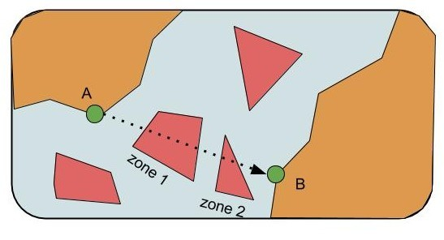
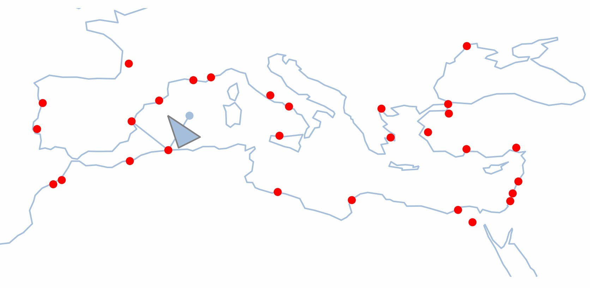

= Projet Python Open Source
:Author Initials: SR
:toc2:
:toclevels: 4
:icons: font
:max-width: 80%
:source-highlighter: pygments
:sectanchors:
:experimental:
:pygments-style: tango

**Auteurs :**

Rey Sebastien
<rey.sebastien@yahoo.fr>

== Projet

Les diagrammes de classes (similaires à ceux présents dans le support de cours) correspondants à votre programme seront également à nous rendre (vous pouvez vous appuyer sur le format de diagramme existants, en PJ de ce mail, pour composer les vôtres).

=== Enoncé général du projet (partie 1)

Le minimum à réaliser lors des séances que nous avions faites ensemble était le suivant :

. Réaliser les fonctions permettant de calculer un combat entre deux Navires, en se basant sur la force des pirates qui composent ces navires
. Penser à payer les pirates à la fin de chaque combat victorieux !

Pour la suite, nous vous demandons de nous montrer que vous avez bien compris les concepts vus en cours en continuant d’ajouter des éléments autour de ce programme initial.

L’idée, c’est de réaliser en quelque sorte “un programme imposé”, au sens sportif du terme.
Ainsi, vous pouvez ajouter tout ce que vous souhaitez dans ce nouveau programme, mais celui-ci devra au moins contenir les éléments suivants :

* Un menu au format texte se lançant au début de chaque tour, indiquant les actions que peut réaliser le joueur. Exemple non contractuel :
“Bonjour Moussaillon, quel est votre prochaine action dans ce programme de simulation de combat pirate ?”
** A. Acheter un nouveau bateau
** B. Virer mon équipage et en prendre un nouveau dans la taverne
** C. Naviguer dans les mers du sud à la recherche d’un trésor
** D. Quitter le programme de navigation

* Un générateur de combats aléatoires entre le bateau du joueur et un bateau ennemi

* La possibilité d’acheter d’autres bateaux/marins avec l’argent récolté par l’équipage à l’issue des combats,

* Un héritage et une composition différente de ceux présentés dans le support de cours,

* L’utilisation d’un dictionnaire.

=== Attendu géomatique du projet (partie 2)

* **Navigation V1 (facile)** Les bateaux naviguent de port en port exclusivement. Il est donc nécessaire que ceux ci partent avec des vivres suffisantes pour effectuer correctement ce trajet. A vous de voir comment vous calculez ça (coût d’une traversée proportionnelle à la distance entre deux ports ?). Si la route calculée passe par un morceau de terre, alors ce trajet ne peut être emprunté.

* **Navigation V2 (difficile) ** On constate que la **Navigation V1** limite fortement les déplacements de notre bateau. Il est donc décidé dans ce mode d'avoir la possibilité de naviguer librement (direction E, O, N, S), mais toujours en stockant les routes dans la table `Routes` correspondante. Dans ce cas à vous de voir comment se fait l'approche des ports, probablement en utilisant un buffer autour du bateau.

* Quelque soit le mode de déplacement, il est nécessaire de tester si il y a eu intersection avec une ou plusieurs Zones dangereuses, et si oui, il faut résoudre successivement chacune de ces rencontres.

[TIP]
====
Le navire va ici du Port A au Port B, sa trajectoire intersecte deux Zones (1 et 2). Avant de pouvoir continuer votre route vers un autre port, le programme devra résoudre de façon séquentielle les événements qui se sont mis au travers de sa route. Dans notre cas, les éventuels événements de la Zone 1, puis ceux de la Zone 2.
====

* Ces zones dangereuses peuvent, à chaque tour, générer ou non des évenements en fonction de la probabilité qui leur est attribuée en base de donnée.
 ** La probabilité “pirate” génèrera ou non un combat avec un navire ennemi
 ** La probabilité “tresor” génèrera ou non la découverte d’un trésor (argent, vivres, armes, etc.)

[TIP]
====
Dans le mode de **Navigation 1**, si jamais vous perdez des marins dans la Zone 1, puis dans la Zone 2, et que vous n’avez plus suffisament de marins, ou de vivres pour finir votre route vers le port B, alors le bateau coule, et vous avez perdu. Dans le mode de **Navigation 2**, les bateaux sont moins soumis aux aléas multiples, mais les règles sont les mêmes pour ce qui est des vivres, ou du nombre de marins.
====

* Vous décidez de tout le reste, ce qui se passe au niveau des zones, des ports, et de tout ce que vous voulez rajouter autour (achat de vivres, d’armes, embauche d’un marin, etc.).

=== Classe utilitaire

Une classe utilitaire nommé `BDUtils.py` est mis à votre disposition par les encadrants. Vous pouvez l'ouvrir et regarder la partie `__main__` .

Cette classe possède des fonctions utilitaires qui permettent d'afficher une carte (ci dessus exemple de la carte de jeu avec une zone, un bateau, et une route) automatiquement à partir des éléments contenus dans les différentes bases de données du programme. Cette classe s'appuie sur l'extension http://matplotlib.org/basemap/[Basemap] de la très connue et très utilisé librairie de visualisation scientifique python http://matplotlib.org/[Matplotlib]. Evidemment, il existe d'autre librairies Python qui vont permettrons de faire de la visualisation et de la cartographie, comme http://bokeh.pydata.org/en/latest/[Bokeh] , http://scitools.org.uk/cartopy/[Cartopy] , https://github.com/python-visualization/folium[Folium], http://kartograph.org/[Kartograph], etc.

Le détail des fonctions est donné ci-dessous.

[source,python]
----
DSN= "dbname='reyman64_cartha' user='reyman64_cartha' password='carthageo' host='web504.webfaction.com'"

util = BDUtils(DSN, "votre_idbinome") <1>

util.update_geom() <2>

util.flush_routes() <3>
util.flush_zones()
util.flush_bateau()

util.refresh(filtering=True) <4>

util.close() <5>
----
<1> Permet d'initialiser la classe `BDUtils`, paramétré avec l'identifiant `idbinome` que vous aurez choisi.
<2> Permet de mettre à jour les différentes géométries des tables.
<3> Ces différentes fonctions permettent de supprimer le contenu que vous avez stocké dans les différentes bases accessibles (`routes`, `zones`, `bateaux`), en se basant sur votre `idbinome` passé en paramètre de la classe.
<4> Calcule et sauvegarde la carte. Si `filtering = True`, alors seules les informations correspondant à `idbinome` sont récupérées et affichées sur la carte. Si `=False`, alors toutes les informations de tous les binômes sont affichées.
<5> Cloture la connexion à la base utilisé par BDUtils. Une fois cette fonction utilisée, les autres fonctions de BDUtils ne seront plus fonctionelles.

[CAUTION]
====
Pour fonctionner, la classe `BDUtils.py` à besoin de plusieurs packages python, que vous pouvez installer avec pycharm en allant dans `Settings` > `Code` > `Code` > `ProjectInterpreter` > `+`

- matplotlib
- descartes
- numpy
- shapely
- mpltoolkits.basemap
====

== Introduction à Psycopg2

Pour manipuler une base de données, on utilise une librairie python spécifique nommé `psycopg2`

[NOTE]
====

- Pour consulter l'url de l'API psycopg2 : http://initd.org/psycopg/docs/
- Pour consulter un tutorial simple d'utilisation de psycopg2 : http://initd.org/psycopg/docs/usage.html
====

=== Info base de données

[NOTE]
====
* L'url est `web504.webfaction.com:5432` ou `185.10.231.177:5432`
* Le login de la base est : `reyman64_cartha`
* Le nom d'utilisateur est : `reyman64_cartha`
* Le mdp est : `carthageo`
====

Cinq tables sont présentes dans la base de données :

.Tables fixes :
* coastline (LineString) : #id, geom
* ports (Point) : #id, city, country, population1950, ..., population2050, geom, name, pop, etc.

.Tables à manipuler avec attribut **idbinome**:
* bateaux (Point) : geom, #id, nom, idbinome, color
* zones (Polygon) : geom, #id, pirates, tresor, idbinome
* routes (LineString) : idbinome, #id, geom

Le schéma `exo2016` de la table `reyman64_cartha` contient donc `ports` et `coastline` qui ne doivent pas être modifié, par contre les tables `bateaux`, `zones` et `routes` sont des tables communes à tous que vous allez manipuler avec précaution en utilisant pour l'insertion ou la suppression l'attribut **idbinome**.

[TIP]
====
Voir les données du site http://www.naturalearthdata.com/downloads/110m-physical-vectors/[naturalearthdata]

Pour les villes/ports, les données viennent d'un shape réalisé par  https://nordpil.com/resources/world-database-of-large-cities/[nordpil]
====

=== Initier une connection

Pour importer `psycopg2` dans python :

[source,python]
----
import psycopg2
----

Pour se connecter à la base de données :

[source,python]
----
conn = psycopg2.connect(database="nomdelabase", user="postgres", password="secret", host="adressebase")
----

`conn` est une variable qui contient l'objet permettant d'accéder au lien entre votre programme et la base de données.

Une fois que votre programme à finit de traiter les données, il est impératif de bien clôturer ce lien en appelant la fonction `close()` sur votre objet, ici `conn` :

[source,python]
----
conn.close()
----

=== Executer une requete

Une requete n'aboutit pas obligatoirement, il faut utiliser des blocs d'instruction `try` `except` pour capturer les erreurs susceptibles d'apparaitre.

Par exemple, si votre requete est mal écrite, elle ne sera pas executé par la base de données, et une exception sera levée par le programme.

-  le bloc `try` contient un code susceptible de soulever une erreur, ce n'est pas forcément limité aux requetes SQL, c'est aussi valable  par exemple pour les opération de lecture/écriture dans un fichier

-  le bloc `catch` contient quant à lui le code à executer en cas d'erreur.

Un bloc `try` `except` se présente sous cette forme :

[source,python]
----
try:
  # tentative d'execution de la requete SQL
  curs.execute(marequeteSQL)

except psycopg2.ProgrammingError,err:
  # Affichage de l'erreur
  print err
----

Plus d'information sur les blocs try / catch en python est disponible sur ces sites http://docs.python.org/2/tutorial/errors.html[#1] http://www.siteduzero.com/tutoriel-3-37204-les-exceptions.html[#2]

Pour executer une requete, nous avons vu qu'il fallait un object connexion, et un curseur qui va vous permettre de dialoguer (dans les deux sens) avec la base de données Postgis.

Pour récupérer et stocker un curseur :

[source,python]
----
cur = conn.cursor()
----

Pour fermer le curseur :

[source,python]
----
cur.close()
----

[NOTE]
====

Il vaut mieux ouvrir (et fermer) un curseur pour chaque bloc de requetes, c'est beaucoup moins couteux que d'ouvrir et de fermer une connexion à chaque fois.
====

Le curseur permet d'executer une requete ainsi :

[source,python]
----
cur.execute("SELECT * FROM test;")

# equivalent à
requete = "SELECT * FROM test;"
cur.execute(requete)

# equivalent à
requete = ("SELECT * FROM %s;") % ("test")
cur.execute(requete)
----

et de récupérer les valeurs après execution (si elles existent) ainsi :

[source,python]
----
cur.fetchone() # ou cur.fetchmany() ou cur.fetchall()
----

Par exemple le résultat de `cur.fetchone()` est un *itérable python*, apellé plusieurs fois il permet d'avancer dans les résultats :

  >>> cur.execute("SELECT * FROM test;")
  >>> for record in cur:
         print record

  (1, 100, "abc'def")
  (2, None, 'dada')
  (3, 42, 'bar')

Chaque élément `record` peut ensuite être parcouru avec une instruction de type *for .. in* car il s'agit d'une variable de type   http://python.developpez.com/cours/DiveIntoPython/php/frdiveintopython/native_data_types/tuples.php[`Tuple`].

Il y'a aussi la possibilité de récupérer un tuple contenant l'ensemble des résultat avec la méthode `fetchall()`

  >>> cur.execute("SELECT * FROM test;")
  >>> cur.fetchall()

  [(1, 100, "abcdef"), (2, None, 'dada'), (3, 42, 'bar')]

=== Valider les données en base

Les bases de données bénéficie de mécanismes de protection permettant de les protéger contre les mauvaises transactions. Il est donc important de valider vos requetes par la commande :

[source,python]
----
conn.commit()
----

Si vous ne le faites pas, tout vos changement sur la base, donc vos requêtes d'insertion/update/delete seront perdus (et cela jusqu'au précédent `commit()`).

Si une requete se passe mal (renvoie une exception par exemple), alors il est possible de remettre la base dans son état précédent datant du dernier commit(), avec la commande suivante :

[source,python]
----
conn.rollback()
----

=== Passer des paramètres aux requetes avec Psycopg

Les types normalisé pour SQL *ne sont pas les même* que les type Python, il n'est donc pas permis de passer une liste ou une chaine de caractère comme variable sans utiliser une syntaxe spéciale.

Par exemple le type `List` de python n'existe pas en SQL, par contre il peut être converti par psycopg2 en utilisant le type http://www.postgresql.org/docs/9.1/static/datatype.html[`ARRAY`] qui lui existe.

[CAUTION]
====
Il est formalement interdit d'executer une requete en utilisant ce formalisme là pour le passage d'arguments (`cur` est l'objet curseur) :

[source,python]
----
SQL = "INSERT INTO authors (name) VALUES ('%s');" # NEVER DO THIS
data = ("O'Reilly", )
cur.execute(SQL % data) # THIS WILL FAIL MISERABLY
----

  ProgrammingError: syntax error at or near "Reilly"
  LINE 1: INSERT INTO authors (name) VALUES ('O'Reilly')

====

La bonne méthode est de passer les variables qu'au moment de l'execution de la requête, de cette façon :

[source,python]
----
cur.execute("INSERT INTO test (num, data) VALUES (%s, %s)", (100, "abcdef",))
----

[CAUTION]
====

Cette méthode n'est utilisé que pour le placement de variable, autrement dit, il est interdit de faire ca pour construire des requetes de façon dynamique !
====

Par exemple, reprenons la requete précédent, et imaginons qu'il nous faut insérer le nom de table comme paramètre pour faire une créer une fonction d'insertion d'objet plus générique :

[source,python]
----
# Remplacement classique de chaine de caractere avec python
SQL = "INSERT INTO %s(num, data) VALUES (%%s, %%s)" % (table)

# Renvoie la chaine "INSERT INTO table(num, data) VALUES (%s, %s)"
print SQL

# Remplacement specifique à psycopg2 avec conversion de types
cur.execute(SQL, (100, "abcdef",))
----

Vous remarquerez l'importance du double `%%s` qui après remplacement devient `%s`, et fait que nos variables puissent être insérées correctement !

Plus d'information sur la conversion de type est disponible sur la documentation de   http://initd.org/psycopg/docs/usage.html#passing-parameters-to-sql-queries[psycopg2]

=== Suppression

Pour supprimer une table de la base, il faut d'abord supprimer la clé primaire avec http://sql.sh/cours/alter-table[`ALTER TABLE`], puis la table elle même avec http://sql.sh/cours/drop-table[`DROP TABLE`]

=== Pour afficher les metadata

Il vous faudra récupérer les métadata concernant les tables (noms de colonnes, type de projection, etc.), pour cela il vous faudra envoyer des requêtes sur la base http://postgis.net/docs/manual-1.4/ch04.html#id418599[`geometry_columns`] contenu dans le schema public.

Pour questionner les metadata d'une table, vous pouvez utiliser ce type de code :

[source,python]
----
metadataSQL = "SELECT srid, type, f_table_schema FROM public.geometry_columns WHERE f_table_name = '%s';" %(table)

curs.execute(metadataSQL)
tableMetaData = curs.fetchone()

tableSRID = int(tableMetaData[0])
tableGeomType = tableMetaData[1]
tableSchema = tableMetaData[2]
----

Lorsque vous faites des requêtes utilisant plusieurs tables, il est tentant d'utiliser le joker `*` (comme dans `select * from ...;`) pour selectionner l'ensemble des colonnes. Cette technique peut poser problème. En effet, dans le cas d'une jointure entre une `tableA` et une `tableB` en vue de réaliser une `tableC`, l'utilisation du joker `*` sur un `select` fait que chacune des colonnes `geom` de `tableA` et de `tableB` sont récupérées dans `tableC`. Ce qui peut poser problème par la suite lors de l'affichage dans QGIS.

Voici une astuce pour récupérer la liste des colonnes d'une table en vue de construire une chaine de caractère où la colonne `geom` à été supprimé ! Vous pouvez ainsi remplacer pour une des tables de notre exemple (A ou B) le `*` du `select` par cette construction de colonne qui supprime la colonne `geom` tout en conservant le reste des colonnes.

[source,python]
----

try:
    curs.execute("SELECT column_name FROM information_schema.columns where table_name= %s;", ( table,))
except psycopg2.ProgrammingError,err:
    print "error " , err

from itertools import chain
columnList = list(chain.from_iterable(curs.fetchall()))
columnList = [c for c in columnList if c != "geom"]
print ",".join(columnList)
----

Enfin, si jamais vous avez des problèmes pour accéder à vos colonnes, il faut  rafraichir la liste des metaData dans postgis, le code suivant supprime et recrée la table :

[source,python]
----
curs.execute("DELETE FROM geometry_columns; SELECT Populate_Geometry_Columns();")
----

=== Mise en application pour le projet

- Ajouter votre bateau avec une couleur au format http://www.colorhexa.com/[héxadécimal] et  avec votre identifiant `idbinome` dans la table `bateau`. Attention, il n'est censé y avoir qu'un seul bateau par binôme dans cette table, sinon cela entrainera des erreurs dans l'affichage de la carte. Cette couleur est celle utilisée pour afficher les géométries correspondant à votre binôme (bateau, routes, zones) sur la carte générée par la classe `BDUtils`.

- Vous pouvez utiliser `ST_Intersects` http://postgis.refractions.net/docs/ST_Intersects.html[#1] pour tester si des intersections existent entre des tables.

- Réaliser une fonction python qui permet d'insérer avec `INSERT INTO` des nouvelles routes à la table `routes`, en faisant attention à la projection de chacune des géométries. N'oubliez pas que les routes insérées doivent être taggées avec l'`idbinome` que vous avez choisi.

- Réaliser une fonction python qui permet d'insérer avec `INSERT INTO` un ou plusieurs polygones dans la table 'zones' au format WKT en base de données, en faisant attention à la projection de chacune des géométries. N'oubliez pas que les zones insérées doivent être taggées avec l'`idbinome` que vous avez choisi.

[TIP]
====
Avant d'utiliser ces fonctions dans votre programme de pirates, vous pouvez tester leur bon fonctionnement en ajoutant/supprimant des polygones et des points que vous aurez généré avec l'outil http://arthur-e.github.io/Wicket/sandbox-gmaps3.html[en utilisant l'outil en ligne suivant]

Penser à utiliser http://www.postgis.org/docs/ST_GeomFromText.html[`ST_GeomFromText`]  et http://postgis.net/docs/ST_Transform.html[`ST_Transform`] pour transformer le `WKT` en `geom`
====

== Installation

Software : http://www.navicat.com/products/navicat-for-postgresql

=== MAC

http://postgresapp.com/
Modification .profile
Kill existing postgres : http://stackoverflow.com/questions/12028037/postgres-app-could-not-start-on-port-5432

== Requete utile

http://gis.stackexchange.com/questions/43187/are-there-any-tricks-to-using-a-schema-other-than-public-in-postgis?lq=1
http://postgis.net/docs/Populate_Geometry_Columns.html
http://postgis.net/docs/UpdateGeometrySRID.html

http://serverfault.com/questions/35332/what-do-i-do-when-pg-cancel-backend-doesnt-work
http://lists.osgeo.org/pipermail/postgis-users/2008-July/020524.html
http://gis.stackexchange.com/questions/34612/how-to-change-the-srid-of-exisisting-data-in-postgis
